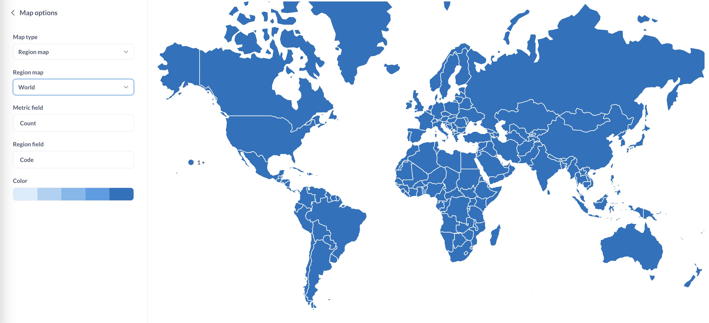
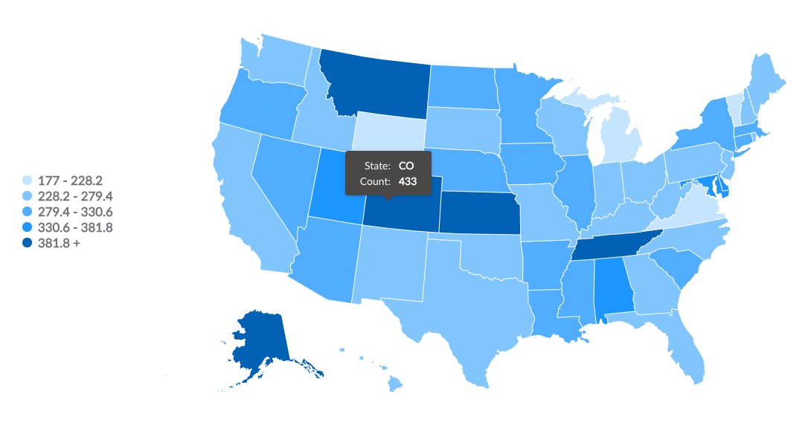
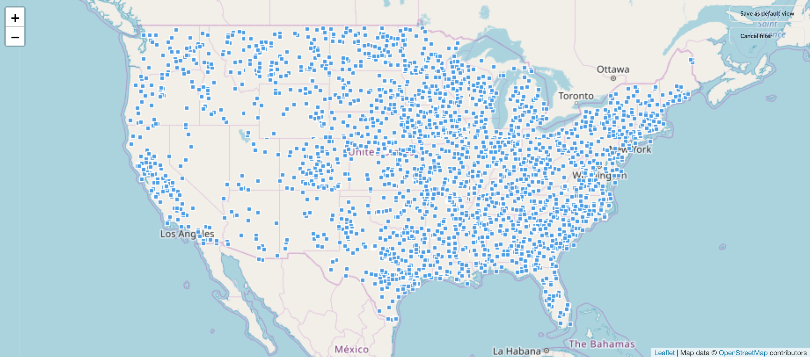

# Maps

When you select the **Map** visualization setting, Metabase will automatically try and pick the best kind of map to use based on the table or result set. Here are the maps that Metabase uses:

## Region maps

There are two region maps included with Metabase:

### World Map

To visualize your results in the format of a map of the world broken out by country, your result must contain a column with two-letter [country codes](https://www.metabase.com/glossary/country_code).

### United States Map

Creating a map of the United States from your data requires your results to contain a column that contains names of states or two-letter state codes. This lets you do things like visualize the count of your users broken out by state, with darker states representing more users.

## Pin map

If your results contains [latitude and longitude fields](../../../data-modeling/field-types.md), Metabase will try to display the results as a pin map of the world. Metabase will put one pin on the map for each row in your table, based on the latitude and longitude fields. You can try this with the Sample Database that's included in Metabase: start a new question and select the People table and choose the Map option for your visualization. You'll see a map of the world, with each dot representing the latitude and longitude coordinates of a single person from the People table.

When you open up the Map options, you can manually switch between a region map (e.g., United States) and a pin map. If you're using a region map, you can also choose which field to use as the measurement, and which field to use as the region (e.g., State or Country).

## Custom maps

Metabase also allows administrators to add [custom maps via GeoJSON files](../../../configuring-metabase/custom-maps.md) through the Metabase **Admin Panel**.

## Further reading

- [Visualizing data with maps](https://www.metabase.com/learn/basics/visualizing-data/maps).