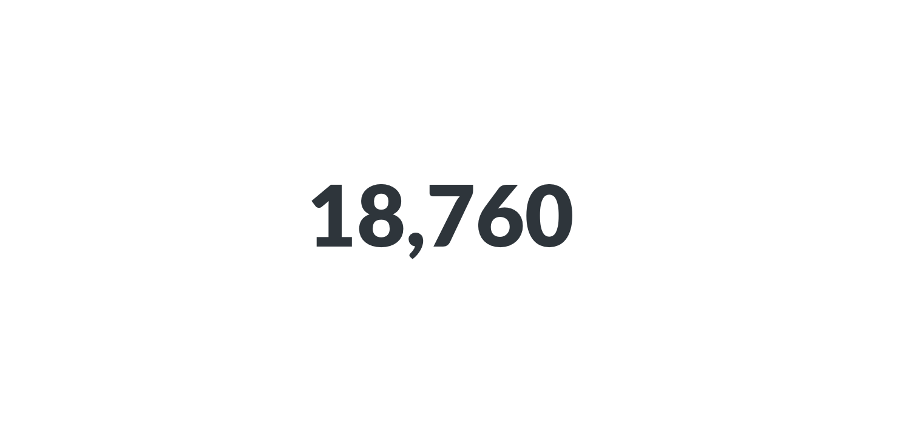

# Numbers

The **Numbers** option is for displaying a single number, nice and big. The options for numbers include:

- **Adding character prefixes or suffixes** to it (so you can do things like put a currency symbol in front or a percent at the end),
- **Setting the number of decimal places** you want to include, and
- **Multiplying your result by a number** (like if you want to multiply a decimal by 100 to make it look like a percent). If you want to _divide_ by a number, then just multiply it by a decimal (e.g, if your result is `100`, but you want it to display as `1`, simply multiply it by 0.01).
