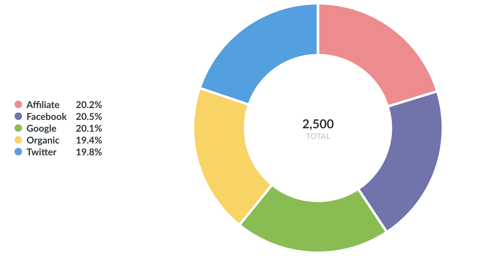

# Pie or donut charts

A **pie or donut chart** can be used when breaking out a metric by a single dimension, especially when the number of possible breakouts is small, like users by gender. If you have more than a few breakouts, like users per country, it's usually better to use a bar chart so that your users can more easily compare the relative sizes of each bar.

The options for pie charts let you choose which field to use as your measurement, and which one to use for the dimension (i.e. the pie slices). You can also customize the color of each slice, the pie chart's legend, whether or not to show each slice's percent of the whole in the legend, and the minimum size a slice needs to be in order for Metabase to display it.

