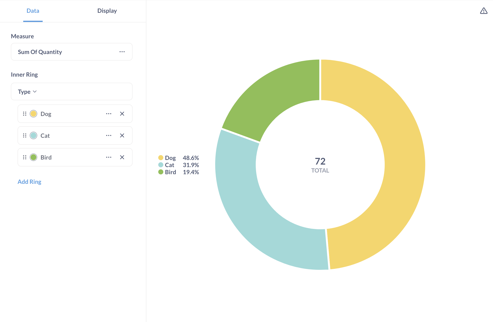
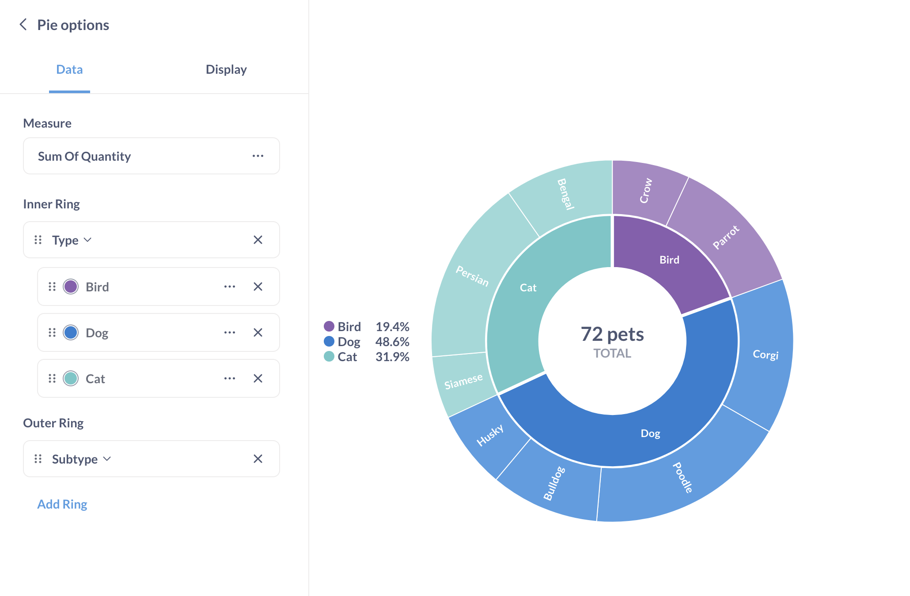
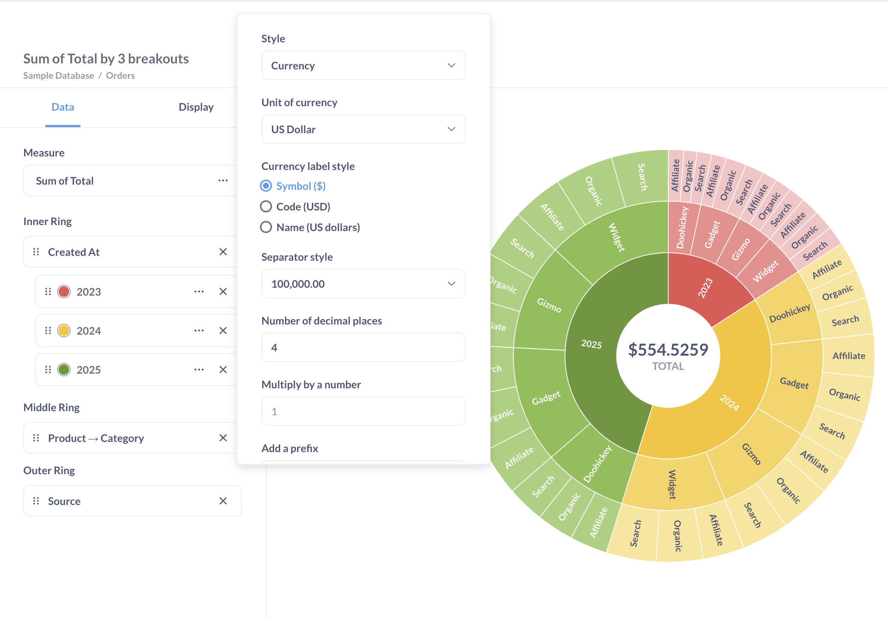
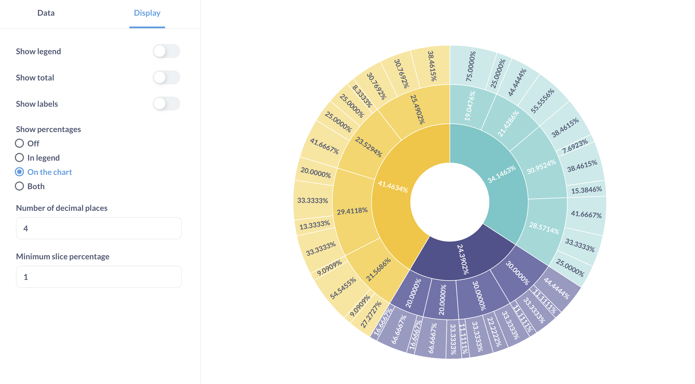
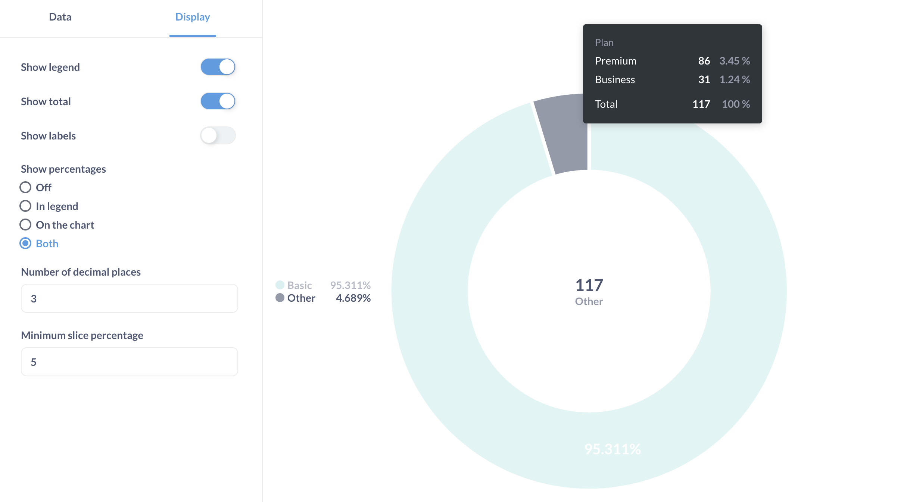

# Pie and sunburst charts

A **pie chart** can be used when breaking out a metric by a single dimension. In Metabase, pies are donuts. A **sunburst chart** is a multi-dimensional pie chart with multiple breakouts.

## When to use a pie or sunburst chart

Pie charts can be used to visualize a metric as part of a whole. Sunburst charts can be used to visualize hierarchical or nested data, or display multiple levels of categorization.

Pie and sunburst charts work best when when the number of possible breakout values is small, like accounts by plan. They are useful when yPie charts communicate a general sense of the relative sizes of breakouts, and shouldn't be used when precise comparison is important. If you have more than a few breakouts, like users per country, or you need to communicate exact differences in sizes, it's usually better to use a bar chart.

Pie and sunburst charts should only be used to visualize metrics that add up to 100% (like count or sum of total).

## How to create a pie or sunburst chart

Pie and sunburst charts display a single metric across one or more breakouts. Both pie/donut charts and sunburst charts are available in the "Pie chart" option in the visualization sidebar.

For a simple pie chart, you'll need a query with a single breakout and a numerical metric, for example:

| Type | Sum of Quantity |
| ---- | --------------- |
| Cat  | 23              |
| Bird | 14              |
| Dog  | 35              |

If your query has multiple metrics, you'll be able to choose the metric for the chart in [chart settings](#pie-and-sunburst-chart-settings).

For a sunburst (multi-dimensional pie) chart, you'll need a query with at most three breakouts and a numerical metric. Here's an example of a query result with two breakouts:

| Type | Subtype | Sum of Quantity |
| ---- | ------- | --------------- |
| Cat  | Siamese | 4               |
| Cat  | Persian | 12              |
| Cat  | Bengal  | 7               |
| Bird | Crow    | 5               |
| Bird | Parrot  | 9               |
| Dog  | Corgi   | 10              |
| Dog  | Poodle  | 13              |
| Dog  | Bulldog | 7               |
| Dog  | Husky   | 5               |

You'll be able to choose which breakouts to assign to inner, middle, or outer ring of the sunburst chart in [chart "Data" settings](#data-settings). If your query has multiple metrics, you'll also be able to choose the metric to display. Here's the sunburst chart for the example table above:

Metabase will automatically compute percentage of total for each value of the metric value (for example, Metabase will compute that 23 Cats make up 31.9% of all pets), so you don't need to include this information in the query.

## Pie and sunburst chart settings

To open the chart options, click on the gear icon at the bottom left of the screen. This will open a settings sidebar with **Data** and **Display** tabs.

### Data settings

You can rename, reorder, or remove slices from the inner ring of a sunburst or pie chart. To reorder the pie slices, drag the cards with the slice names. To rename the slices, click on three dots next to the series name and enter a new name.

To change the color of the slices, click on the color circle next to the slice name. In sunburst charts, you can only change the color of the inner ring slices (the outer ring slices inherit the color of their parent inner slice).

If your query has multiple numeric metrics (columns), you can pick the column that should be depicted on the chart in the **Measure** dropdown.

To format the total displayed in the middle of the chart, click on the three dots next to the metric name in the **Measure** setting. The measure format options — including the "number of decimal places" option — will only apply to the total, and not to the percentage values or labels. To configure the display of the percentage values and labels, go to the [display settings](#display-settings) tab.

### Display settings

You can configure whether to show:

- The legend next to the chart.
- The total in the center of the chart. The format of the total can be changed in the [data settings](#data-settings).
- The labels for the slices. The labels for the inner ring slices can be changed in the [data settings](#data-settings).

  For sunburst charts with multiple breakouts, only the inner ring breakout will be displayed in the legend, and by default, "Show labels" will be turned on, so the labels for slices will be visible on the chart. If you turn off "Show labels" for a sunburst chart, the only way to distinguish slices will be to hover over them.

- The percentage values for the slices. If you select to display percentages **In the legend**, but you toggle off **Show legend**, the percentage values will not be shown on the chart.

  You can always see percentage values for any slice by hovering over the slice.

To change the number of decimal places in the percentage values, use the **Number of decimal places** setting in the **Display** tab. If you want to change the number of decimal places in display of the total in the center of the chart, go to [data settings](#data-settings).

To make the chart more legible, you can group slices smaller than a certain percentage into one slice by adjusting **Minimum slice percentage**. You'll be able to see the categories and values in the **Other** slice by hovering over it:

Currently, you can't change the color or label of the **Other** slice.

## Limitations and alternatives

Consider using a bar chart (or a [stacked bar chart](line-bar-and-area-charts.md#stacked-bar-chart)) or a [pivot table](pivot-table.md) instead of a pie or sunburst chart in the following cases:

- If your data has more than three breakouts
- If your metrics doesn't add up to 100% (e.g. average rating)
- if you have a lot of categories in each breakout
