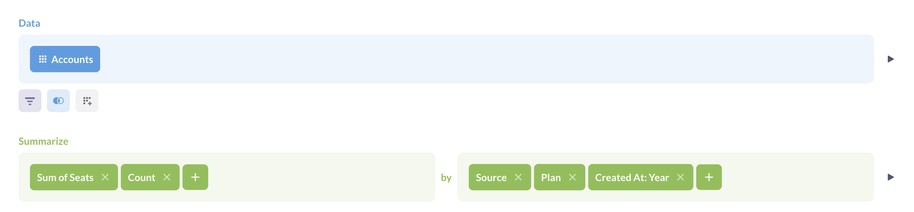
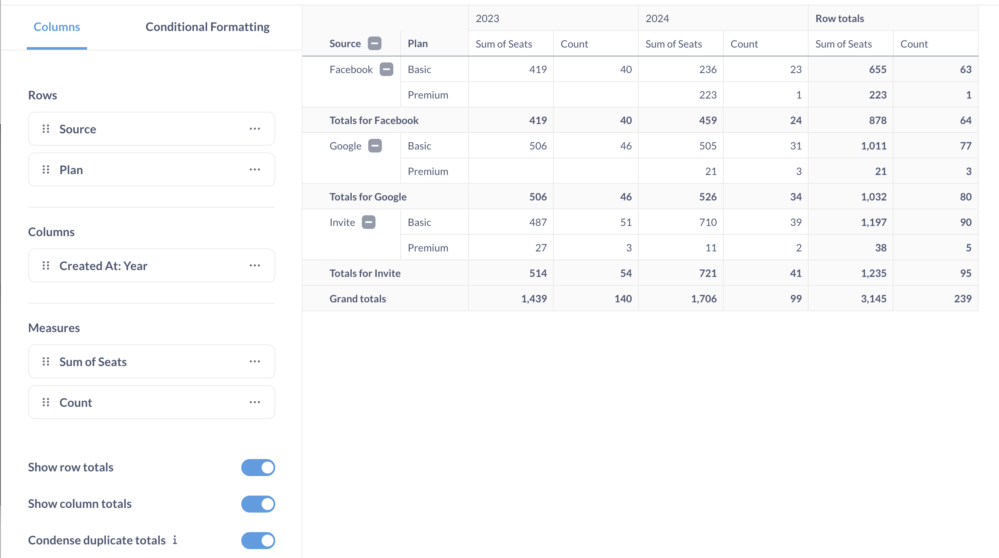

# Pivot table

Pivot tables allow you swap rows and columns, group data, and include subtotals in your table. You can group one or more metrics by one or more dimensions.

Pivot tables are not currently available for the following databases in Metabase:

- Druid
- MongoDB

Pivot tables work for simple and custom questions with summarized data for all other [officially supported databases](../../../databases/connecting.md). They don't work for questions that lack aggregate data, and they don't work for questions written in SQL, as Metabase would need to modify your SQL code in order to calculate subtotals. If you really need to use SQL, the workaround here is to create your question in two steps: first do all the complex things you need to do in SQL, save the results as a question, then use that saved SQL question as the starting point for a new GUI question which summarizes that data.

In the settings for the Pivot Table visualization, you can assign fields to one of three "buckets":

- Fields to use for the table **rows**
- Fields to use for the table **columns**
- Fields to use for the table **values**

Let's say we ask the following question in the notebook editor:

From the `Orders` table, we've summarized by the count of orders and the average order total, and grouped by `User → State`, `Product → Category`, and `Created At` binned by year. Here's our question visualized as a pivot table:

We've assigned the fields `User → State` and `Created At` to table rows, and assigned the `Product -> Category` field to generate our columns: Doohickey, Gadget, and so on. We can drag and drop dimensions between the row and column buckets, and add aggregations to the table values bucket. For example, if we assign a field to the columns bucket, Metabase will pivot that field and render each unique value of that field as a column heading.

You can put multiple fields in the "rows" and "columns" buckets, but note that the order of the fields changes how Metabase displays the table: each additional field will nest within the previous field.

Where it makes sense, Metabase will automatically include subtotals for grouped rows. For example, as in the image above, because we've grouped our rows first by `State`, then by `Created At`, Metabase will list each year for each `State`, and aggregate the metric(s) for that subgroup. For orders placed in Wisconsin, Metabase would sum the count of orders for each category, and find the average annual order total in each product category in Wisconsin.

To collapse a group on a pivot table, you can click on the minus (–) button next to the group's heading (or the plus (+) button to expand it). When you save a pivot table, Metabase will remember which groups were expanded and which were collapsed.

For more, check out [How to create a pivot table to summarize your data](https://www.metabase.com/learn/basics/visualizing-data/how-to-create-pivot-tables.html).
