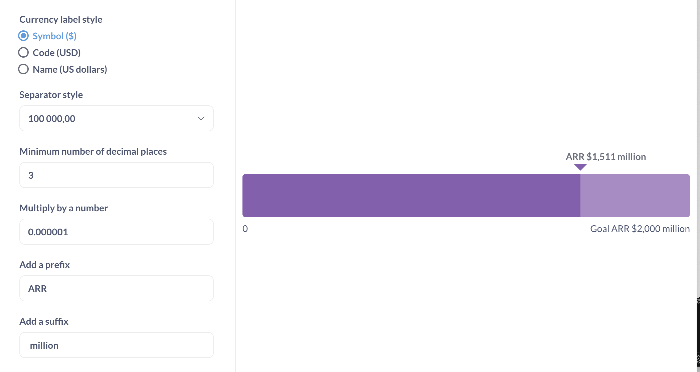

# Progress bars

**Progress bars** are for comparing a single number to a goal value that you set.

## Example use cases

- KPI tracking

  

- Percent completion

  

## Progress bar requirements

To create a progress bar you'll need:

- A query that returns a single number, like "Sum of order quantity". Progress bar doesn't work with breakouts.

- A goal value. The goal value should be a positive number. Currently, Metabase only supports setting a static goal (you can't set a goal based on another query).

  The goal is set in the [chart options](#progress-bar-options).

## Create a progress bar

1. Create a question that returns a single number (either using the [query builder](../../query-builder/introduction.md) or in the [native query editor](../../native-editor/writing-sql.md)).
2. Visualize the results:

- In the query builder, click the "Visualize" button.
- In the native query editor, click the "Play" button to execute the query

3. Switch the visualization type to "Progress bar" by clicking on the Visualization button in the bottom left corner.
4. Select "Progress bar" from the visualization sidebar.
5. Set the goal value in [chart options](#progress-bar-options).

## Progress bar options

To open the chart options, click on the gear icon at the bottom left of the screen.

### Display options

- **Goal**

  The goal value that the query results will be compared to. The goal should be a positive number.

- **Color**

  The base color for the progress bar. Metabase will use the selected color for the achieved progress, a lighter shade of the same color for remaining progress towards the goal, and a darker shade of the same color for progress exceeding the goal.

  Available colors are determined by the [**Appearance** admin settings](../../../configuring-metabase/appearance.md#chart-colors).

### Format options

Format options will apply to both the result of the query and the goal value.

To see how different format options affect the appearance of the chart, here's an example of a progress bar with default format options (default options in your Metabase [might be different](../../../data-modeling/formatting.md)):

And here's the same progress bar with different format options:

Here's how the different format options affected the display of the progress bar:

- **Style** `Currency` with `Symbol`: adds a `$` sign in front of both the result and the goal values.
- **Multiply by a number** `0.000001`: divides both the result and goal values by a million so that the values are displayed in number of millions (for example, `2 000 000` becomes `2`).
- **Separator style** `100 000,00`: changes the decimal separator from `.` to `,` .
- **Minimum number of decimal places** `3`: forces Metabase to display `2,000` instead of `2` and `1,511` instead of `1,51`.
- **Add a prefix** `ARR `: adds `ARR ` before both the result and the goal value. Note the space included in the prefix to separate it from the value.
- **Add a suffix** ` million`: adds ` million` after both the result and the goal value. Note the space included in the suffix to separate it from the value.

Note that selecting "**Style**: Percent" in format options will only change how the result of the query is formatted: for example, `17` will be formatted as `1700%`. It will not make Metabase display the query result as % of the **Goal**. If that's what you want, you'll need to build that computation into your query: for example, to display count of orders as % of the goal of `20`, use [custom expressions](../../query-builder/expressions.md) to return "Count of orders divided by 20", and format the result as a percentage.

## Drill-through actions

Progress bars build with the query builder support the following drill-through actions:

- See these records
- Break out

## Progress bar alerts

You can set up an alert whenever the result of a question reaches the goal set in the progress bar settings. See [Progress bar alerts](../alerts.md#progress-bar-alerts).

## Limitations and alternatives

- Progress bar assumes that your objective is to increase a metric. It might not be appropriate for metrics where the objective is to reduce a value (for example, number of unanswered support tickets). Consider using the [gauge chart](gauge.md) for those use cases.

- Progress bar does not support breakouts. If you'd like to display progress of a metric towards a goal across a breakout, consider using a [bar or line chart with a goal line](line-bar-and-area-charts.md#goal-lines).

## See also

- [Gauge charts](./gauge.md)
- [Goal lines on bar and line charts](./line-bar-and-area-charts.md#goal-lines)
- Tutorial: [Which chart should I use?](https://www.metabase.com/learn/metabase-basics/querying-and-dashboards/visualization/chart-guide)
