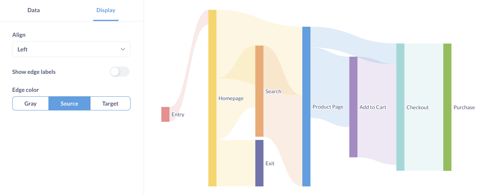
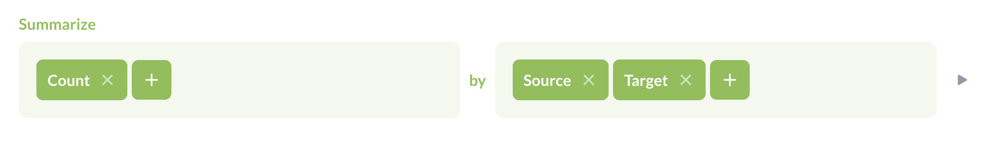
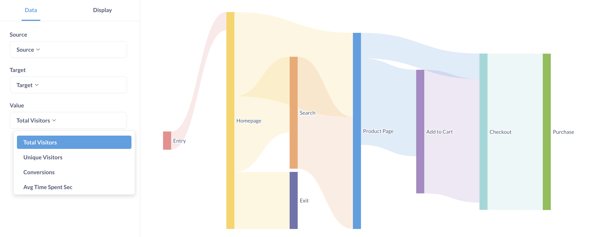
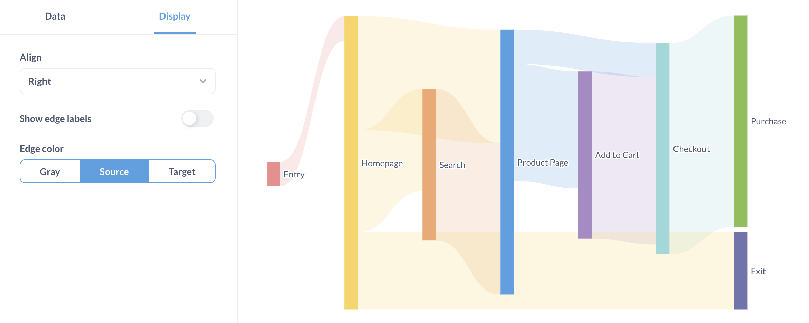
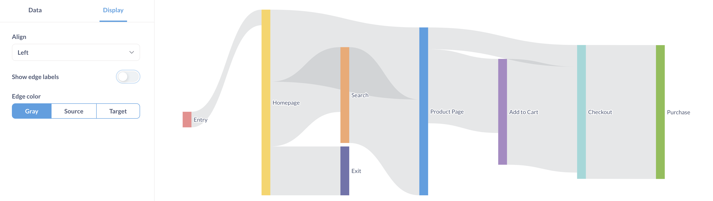

# Sankey charts

Sankey charts show how data flows through multi-dimensional steps. They're useful for showing which elements, called nodes, contribute to the overall flow.

## Sankey data shape

To create a Sankey chart, you'll need at least three columns in your results:

- **Source column**: specifies a node in the sankey flow.
- **Target column**: specifies a receiving node.
- **Count column**: value that determines the thickness of the target node.

If you had raw page views where each row had a source page (like the title of a referrer page) and a target page (like the title for the current page view), you could summarize by count and group by the source, then the target.

Here's the data shape used to create the chart above.

| Source page  | Target page  | Total Visitors |
| ------------ | ------------ | -------------- |
| Entry        | Homepage     | 584            |
| Homepage     | Product Page | 2,700          |
| Product Page | Add to Cart  | 572            |
| Add to Cart  | Checkout     | 2,490          |
| Checkout     | Purchase     | 1,756          |
| Homepage     | Search       | 2,427          |
| Search       | Product Page | 2,027          |
| Product Page | Add to Cart  | 2,203          |
| Add to Cart  | Checkout     | 1,475          |
| Search       | Product Page | 1,563          |
| Checkout     | Purchase     | 1,041          |
| Homepage     | Exit         | 810            |
| Product Page | Checkout     | 815            |
| Checkout     | Purchase     | 2,217          |
| Homepage     | Exit         | 1,020          |

See [data options](#sankey-data-options).

### Circular dependencies won't work

If some of your sources point to targets that point back to the same sources, Metabase won't be able to create a Sankey chart.

## Sankey data options

To select which columns Metabase should use as the source, target, and values for the Sankey chart, click on the **settings** icon in the bottom right to view the **Data** tab.

Your data can include more than three columns, but each row must include the required three columns: source, target, and a value to scale the size of the target node.

## Sankey display options

You can change a charts alignment, edge labels, and edge colors.

### Alignment

You can select left, right, or justified alignment for the Sankey chart. Alignment determines how the chart should display the end nodes (a.k.a. leaf nodes or terminal nodes).

The chart in the section above is left-aligned. The end nodes, `Exit` and `Purchase`, are aligned to the left.

For right alignment, the end nodes, `Exit` and `Purchase`, move to the chart's right:

In this case, justified alignment looks the same, as the end nodes move to take up the whole chart.

### Edge labels

Whether an edge (a.k.a. link or arrow) displays its value. Options for displaying labels include auto, compact, or full formatting.

### Edge color

Options for edge colors include:

- **Gray**: All edges are gray. Nodes retain their color.
- **Source**: The source node determines the edge colors. The source node is the node to the left of an edge.
- **Target**: The target node determines the edge colors. The target node is the node to the right of an edge.
