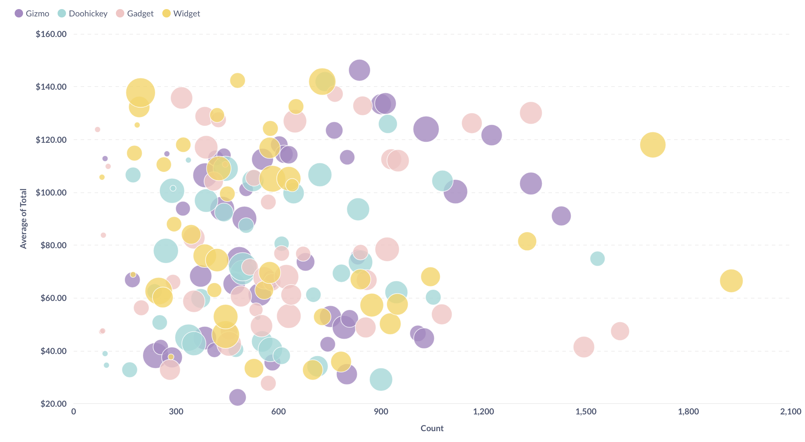

# Scatterplots and bubble charts

**Scatterplots** are useful for visualizing the correlation between two variables, like comparing the age of your users vs. how many dollars they've spent on your products. To use a scatterplot, you'll need to ask a question that results in two numeric columns, like `Count of Orders grouped by Customer Age`. Alternatively, you can use a table and select the two numeric fields you want to use in the chart options.

If you have a third numeric field, you can also create a **bubble chart**. Select the Scatter visualization, then open up the chart settings and select a field in the **bubble size** dropdown. This field will be used to determine the size of each bubble on your chart. For example, you could use a field that contains the total dollar amount for each x-y pair — i.e. larger bubbles for larger total dollar amounts spent on orders.

Scatterplots and bubble charts also have similar chart options as line, bar, and area charts, including the option to display trend or goal lines.

