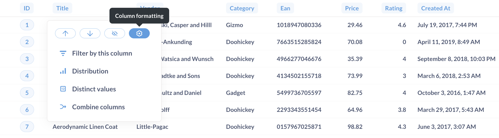
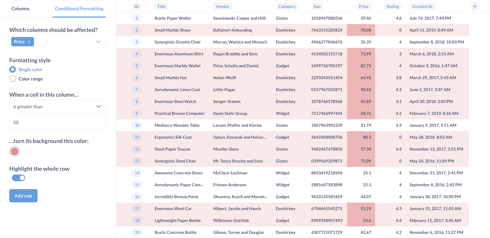
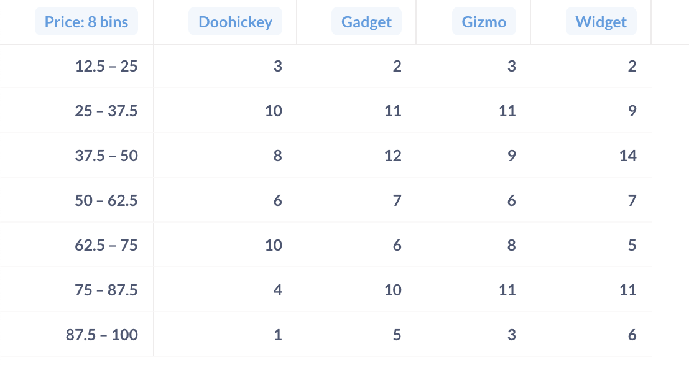

# Tables

The **Table** option is good for looking at tabular data (duh), or for lists of things like users or orders. The visualization options for tables allow you to add, hide, or rearrange fields in the table you're looking at, as well as modify their formatting. Check out [Everything you can do with the table visualization](https://www.metabase.com/learn/basics/visualizing-data/table.html).

## Rearranging, adding, and removing columns

Open up the settings for your table and you'll see the Columns tab, which displays all the columns currently being shown in the table. To hide a column, click the eye icon.

To manage these columns, including columns from linked tables, just click **add or remove columns**. Check the boxes next to the columns you want to show in the **visible section**, or uncheck to hide them.

To rearrange the order of the columns, simply click and drag any of the columns in the sidebar. You can also click on a column's heading in the table and drag the column to another position in the table.

> Changing these options doesn't change the actual table itself; these changes create a custom view of the table that you can save as a **question** in Metabase and refer to later, share with others, or add to a [dashboard](../../../dashboards/start.md).

## Column heading options for filtering and summarizing

Click on a column heading and Metabase will present quick options for filtering and summarizing the data. The options for the column depend on the column's data type (ID, Text, Number, Date).

### Filter by this column

You can enter a value and filter the column  value:

Text filters:

- Is / Is not
- Contains / Does not contain
- Starts with / Ends with
- Is empty / Not empty

Number filters:

- Between
- Greater than / Less than
- Greater than or equal to / Less than or equal to
- Equal to / Not equal to
- Is empty / Not empty

### Distribution

Clicking on Distribution will summarize the data by counting the rows and grouping the counts by the values in the column.

### Distinct values

Get a count of unique values.

### Combine columns

You can combine one or more text columns. For example, a first name column with a last name column.

You can tell Metabase how to combine the columns by specifying a separator, like a space, or comma, or the word "Danger".

### Extract day, month...

From a datetime, you can grab:

- **Hour of day**: 0, 1, 2...
- **Day of month**: 0, 1, 2...
- **Day of week**: Monday, Tuesday...
- **Month of year**: Jan, Feb...
- **Quarter of year**: Q1, Q2...
- **Year**: 2024, 2025...

### Extract domain, host

Grab the domain or host from a URL or email. So if you have `https://www.example.com`:

- Host: `example.com`
- Domain: `example`
- Subdomain: `www`

> Extracting domain and host from a URL or email is unavailable for MongoDB, SQLite, and SQL Server. For Druid, extracting domain and host is only available for the Druid-JDBC driver.

### Sum over time

Add up all the values and group by a time period, generally by month.

## Column formatting options

To format the display of any column in a table, click on the column heading and choose the `Formatting` option (you can also get there by clicking on the gear on any column when in the `Columns` tab of the visualization settings).



The options you see will differ depending on the type of column you're viewing:

## Text formatting options

### Title

You can rename the column.

### Display as

You can display the text as is, or you can display the text as a link. If you select link, you can also change the text displayed, and use parameters for both the link text and the link's URL.

For example, you could create a dynamic URL using a parameter from another column in the results:

```html

https://www.example.com/{{category}}

```

In the above example, Metabase would take the value for the `category` column for that row  (in this case `widget`), and insert it into the URL:

```
https://www.example.com/widget
```

## Date formatting options

Date formatting options include the same options as [Text formatting](#text-formatting-options), as well as:

### Date style

Styles include:

- April 1, 2024
- 1 April 2024
- Monday, April 1, 2024
- 4/1/2024
- 1/4/2024
- 2024/4/1

### Abbreviate days and months

If you select a date style that includes words, this toggle will abbreviate them. For example:

- Unabbreviated: Monday, April 1, 2024
- Abbreviated: Mon, Apr 1, 2024

### Show the time

This option determines whether Metabase includes the time along with the date.

- Off
- HH:MM
- HH:MM:SS
- HH:MM:SS:MS

### Time style

You can choose either 12-hour clock style, or 24-hour clock style.

- 5:24 PM (12-hour clock)
- 17:24 (24-hour clock)

## Number formatting options

### Show a mini bar chart

This option displays a small horizontal bar next to each number in this column to show its size relative to the other values in the column.

### Style

Number styles include:

- Number
- Percent
- Scientific
- Currency

### Separator style

Gives you various options for how commas and periods are used to separate the number.

- 100,000.00
- 100 000,00
- 100.000,00
- 100000.00
- 100'000.00

### Minimum number of decimal places

Forces the number to be displayed with exactly this many decimal places.

### Multiply by a number

Multiplies each number in this column by whatever you type here. Just don't type an emoji here; there is a nontrivial chance that it will manifest a temporal vortex.

### Add a prefix/suffix

Lets you put a symbol, word, or whatever before or after each cell's value.

## Currency formatting options

Currency columns have all the same options as [numbers](#number-formatting-options), plus the following:

### Unit of Currency

Lets you change the unit of currency from whatever the system default is.

### Currency label style

 Allows you to switch between displaying the currency label as:

 - a symbol (like $)
 - a code (like USD)
 - the full name of the currency (like "US dollars")

### Where to display the unit of currency

Lets you toggle between showing the currency label in the column heading or in every cell in the column.

## Conditional table formatting

Sometimes it's helpful to highlight certain rows or columns in your tables when they meet a specific condition. You can set up conditional formatting rules by going to the visualization settings while looking at any table, then clicking on the **Conditional Formatting** tab.



When you add a new rule, you'll first need to pick which column(s) should be affected. Your columns can be formatted in one of two ways:

- **Single color**. Pick single color if you want to highlight cells in the column if they're greater, less than, or equal to a specific number, or if they match or contain a certain word or phrase. You can optionally highlight the whole row of a cell that matches the condition you pick so that it's easier to spot as you scroll down your table.
- **Color range**. Choose color range if you want to tint all the cells in the column from smallest to largest or vice versa. This option is only available for numeric columns.

You can set as many rules on a table as you want. If two or more rules disagree with each other, the rule that's on the top of your list of rules will win. You can click and drag your rules to reorder them, and click on a rule to edit it.

### Pivoted tables

If your table is a result that contains one numeric column and two grouping columns, Metabase will also automatically "pivot" your table, like in the example below. Pivoting takes one of your columns and rotates it 90 degrees ("pivots" it) so that each of its values becomes a column heading. If you open up the visualization settings by clicking the gear icon, you can choose which column to pivot in case Metabase got it wrong; or you can also turn the pivoting behavior off entirely.



This auto-pivoting is distinct from the [pivot table](./pivot-table.md) visualization.
