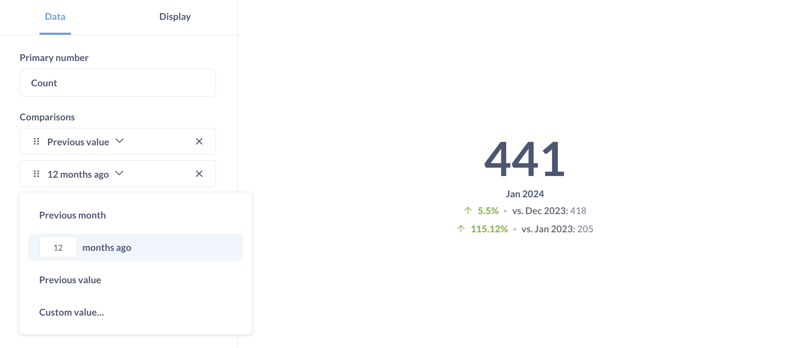

# Trend

The **Trend** visualization is great for displaying how a single number compares with:

- Previous time period(s).
- Custom values, like a target or goal.
- Values from another column.

To use this visualization, you'll need to have a single number grouped by a Time field, like the Count of Orders by Created At.

By default, the Trend chart will display the value of the number during the most recent period, as well as how much the number has increased or decreased compared to its value in the previous period. The period is determined by your group-by field; if you're grouping by Day, the Trend will show you the most recent day compared to the day before that.

By default, Trends will display increases as green (i.e., "good") and decreases as red ("bad"). If your number is something where an increase is bad and a decrease is good (such as Bounce Rate, or Costs), you can reverse this behavior in the visualization settings.

## Adding comparisons

To add a comparison, click on the **gear** icon in the lower left (next to Visualization). In the **Data** tab in the left sidebar, click **Add comparison**. You can select from:

- **Previous time period**
- **Previous value**. If there is no previous value, Metabase will ignore the value so the chart doesn't show a comparison with a null value.
- **Custom value**.
- **Value from another column**. Metabase will only show this option if your results contain multiple columns with aggregate values in your results (e.g., if you have two Summarize columns).

You can add up to three comparisons.
