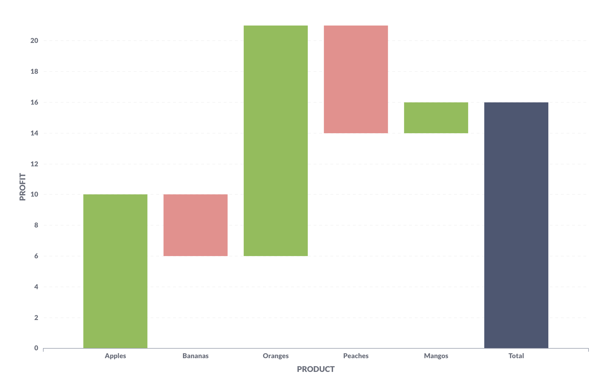

# Waterfall charts

Waterfall charts are a kind of bar chart useful for visualizing results that contain both positive and negative values. Each bar on a waterfall chart shows either an increase or decrease, with a final bar on the right of the chart that represents the total value.

In the example above, the waterfall chart displays "Profit" for each "Product:" apples, bananas, oranges, peaches, and mangos. From left to right, each bar indicates the change in total. The products with green bars indicate positive values (they made a profit). Peaches, however, lost money, indicated by a red bar, which signals a negative value. The bar at the end shows the total profit of all products combined. You can show values on each bar, and change the colors for increases and decreases.

For waterfall charts, you'll want a query that is a single metric grouped by a single dimension: by time or category.