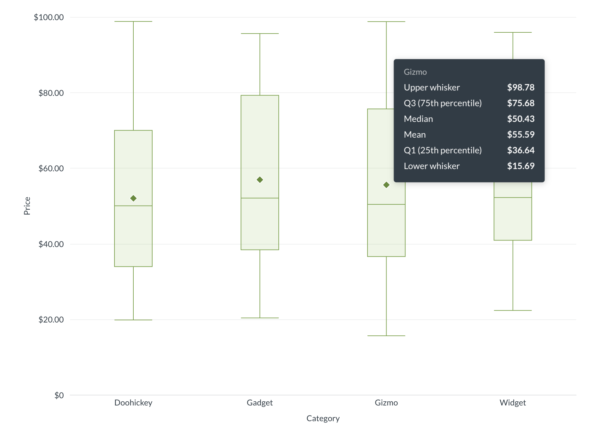
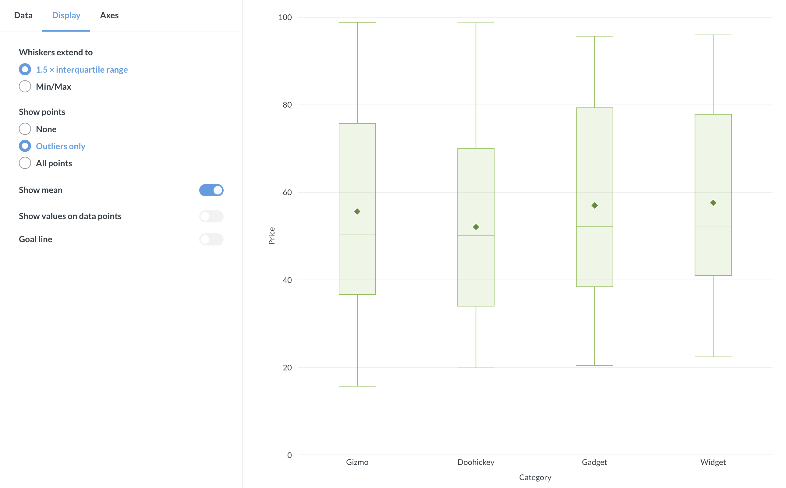
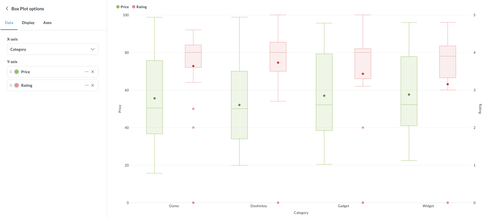

# Box plots

Box plots, also known as box and whisker plots, show the distribution of numeric data across groups. Box plots are great for comparing how values are spread out across categories or time periods.

Each plot displays:

- The **mean** as a diamond.
- **Q1** (25th percentile) and **Q3** (75th percentile) as the bottom and top of a box.
- The **median** bisecting the box.
- Whiskers extend to either 1.5x the interquartile range (the box), in which case points outside of the whiskers are outliers, or the whiskers can plot the full range of values, from the minimum value to the maximum value.

## When to use box plots

Box plots need multiple data points per group to compute meaningful statistics like median and quartiles. For example, if you summarize "Count of Orders" grouped by "Created At" and "State," Metabase has enough data points per time period to compute quartiles and show outliers.

If your question returns a single aggregated value per group (like total orders per year), you'll want a [bar chart](./line-bar-and-area-charts.md) instead.

Compared to [scatter plots](./scatterplot-or-bubble-chart.md), which show individual data points, box plots summarize the distribution so you can quickly spot differences between groups.

## Box plot data shape

To create a box plot, you'll need a metric plus one or two grouping dimensions. You don't need to include the mean or median calculations in your results; Metabase will include those calculations in the box plot visualization itself.

For example, "Count of Orders" grouped by "Created At" and "State" produces a result like:

| Created At | State | Count |
| ---------- | ----- | ----- |
| 2024       | AZ    | 487   |
| 2024       | CA    | 1,302 |
| 2024       | CO    | 253   |
| 2024       | NY    | 1,118 |
| 2025       | AZ    | 512   |
| 2025       | CA    | 1,450 |
| 2025       | CO    | 301   |
| 2025       | NY    | 1,200 |

The first grouping dimension (Created At) defines the x-axis categories, and the second (State) provides the individual data points within each category that Metabase uses to compute the box plot statistics.

Another example with a single grouping dimension: product prices grouped by category (assuming you have a lot of products in each of the categories):

| Category  | Price ($) |
| --------- | --------- |
| Gizmo     | 29.46     |
| Doohickey | 70.08     |
| Doohickey | 35.39     |
| Doohickey | 73.99     |
| Gadget    | 82.75     |
| Doohickey | 64.96     |
| Doohickey | 98.82     |
| Doohickey | 65.89     |
| ...       | ...       |

You can add multiple metrics to create multiple box plot series, or use a second breakout dimension to create colored series per category.

## Box plot settings

To configure your box plot, click the **gear** icon in the bottom left of the visualization.

### Whisker type

The **Whiskers extend to** setting controls how far the whiskers reach:

- **1.5 × interquartile range** (default): Whiskers extend to the farthest data point within 1.5 × IQR from the first and third quartiles. Points beyond this range appear as outliers. This is the standard Tukey method.
- **Min/Max**: Whiskers extend to the actual minimum and maximum values. No outliers are shown.

### Show points

Controls whether individual data points appear on the chart:

- **None**: No data points shown.
- **Outliers only** (default with 1.5 × IQR whiskers): Only outlier points are displayed. This option isn't available when whiskers are set to Min/Max.
- **All points**: All raw data points are shown. Non-outlier points have reduced opacity so the box remains prominent.

### Show mean

Toggle the diamond-shaped mean marker on or off. Enabled by default. The mean marker helps you compare the average to the median — if they differ noticeably, the data is skewed.

### Show values

Toggle numeric labels on or off. When enabled, you can configure:

- **Values to display**: "Median only" (default) or "All" (min, Q1, median, Q3, max).
- Labels automatically reposition based on available space: side layout when there's room, column layout when the chart is dense.
- **Hide overlapping values**: Prevents overlapping labels in tight layouts.
- **Auto formatting**: Either full or compact (e.g., 42,000 → 42K).

### Goal line

You can add a goal line to your box plot. Toggle **Show goal**, then set the goal value and an optional label. Note that goal-based alerts aren't available for box plots.

## Axes

### X-axis

- **Label**: Add or rename the axis label.
- **Line and marks**: Show or hide the axis line and tick marks.

### Y-axis

- **Label**: Add or rename the axis label.
- **Auto y-axis range**: When toggled off, you can set custom minimum and maximum values.
- **Scale**: Linear, power, or log.
- **Split y-axis**: Available when you have multiple series assigned to different axes.

## Multiple series

You can add more metrics to display side-by-side box plots, or use a second dimension as a breakout to create a colored series for each category. When you have multiple series, you can assign each to the left or right y-axis.
