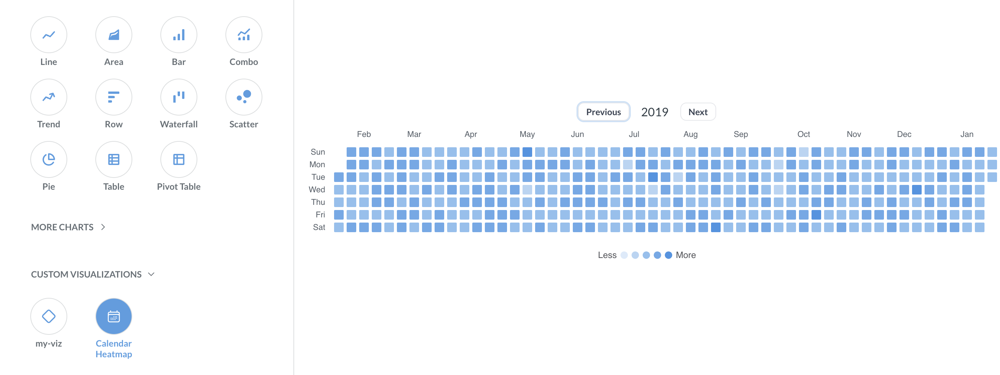
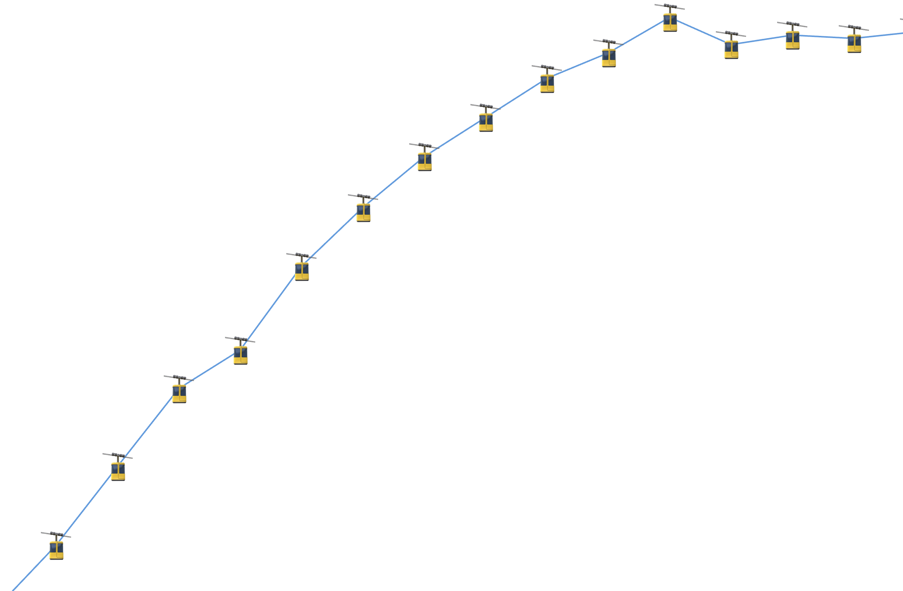

# Custom visualizations



You can build new chart types and add them to Metabase. Here's a calendar heatmap:

Here's the [code for that calendar heatmap viz](https://github.com/metabase/custom-viz-calendar-heatmap).

This page covers how to add a custom visualization to your Metabase. To _create_ a new custom visualization, see [developing a custom visualization](../../developers-guide/custom-visualizations.md).

## Enabling custom visualizations

### Restrict image domains first

Before you can turn on custom visualizations, you need to enable [Restrict image domains](../../configuring-metabase/settings.md#restrict-image-domains). A custom visualization runs third-party JavaScript in your Metabase. By restricting image (and font) domains, you limit where that code can load assets from, which narrows the ways a plugin could leak data through outbound asset requests. See [Only add plugins you trust](#only-add-plugins-you-trust).

While custom visualizations are enabled, you can't turn **Restrict image domains** back off. You'll need to first disable custom visualizations.

### Turn on custom visualizations

To turn on custom visualizations, go to **Admin** > **Settings** > **Custom visualizations** and click **Enable custom visualizations**.

You can also enable (or disable) custom visualizations with the [`MB_CUSTOM_VIZ_ENABLED`](../../configuring-metabase/environment-variables.md#mb_custom_viz_enabled) environment variable, or with the `custom-viz-enabled` key in a [configuration file](../../configuring-metabase/config-file.md).

## Adding a custom visualization

Once you've [built the custom visualization](../../developers-guide/custom-visualizations.md):

1. In Metabase, go to **Admin** > **Settings** > **Custom visualizations** > **Manage visualizations**.
2. Click **Add** and drag the `.tgz` file into the upload area (or click to browse for it).
3. Click **Add visualization**.

- Bundles must be smaller than 5 MiB.
- Each plugin lists the Metabase versions it supports (for example, "Requires Metabase >=1.62"). If your Metabase version isn't in that range, Metabase rejects the upload and tells you which version the plugin needs.
- The **Manage visualizations** page shows each plugin's icon, name, the first eight characters of the bundle's hash, and its required Metabase version range, so you can tell which version is installed.

## Using a custom visualization

On a question, dashboard or document card, open the visualization sidebar (the **Visualization** button), and look for the **Custom visualizations** section. Pick your visualization the same way you'd pick a line chart or a table, and voilà, there's that gondola line chart you needed:

If a custom visualization can't render the current query results (for example, if the query is missing a column the visualization needs), Metabase shows the error message from the plugin so you can adjust the query or pick a different chart.

Custom visualizations behave like built-in charts in most places:

- **Settings.** Click the **gear** icon in the visualization sidebar to change the visualization's settings. A plugin defines its own setting tabs: each setting names the section it belongs to.
- **Dark mode.** Plugins that use Metabase's colors adapt to [dark mode](../../people-and-groups/account-settings.md#theme) automatically.
- **Icons.** A custom visualization shows its own icon in the visualization picker, and questions that use it show that icon in collections and bookmarks.

## Managing custom visualizations

_Admin > Settings > Custom visualizations > Manage visualizations_

- **Disable a visualization.** Any question, dashboard card, or document card that used the visualization falls back to the default visualization for that query's results. If you re-enable the plugin, those cards will go back to using the custom visualization.
- **Replace a bundle.** Upload a new `.tgz` to ship an updated version of a plugin. The new bundle's manifest `name` _must_ match the existing plugin's identifier, so questions that already use the visualization keep working.
- **Remove a visualization.** Cards that used the custom viz fall back to the default visualization.

## Exports

- **Dashboard subscriptions and alerts don't use custom visualizations**. Cards that use custom visualizations will fall back to a default visualization for the card's data shape.
- **PDF exports of dashboards include custom visualizations**.
- **Custom visualizations can support PNG export**, but only if its developer turned on PNG export for that plugin. PNG export is off by default.

## Only add plugins you trust

A custom visualization plugin runs JavaScript in your Metabase. Only upload plugins from sources you trust (like plugins you've built yourself, or have vetted).

Metabase runs custom visualizations in a sandbox to limit what a plugin can do:

- A plugin renders inside an isolated container and can't reach the rest of the Metabase app.
- A plugin can't call Metabase's APIs or make network requests.

While this sandboxing limits the damage a plugin can do, you still need to review the code.

## Further reading

- [Building custom visualizations](../../developers-guide/custom-visualizations.md)
- [Visualization overview](./visualizing-results.md)
- [Appearance](../../configuring-metabase/appearance.md)
