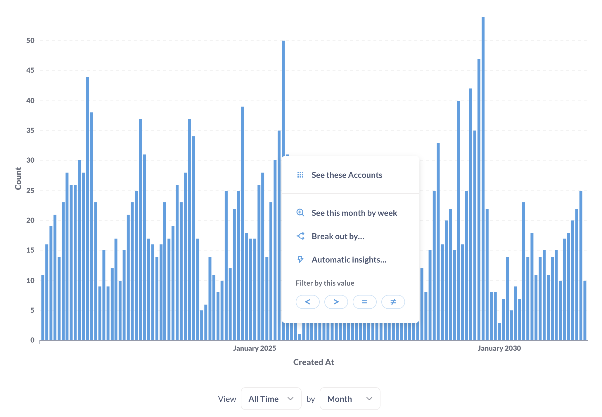
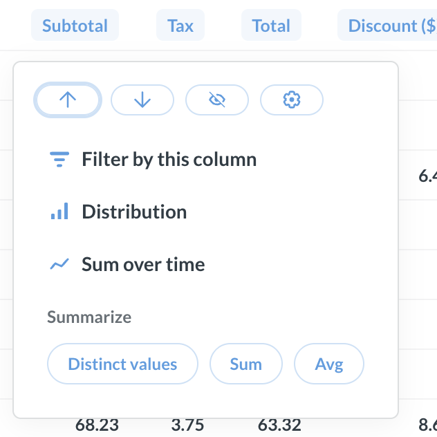

# Drill-through

Drill-through lets you explore data in your Metabase by clicking a chart, a column header, or a table cell. Each click opens a menu with options like **Filter by this value**, **See these records**, **Break out by**, and **Zoom in**. Selecting one of these options generates a new query and visualizes the result.

## How drill-through works

Every drill-through action creates a new query and visualizes the result. Metabase takes the original query and modifies it based on what you click. Switch to the editor to see and edit the new query.

For example, say a bar chart shows order counts summarized by product category and month. Click the April bar in the Widgets series, then select **See these orders**. Metabase creates a new question that filters the orders to Widgets in April.

Some things to keep in mind:

- **Drill-through requires query-building permissions.** You must have permission to create queries on the underlying data to see the drill-through menu.
- **The drill-through does not modify the original question.** Drill-through creates a new question without overwriting or modifying your original question.
- **The menu options depend on the type of data you click.** Different options appear in the action menu depending on whether you click a chart, a column header, a table cell, or a point on a map.

## Drill-through types

There are two types of drill-through:

- **Results-based drill-through:** Metabase takes the data in the query result and filters, distributes, or otherwise transforms it. Example options include **Filter by this value**, **Distribution**, and **Sort**. You can perform results-based drill-through on questions built with the query builder or native SQL.
- **Query-rewriting drill-through:** Metabase modifies your query. Example options include **See these records**, **Break out by**, and **Zoom in**. You can only perform query-rewriting drill-through on questions built with the query builder.

## Drill-through options

The drill-through menu options depend on what you click and on the underlying data.

### Tables

To drill-through a table, click either:

* Column headers
* Table cells

#### Column headers

| Option                                              | When it appears                                                          |
| --------------------------------------------------- | ------------------------------------------------------------------------ |
| **Filter by this column**                           | Any column                                                               |
| **Sort**                                            | Any column except JSON                                                   |
| **Distribution**                                    | Any column except primary keys, JSON, or description and comment fields  |
| **Sum / Average**                                   | Numeric columns when the query isn't summarized                          |
| **Distinct values**                                 | Any column when the query isn't summarized                               |
| **Sum over time**                                   | Numeric columns when the query has a date column and isn't summarized    |
| **Extract domain, host…** / **Extract day, month…** | URL, email, and date columns                                             |
| **Combine columns**                                 | Text columns                                                             |

#### Table cells

| Option                                        | When it appears                                                                              |
| --------------------------------------------- | -------------------------------------------------------------------------------------------- |
| **Filter by this value**                      | Any column except primary keys and foreign keys                                              |
| **View details**                              | Rows that have a primary key                                                                 |
| **View this [related record]**                | Foreign key values                                                                           |
| **View these [related rows]**                 | Foreign key values                                                                           |
| **View these records**                        | Aggregated values                                                                            |
| **Break out by [time / location / category]** | Aggregated values                                                                            |
| **Automatic insights**                        | Summarized queries, when [X-rays](../../exploration-and-organization/x-rays.md) are enabled  |

### Charts

To drill-through a chart, click either:

* Data points
* Legend items

> [Pivoted tables](./table.md#pivoted-tables) behave like charts. Cells in pivoted tables offer the same options as data points. This is different from the [pivot table visualization](./pivot-table.md), which offers a smaller subset of drill-through options.

#### Data points

| Option                                        | When it appears                                                                              |
| --------------------------------------------- | -------------------------------------------------------------------------------------------- |
| **Filter by this value**                      | Any column except primary keys and foreign keys                                              |
| **View these records**                        | Aggregated values                                                                            |
| **Break out by [time / location / category]** | Aggregated values                                                                            |
| **Automatic insights**                        | Summarized queries, when [X-rays](../../exploration-and-organization/x-rays.md) are enabled  |
| **Zoom in**                                   | Histograms, binned charts, and maps                                                          |
| **See this [period] by [smaller period]**     | Time series                                                                                  |

On a time series or other chart with a continuous axis, click and drag across a range to filter the question to those values. This works like **Filter by this value**, but for a range of data instead of a single data point.

#### Legend items

Clicking the colored circle on a legend item toggles the series on or off. Clicking the label on the legend item opens the drill-through menu.

Drill-through on a legend item applies to the entire series, not just one data point. For example, clicking **View these records** on a legend item shows all the rows for that series across the whole chart.

| Option                                        | When it appears                                                                              |
| --------------------------------------------- | -------------------------------------------------------------------------------------------- |
| **View these records**                        | Aggregated values                                                                            |
| **Break out by [time / location / category]** | Aggregated values                                                                            |
| **Automatic insights**                        | Summarized queries, when [X-rays](../../exploration-and-organization/x-rays.md) are enabled  |
| **Zoom in**                                   | Histograms, binned charts, and maps                                                          |
| **See this [period] by [smaller period]**     | Time series                                                                                  |

## Drill-through and native SQL

When you create a query with the query builder, Metabase can read and modify your query for any drill-through action. 

When you write a query with the native SQL editor, Metabase runs your query but doesn't parse it. It can modify the results, but it can't modify the query itself. This means you can use results-based drill-through, but not query-rewriting drill-through. For example:

| Works on native SQL questions | Doesn't work on native SQL questions |
| ----------------------------- | ------------------------------------ |
| **Filter by this value**      | **See these records**                |
| **Distribution**              | **Break out by**                     |
| **Sort**                      | **Zoom in**                          |

> To use drill-through on a native SQL question, you must save the question.

For more information, see [drill-through types](#drill-through-types).

### Make native SQL questions interactive

Drill-through can't rewrite a native SQL query, but you can still make a native SQL chart interactive using [custom click behavior](../../dashboards/interactive.md#customizing-click-behavior). Add the question to a dashboard, and set a click behavior on the card.

A custom click behavior replaces the drill-through menu with an action you define. It can send you to another question, dashboard, external URL, or update a filter on the current dashboard. Set a [dashboard filter](../../dashboards/filters.md) to the clicked value to scope the destination.

### Combine native SQL with full drill-through

If you need native SQL but also want to use the full drill-through menu, write your SQL query as a [transform](../../data-studio/transforms/transforms-overview.md) and build the user-facing question with the query builder.

Write the transform's SQL to return the individual records, not summarized results. Build questions on the transform's table with the query builder. These questions support the full drill-through menu.

Drill-through actions can only reach data that the transform's table contains.

> To create transforms, you must have transform permissions. If you use Metabase Cloud, you must also have the [transform add-on](../../data-studio/transforms/addons.md).

## Drill-through and embedding

Drill-through behavior depends on the [embedding type](../../embedding/start.md), because drill-through requires a Metabase user with query permissions.

| Embedding type                      | Drill-through                                         |
| ----------------------------------- | ----------------------------------------------------- |
| **Authenticated modular embedding** | Full drill-through, scoped to the user's permissions  |
| **Guest modular embeds**            | No drill-through                                      |
| **Full app embedding**              | Full drill-through                                    |
| **Public embeds**                   | No drill-through                                      |

To turn off drill-through in modular embedding, use the **Allow people to drill through on data points** setting when you create the embed. In a dashboard, override drill-through on a single card with [custom click behavior](../../dashboards/interactive.md).

Use [modular embedding SDK plugins](../../embedding/sdk/introduction.md) to customize some drill-through menu options and click behavior in embedded apps.

## Alternatives to drill-through

On a dashboard, you can replace drill-through with a different click action:

- **[Custom click behavior](../../dashboards/interactive.md#customizing-click-behavior):** Send users to another question, dashboard, external URL, or update a filter on the current dashboard
- **[Cross-filtering](../../dashboards/interactive.md#use-a-chart-to-filter-a-dashboard):** Update a filter on cards across a dashboard

Setting one of these alternatives on a card replaces the drill-through menu for that card.