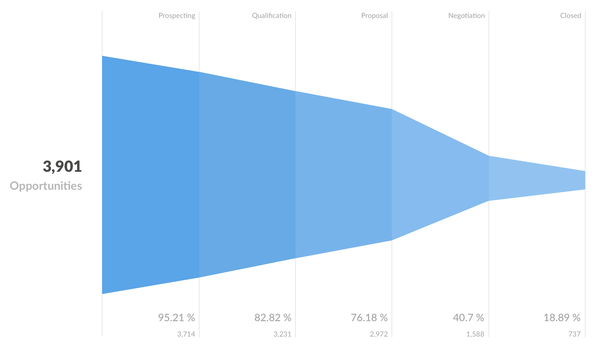

# Funnel charts

Funnel charts visualize how a value is broken out by a series of steps, and the percent change between steps.



Funnels are commonly used in e-commerce or sales to visualize how many customers are present within each step of a checkout flow or sales cycle. Funnels only make sense if the steps are sequential, with the metric dropping from one step to the next.

## Data shape for a funnel chart

To create a funnel in Metabase, you'll need to have a table with at least two columns: one column that contains the funnel's steps, and another column contains the metric you're interested in, like the number of customers at this step.

Here's the data shape used to create the chart above:

| Stage         | Opportunities |
| ------------- | ------------- |
| Leads         | 3901          |
| Qualification | 3714          |
| Prospecting   | 3231          |
| Proposal      | 2972          |
| Negotiation   | 1588          |
| Closed        | 737           |

If you have more columns in your query results, you can select which columns should be used for the funnel steps and the metric in the [data settings](#funnel-chart-settings).

By default, Metabase will present steps in the same order as they appear in the query result, but you can reorder or hide the steps in the [data settings](#funnel-chart-settings).

## Build a query for a funnel chart

To create a query with a result that has the shape required for a funnel chart, you'll probably need to summarize your data.

If your (original, unaggregated) data already contains a field with the the step for every data point, you can build a simple query with a breakout by steps:


If data for the different steps of the funnel comes from different tables, or if you need to use different filters or aggregation rules for each step, you can create separate questions for each step, and then combine them with a SQL query.

For example: you could create three separate [query builder](../query-builder/editor.md) questions, each returning the counts for `Leads`, `Qualification`, and `Proposal` stage. Then you'd write a [SQL query](../native-editor/writing-sql.md) that [references those questions](../native-editor/referencing-saved-questions-in-queries.md) and uses `UNION` to return results in the right shape to build a funnel chart.

```sql
-- example of a query that retrieves results of questions and combines them with UNION

SELECT 'Leads' as step, * from {{#120-leads}}
UNION
SELECT 'Qualified' as step, * from {{#121-qualified}}
UNION
SELECT 'Prospects' as step, * from {{#122-prospects}}

```


## How to read a funnel chart

Funnel charts show the value of the metric for each step, and how the metric compares to the value at the _first_ step. The first step's metric is displayed to the left of the chart.


So for example,"76.19\%, 2,972" under a step means that the value of the metric at this step is 2,972, which is 76.19\% of the value of the _first_ step (equal to 3,901).

To see percentage comparison with the _previous_ step (instead of the first), hover over the step and read the tooltip.

## Funnel chart settings

To open chart settings, click on the **Gear** icon in the bottom left.


If you have more than two columns in your query results, you can select which columns should be used for the funnel steps and the measure in the **Data** tab.

You can reorder funnel steps by dragging and dropping, or hide a step by clicking on the **Eye** icon on the step card.

To edit the formatting of the metric, click on **Three dots** next to the metric. The formatting will only apply to the _metric itself_, but _not_ to the percentage values that compare each step's metric to the first step (which currently you can't format).

## Limitations and alternatives

Currently, you can't change the color or orientation of the funnel, or add breakouts. Consider using a [bar or row chart](./line-bar-and-area-charts.md) for more flexible visualization options.
