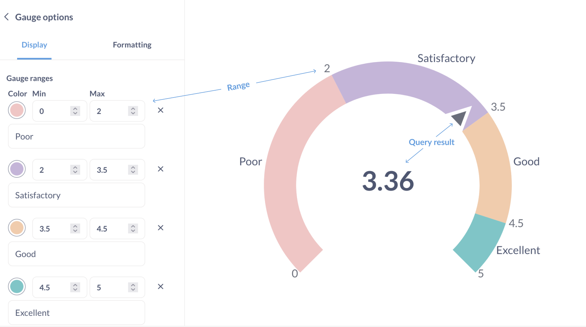
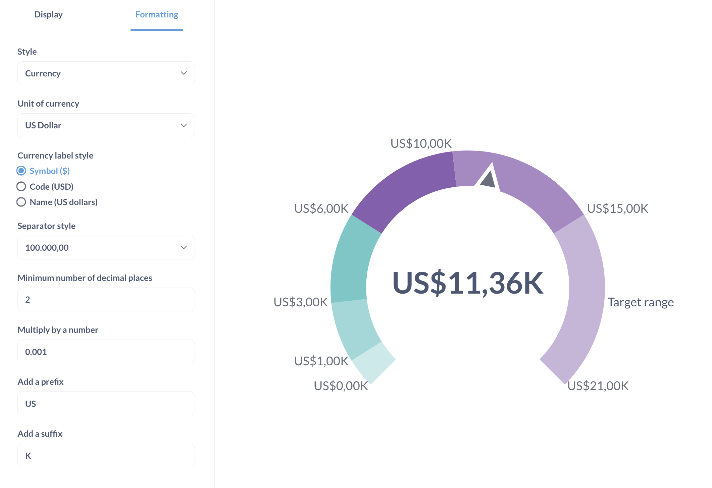

# Gauge chart

Ah, **gauges**: you either love 'em or you hate 'em. …Or you feel "meh" about them, I guess. Whatever the case, gauges allow you to show a single number in the context of a set of colored ranges that you can specify.

## When to use a gauge chart

A gauge chart is useful when you want to show progress or status across different categories.
They're helpful for performance metrics, risk assessments, or any metric that has distinct thresholds.

## How to create a gauge chart

To build a gauge chart, you'll need:

- A query that returns a single number:

  | Sum of Quantity |
  | --------------- |
  | 4910            |

  You can also use a query that returns several metrics in a single row:

  | Sum of Quantity | Average Quantity | Max Quantity |
  | --------------- | ---------------- | ------------ |
  | 4910            | 17.32            | 173          |

  In this case, the gauge chart will use the metric in the first column ("Sum of quantity"). To change the metric, go to the editor and drag the metric you want to the first position in the Summarize block.

- One or more ranges for the metric, for example "Low", "Medium", "High". Currently, Metabase only supports defining static ranges (you can't set range boundaries based on another query).

## Gauge chart settings

You can set the ranges, their colors, and optional labels in chart settings.

To open the chart setting, click on the gear icon at the bottom left of the screen.

Format options will apply to both the result of the query and the range boundaries:

In particular, the gauge chart will apply the "Multiply by a number" option to the range boundaries. So if you want to show a range from 2000 to 4000 on the chart, you can set "Multiply by a number: 1000", then set the underlying range to be from 2 to 4.

Selecting “Style: Percent” in format options will only change how Metabase formats the results. For example, `17` will be formatted as `1700%`. If you instead want to display the query result as a percentage of the _total_ range of the chart, you’ll need to calculate that percentage in your query. Another example: to display the count of orders as a percentage of 20, use custom expressions to return “Count of orders divided by 20”, and format the result as a percentage.

## Limitations and alternatives

- If you want to show progress of a metric within a single range, consider using the [progress bar](./progress-bar.md) instead.

- Metabase doesn't support setting alerts for when a metric moves from one region of the gauge chart to another. Consider using a [progress bar](./progress-bar.md) to create an alert when your metric reaches a certain value.

- Gauge charts don't support breakouts. Depending on your use case, consider using a [bar chart with a goal line](./line-bar-and-area-charts.md#goal-lines).

- Gauge chart ranges can't be set based on results of another query.
