# Line charts, bar charts, and area charts

Line, bar, and area charts plot values across an x-axis. Pick the type that matches what you want to show:

- **Line chart**: Show how a number changes over time. Use a line chart when you have many x-axis values, since lines stay readable where bars become crowded.
- **Bar chart**: Compare values across categories, or a smaller number of values over time. Bar charts make individual values easier to read and compare than line charts.
- **Area chart**: Show how much each series contributes to a total over time. Stack the areas to see the total across series as well as the individual series.

You can set the display type separately for each series on a chart. A single chart that mixes types is a [combo chart](#combo-charts).

## Line charts

**Line charts** are best for displaying the trend of a number over time, especially when you have lots of x-axis values.

Line charts also work for non-time sequences, like steps in a workflow. Set the x-axis scale to Ordinal in the [axes settings](#axes-settings).

On a dashboard, pair a line chart with a [trend chart](./trend.md) to make the latest value easy to read.

### Filter out incomplete time periods

If your data includes the current period, a time series can end in a misleading drop, because the most recent day, week, or month only has partial data. To avoid this, add a filter on your date column and turn off the option to include the current period.

## Bar charts

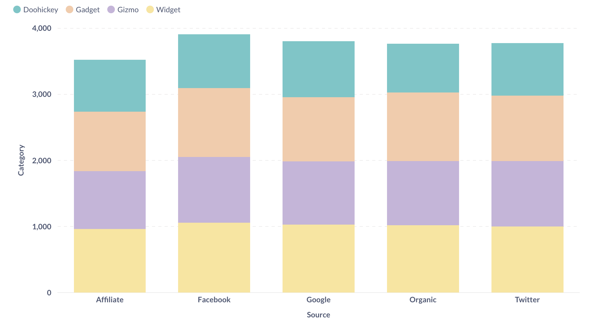



If you're trying to group a number by a column that has a lot of possible values, like a Vendor or Product Title field, try visualizing it as a **row chart**. Metabase will show you the bars in descending order of size, with a final bar at the bottom for items that didn't fit.

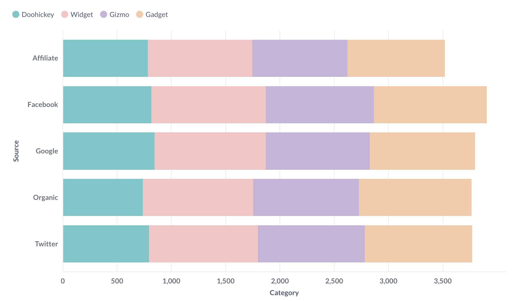

### Histograms

A bar chart grouped by a number is a histogram. Where a regular bar chart compares categories, a histogram shows the distribution of values across a continuous range. Each bar covers a range of values, called a bin, and its height represents the count of records in that bin.

To change the number of bins, see [summarizing and grouping](../query-builder/summarizing-and-grouping.md).

Metabase sets the x-axis scale to **Histogram** automatically, so the bars sit flush against each other to show a continuous range.

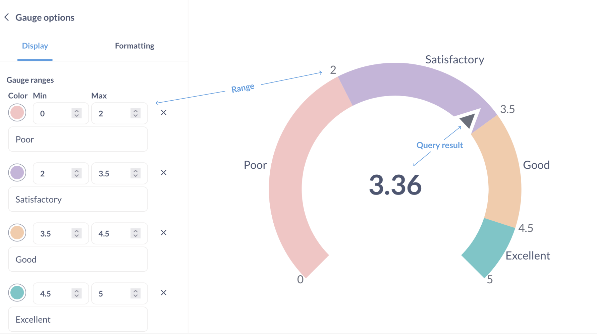

## Area charts

**Area charts** are line charts with the area under each line filled in. [Stack them](#stacking) to compare how much each series contributes to a total.

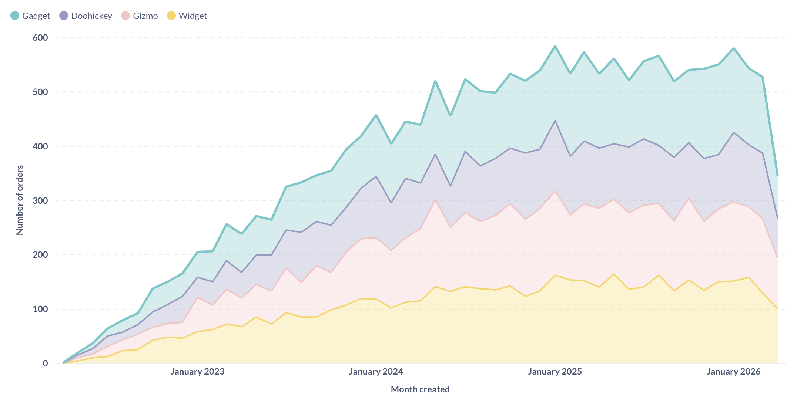

## Combo charts

Combo charts let you combine bars and lines (or areas) on the same chart. Use a combo chart to plot two metrics with very different ranges, like order count against total revenue.

By default, Metabase displays one series as a line and another as a bar. To set the display type for each series, or set the colors for each series, see [Change the display type for a series](#change-the-display-type-for-a-series).

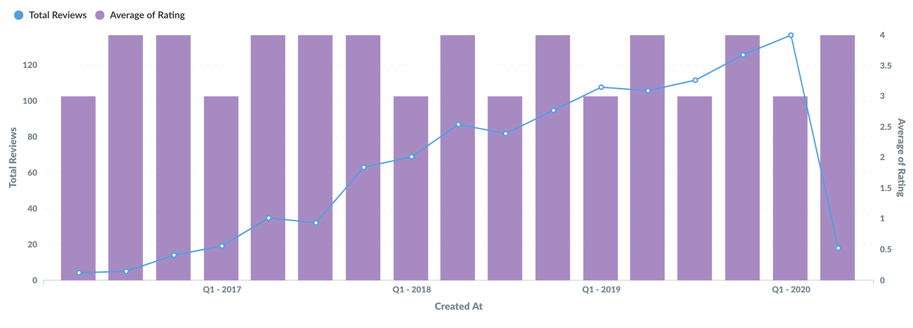

To use a combo chart, your question must have either:

- Two or more metrics in the **Summarize** section, with one or two groupings.

  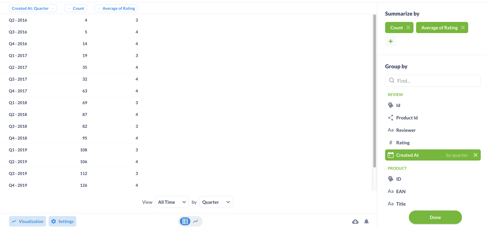

- One metric with two groupings.

  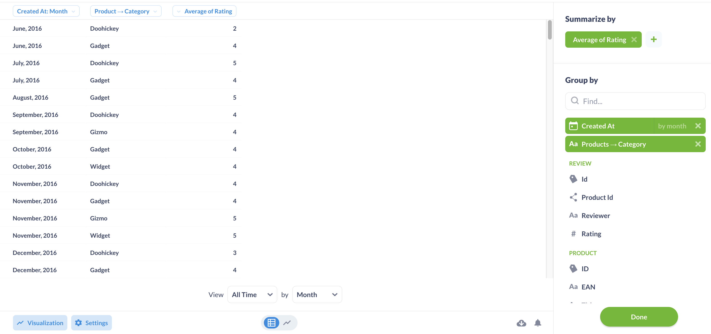

## Change the display type for a series

You can set the display type for each series independently of the chart type. For example, on a bar chart you can display one series as a line.

In the **Data** tab, click the three-dot menu (**...**) next to a series, then select a **Display type**.

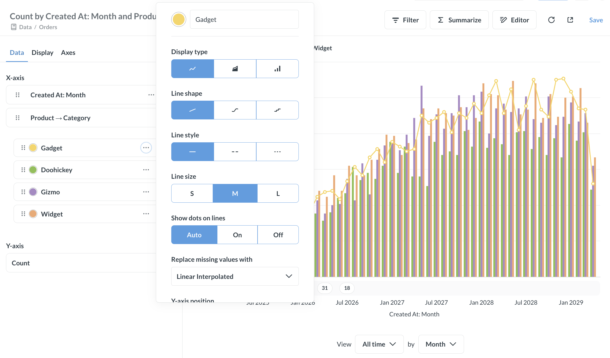

## Settings for line, bar, and area charts

To open the chart settings, click the **gear** icon in the lower left of the chart. Settings are split across three tabs:

- [Data settings](#data-settings)
- [Display settings](#display-settings)
- [Axes settings](#axes-settings)

## Data settings

In the **Data** tab, you can:

- Show or hide a series.
- Reorder the series in the chart's legend.
- Set options for individual series.

### Series options

To set options for a series, click the three-dot menu (**...**) next to the series in the **Data** tab.

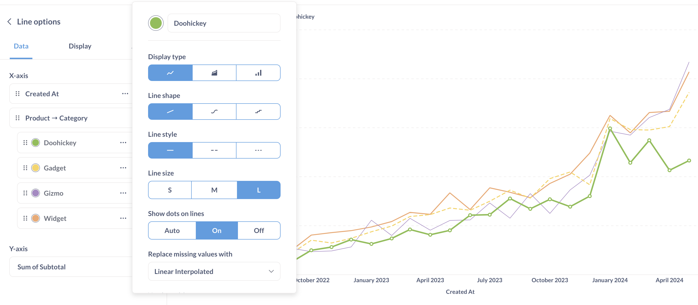

For each series, you can set:

- Color
- [Display type](#change-the-display-type-for-a-series)
- Y-axis position: Auto, Left, or Right
- Whether to show a trend line for the series
- Whether to show values for the series

For line and area series, you can also set:

- Line shape
- Line style
- Line size: Small, Medium, or Large
- Whether to show dots on the lines (the dots represent the actual data points plotted on the chart)
- How to replace missing values: Zero, Nothing (just a break in the line), or Linear interpolated

## Display settings

Use the **Display** tab to set:

- [Stacking](#stacking)
- [Stack series](#stack-series)
- [Goal lines](#goal-lines)
- [Trend lines](#trend-lines)
- [Values on data points](#values-on-data-points)
- [Autoformatting](#autoformatting)

### Stacking

On bar and area charts, you can stack series on top of each other within a single chart. In the **Display** tab, set **Stacking** to:

- **Don't stack**: Display each series separately.
- **Stack**: Show the total across series.
- **Stack - 100%**: Show each series' share of the total.

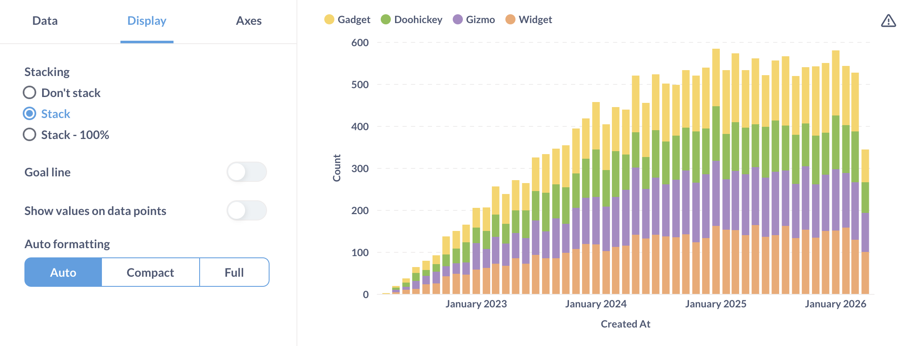

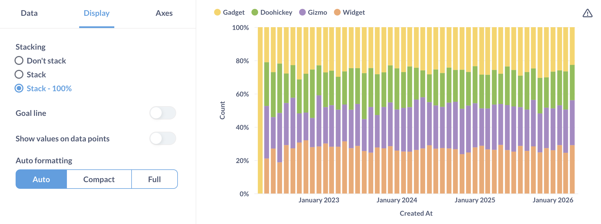

### Stack series

In the **Display** tab, turn on **Stack series** to plot each series in its own panel. The panels stack vertically, and each gets its own y-axis.

To use Stack series, your question must have either:

- **Multiple breakouts**: at least two entries in the grouping block in the query builder or `GROUP BY` clause in SQL.
- **Multiple metrics**: at least two entries in the summarize block, or two aggregation functions in the `SELECT` statement.

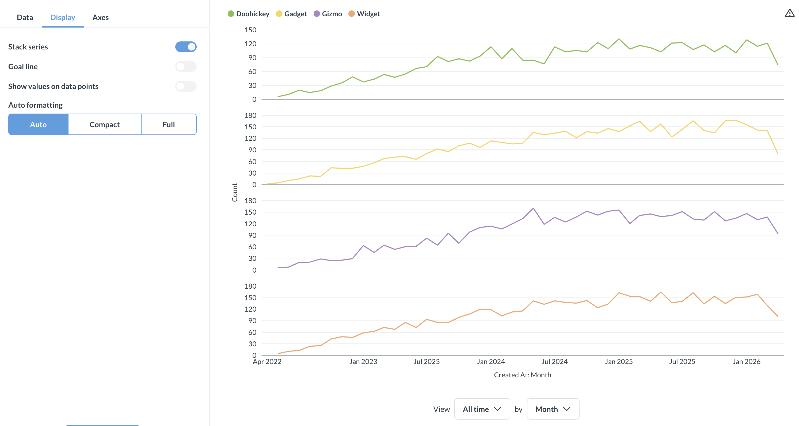

You can mix bar, line, and area types across panels. See [Change the display type for a series](#change-the-display-type-for-a-series).

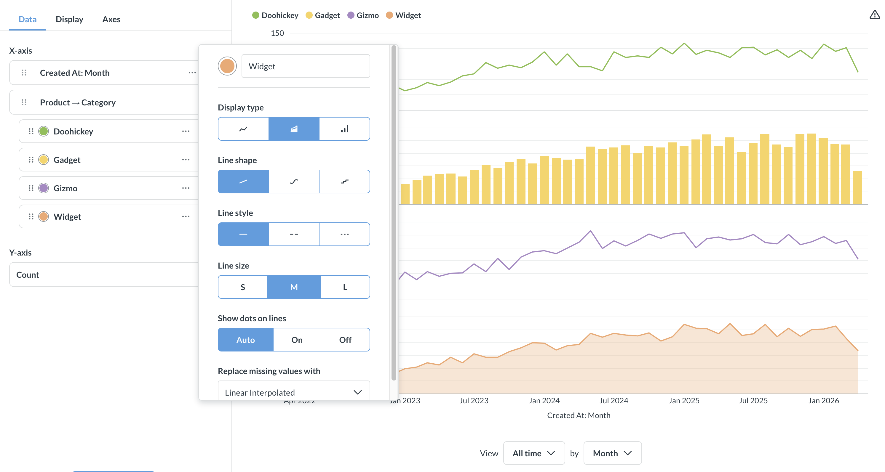

When you enable **Stack series**, the **Stacking** options are hidden.

### Goal lines

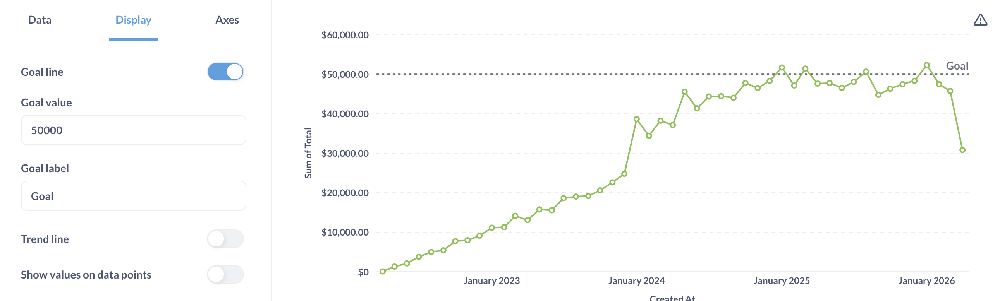

Goal lines can be used in conjunction with [alerts](../alerts.md) to send an email or a Slack message when your metric crosses this line.

### Trend lines

A trend line shows the general direction of a series over time. Metabase picks the line that best fits your data.

To add a trend line, group your question by a time field and enable the **Trend line** toggle in the **Display** tab.

You can also turn the trend line on or off for individual series. In the **Data** tab, click the three-dot menu (**...**) next to a series and use the **Show trend line for this series** toggle.

Trend lines work with multiple metrics, but they don't work if your question has more than one grouping.

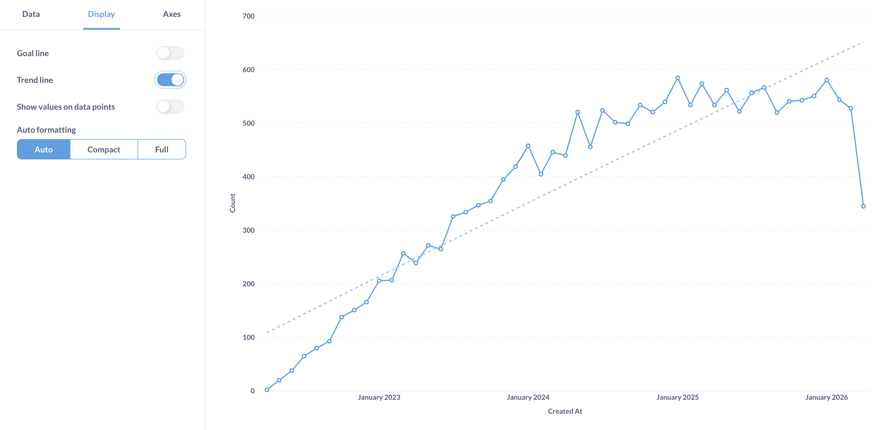

### Values on data points

To label points on your chart, enable the **Show values on data points** toggle in the **Display** tab. In **Values to show**, choose either **All** or **Some**. When you choose **Some**, Metabase picks which values to display to keep the chart legible.

When values are on, you can turn them off for individual series. In the **Data** tab, click the three-dot menu (**...**) next to a series and disable the **Show values for this series** toggle.

### Autoformatting

For displaying numbers on the chart, Metabase can truncate the numbers to make the chart more legible. For example, Metabase will truncate 42,000 to 42K.

## Axes settings

Here you'll find additional settings for configuring your x and y axes (as in axis, not battle axe).

### X-axis

- Show label (the label for the axis).
- Rename the axis.
- Show lines and tick marks: **Hide**, **Show**, **Compact**, **Rotate 45°**, or **Rotate 90°**.
- Scale: **Timeseries**, **Linear**, **Histogram**, or **Ordinal**, depending on what you group by. Ordinal lists every value in the series along the x-axis. Use ordinal when you're plotting steps in a sequence.

### Y-axis

- Show label (the label for the axis).
- Rename the axis.
- Split y-axis when necessary.
- Auto y-axis range. When not toggled on, you can set the y-axis range (its **Min** and **Max** values).
- Scale: **Linear**, **Power**, or **Log**. Use a log scale to show the rate of change over time, like when your data grows or shrinks exponentially.
- Show lines and tick marks: **Hide** or **Show**.
- Number of tick marks.

## Chart legend

For charts with multiple series or breakouts, the chart legend displays the label and color of each series.

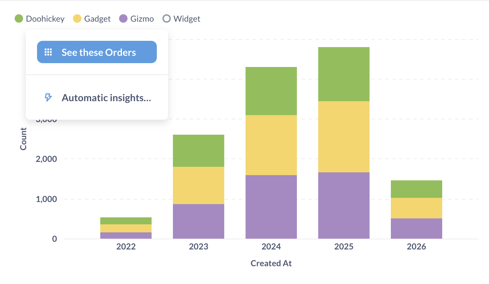

You can change the color and label for each series and reorder them in [data settings](#data-settings).

You can use the legend to:

- Highlight a series, by hovering over the name of the series in the legend.
- Hide the series, by clicking on the color circle for the series.
- Drill down to individual records for aggregated series, by clicking on the series name.

To permanently hide the series from the chart, use the [data settings](#data-settings).

You can also select a range on the chart to filter results to a specific time period, then drill through to the individual records.

You can't hide the legend or change its position on the chart.

## Further reading

- [Summarizing and grouping](../query-builder/summarizing-and-grouping.md)
- [Trend charts](./trend.md)