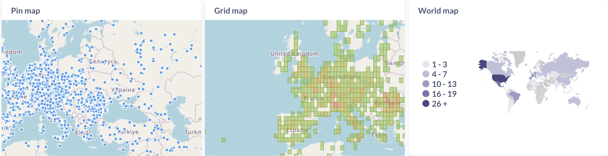
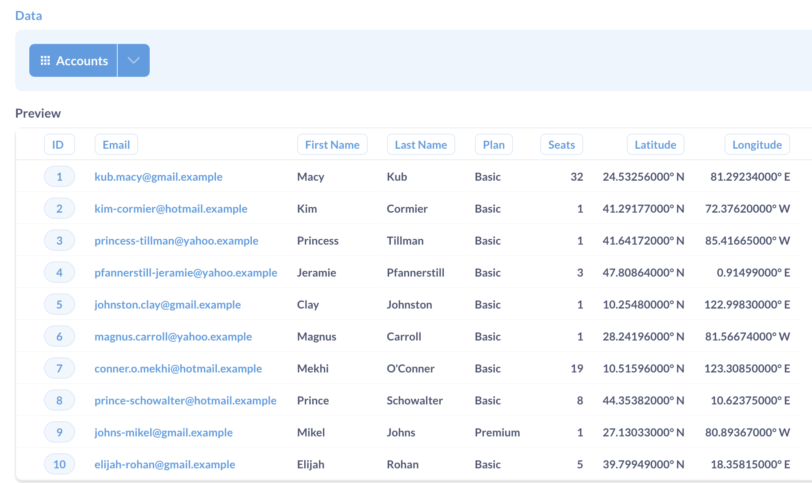
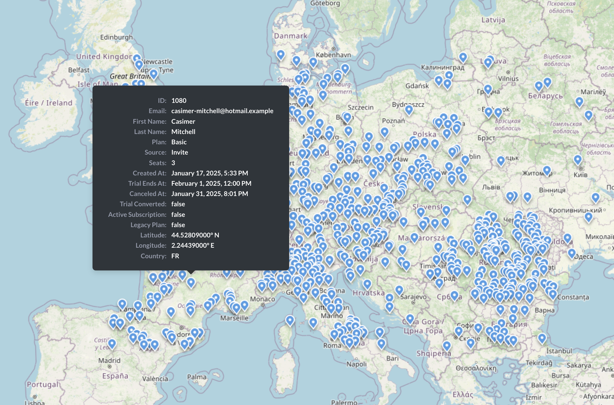
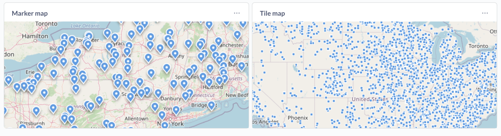
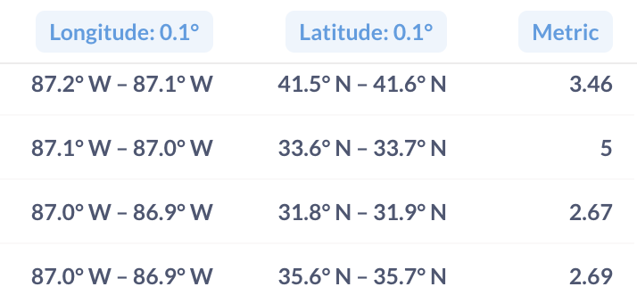
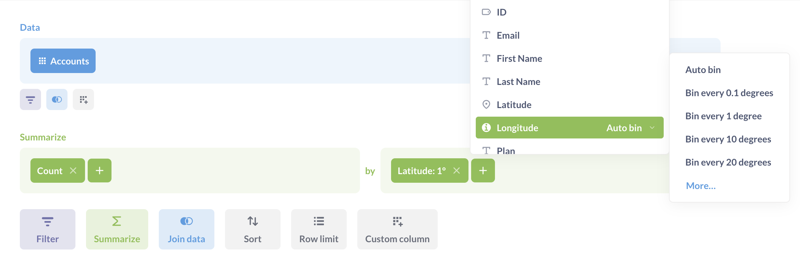
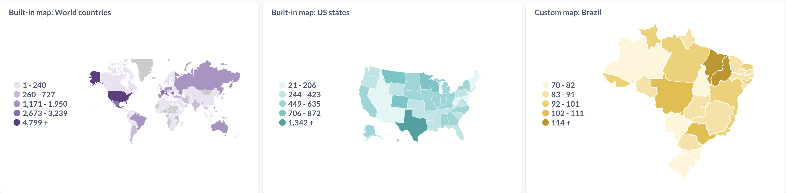
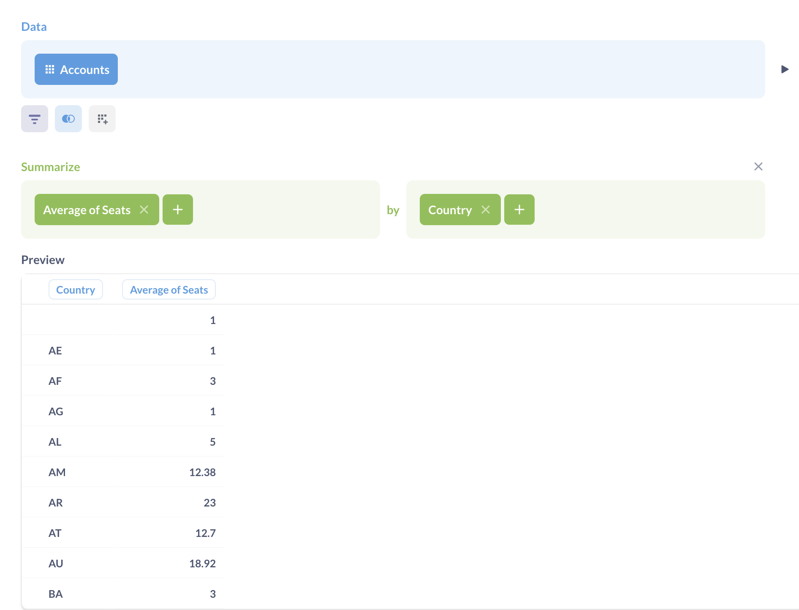
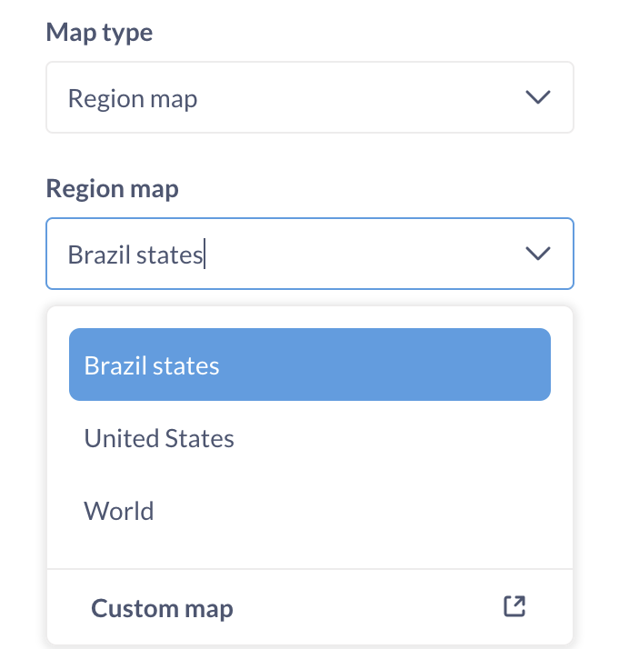
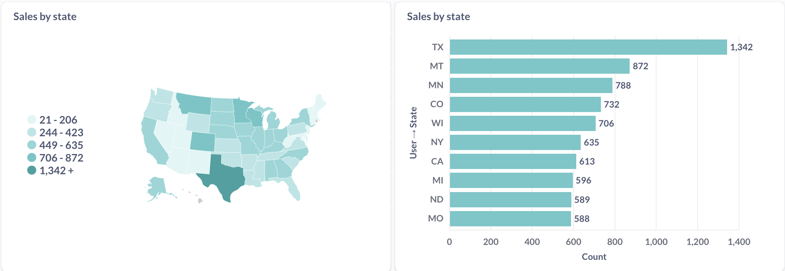

# Maps

Metabase has three types of map visualization:

- [**Pin map**](#pin-map) for putting individual data points on a map using longitude and latitude coordinates;
- [**Grid map**](#grid-map) for distributing a large number of points over a specified area.
- [**Region map**](#region-maps) for data broken out by regions, like countries or states. Metabase comes with two built-in maps, but you can upload your own custom regions.

When you select the **Map** visualization setting, Metabase will automatically try and pick the best kind of map to use based on the table or result set, as long as the columns with the geographic data have the [right metadata](../../data-modeling/metadata-editing.md).



## Pin map

Pin maps display markers or tiles for individual data points on the map. They work best for displaying small amounts of unaggregated geographic data.

### Pin map data shape

To build a pin map, you need a query that returns a result that has latitude and longitude columns. Metabase will put one pin on the map for each row in your table, based on the latitude and longitude fields. Other data in the rows will be shown in the tooltip, and won't otherwise affect the placement or shape of pins.

Note that the tooltips will only be displayed when using the [marker pin type](#choose-pin-type).

### Create a pin map

To create a pin map:

1. Build a query with latitude and longitude columns for each data point (either in the query builder or using SQL);
2. Select **Visualization**, and pick **Map**;
3. If your query results have columns whose field type is set to latitude/longitude in [table metadata](../../data-modeling/metadata-editing.md#semantic-type), Metabase should build a pin map automatically.

   Otherwise, click on the **Gear** icon to go to visualization settings, choose **Map type: Pin map**, and pick columns that contain latitude and longitude coordinates.

### Choose pin type

Metabase can display individual data points on a map as markers or tiles (small squares).

Maps default to markers for results fewer then 1,000 rows, and to tiles for results with 1,000 rows or more.

To change the pin type:

1. While viewing the map, click the **gear** icon in the bottom left.
2. In the visualization settings, choose the pin type in the **Pin type** dropdown.
   - **Markers**. Maps display up to 1,000 markers. If you choose the marker pin type for results with more than 1,000 rows, Metabase will still only display 1,000 markers. Maps default to markers for results fewer then 1,000 rows.
   - **Tiles**. Maps display up to 2,000 tiles. Maps default to tiles for results greater than 1,000 rows. Tooltips will not be displayed for tiles.

By default, maps can't display more than 2,000 individual unaggregated data points, regardless of the pin type. This limit is the same for every chart displaying unaggregated data in Metabase. To increase the number of data points rendered on charts based on unaggregated queries, you can use the environment variable [`MB_UNAGGREGATED_QUERY_ROW_LIMIT`](../../configuring-metabase/environment-variables.md#mb_unaggregated_query_row_limit). This setting will affect data points on _all_ charts—not just the pin maps—so increasing the limit too much could significantly slow down your Metabase and your browser.

If you need to display a large number of geographic data points, consider using a grid map to display the distribution instead.

## Grid map

Grid map is an aggregated version of the pin map — like a heatmap for the distribution of pins. Grid map breaks the map into a grid based on latitude/longitude, and then colors each grid cell based on how many data points fall in it.

### Grid map data shape

To create a grid map, you need to have a query returning a metric summarized by binned latitude/longitude coordinates.

If you're writing a query in the query builder, you can choose how to bin latitude/longitude in the **Group by** block. If you're writing a query in SQL, you'll need to add binning logic yourself.

### Create a grid map

To create a grid map:

1. Build a query with summary by binned latitude and longitude columns (either in the query builder or using SQL);
2. Select **Visualization**, and pick **Map**;
3. If your query results have columns whose field type is set to latitude/longitude in [table metadata](../../data-modeling/metadata-editing.md#semantic-type), Metabase should build a grid map automatically.

   Otherwise, click on the **Gear** icon to go to visualization settings, choose **Map type: grid map**, and pick columns that contain latitude and longitude coordinates.

4. If your query contains several metrics, you can pick the one you want to display in visualization settings.

## Region maps

Region maps display a distribution of aggregated data broken out by regions, like count of users by country.

Metabase comes with two built-in regions: [world map](#world-map) with countries, and the [Unites States map](#united-states-map) with states. Admins can [add custom regions](#custom-regions) in Admin setting.

You can disable the default regions by setting the environment variable [`MB_DEFAULT_MAPS_ENABLED`](../../configuring-metabase/environment-variables.md#mb_default_maps_enabled).

### Region map data shape

To build a region map, you need a query (either a question built with the query builder, or a native query) with at least two columns: the column with the region name and the column with the metric that you want to display by region.

The region name in the query results must be an exact case-sensitive match to the region name: two-letter country code for world maps, two-letter state code or state name for the United States map, or the [region identifier](../../configuring-metabase/custom-maps.md) in the custom region.

To build a region map, you must have a column with a region name in your query results, even if your query results also have latitude/longitude coordinates. Metabase can't infer regions from latitude/longitude coordinates, and doesn't check whether the coordinates of a datapoint are consistent with the region for that data point.

### Create a region map

To create a region map:

1. Build a query with summary by region name (either in the query builder or using SQL).
2. Select **Visualization**, and pick **Map**;
3. Choose **Map type: region**;
4. Pick the region map: world map (built-in), United States (built-in), or
5. Pick the column with the region name in **Region field**
6. If your query contains several metrics, you can pick the one you want to display in **Metric field**.

You can change the base color used for the region map, but you can't currently use custom color gradients (for example, red to green), or change how Metabase bins the metric.

### World Map

To visualize your results in the format of a map of the world broken out by country, your result must contain a column with [two-letter ISO country codes](./country-codes.md), like "US" or "BR", or country names like "United States of America" or "Brazil". For example:

| Country code | Metric |
| ------------ | ------ |
| US           | 36     |
| BR           | 25     |
| IN           | 62     |
| RO           | 78     |

The country codes in the query results must match the two-letter codes exactly: if the country codes are lowercase or contain extra spaces, Metabase won't recognize them.

If your query result has columns with [semantic type](../../data-modeling/metadata-editing.md#semantic-type) "Country", Metabase should build a world map automatically. Otherwise, you can choose which columns to use as the country name in the **Region field** visualization setting.

You can connect the country column in the world region map to a "Location" type dashboard filter.

### United States map

Creating a map of the United States from your data requires your results to contain a column that contains names of states or two-letter state codes, for example "NM" or "New Mexico", for example:

| State      | Metric |
| ---------- | ------ |
| California | 45     |
| New York   | 56     |
| Texas      | 34     |
| Illinois   | 67     |

If your query result has columns with [semantic type](../../data-modeling/metadata-editing.md#semantic-type) "State", Metabase should build a US map automatically. Otherwise, you can choose which columns to use as the country name in the visualization settings.

You can connect the state column in the US region map to a "Location" type dashboard filter.

### Custom regions

Admins can add more regions - like Brazil states or NYC neighborhoods - by [adding custom GeoJSON maps](../../configuring-metabase/custom-maps.md) in **Admin settings**. Once custom maps have been added, you'll be able to select them when building a region map in map settings.

Your query results must contain a column with values that match the _region identifier_ property in the custom map setting (not the region display name).

If you want to connect the region column in a custom region map to a dashboard filter, you'll need to use a "Text or Category" - not "Location" - dashboard filter type.

## Working with maps

### Drill-through

- **Pin map**: If the pin is linked to other tables, or there's too much information to fit in the tooltip, clicking on the pin will take you to a details page that displays a list of fields, as well as a list of connected tables.
- **Grid map**: If you click on a grid cell, you'll get an option to zoom in further into a cell.
- **World region map and US states region maps**: If your unaggregated data also contains latitude/longitude coordinates for each data point (in addition to the region name), then you'll get an option to zoom into a specific region, which will create a grid map of data points in that region binned by latitude/longitude. This only applies to the built-in region maps, not custom region maps.

### Set as default view

On pin and grid maps, the map resets to the default view every time the page is refreshed. To control what is displayed when someone opens a map (e.g. center around a specific point, with a specific level of zoom), adjusted your map orientation. This will be the new default view that the map returns to after a page refresh.

### Draw box to filter

On pin and grid maps, filter boxes allow you to zoom in or filter data by a specific area.

You can click **Draw box to filter** and mouse over the map. To outline a section of the map, hold your mouse down and drag across the map to create a transparent blue box. Once you've outlined your target area, release your mouse, and your map will update to filter for data in the selected area. If you've set a default view, the view will remain stationary. If no default view is set, the view will zoom in on the selected area.

Drawing a box will add filters to your query.

## Customizing map tiles

Admins can customize the background tiles that are used for pin and grid maps, see [Changing the Map tile server](../../configuring-metabase/custom-maps.md#map-tile-server).

Currently, Metabase uses a single tile server per instance. You can't specify different tiles for different maps.

## Limitations

- Currently, you can't customize the following visualization settings on maps:

  - The color or pins on a pin map;
  - The color of bins on the grid map;
  - The number of size of bins for region maps.

- You can't combine different types of maps. For example, you can't put pins on a region map.
- You need to use category (not location) dashboard filter types when connecting custom region maps to dashboard filters.
- You can't specify different background tiles for different maps.

## When NOT to use a map to visualize geographic data

If the relative locations of regions on the map aren't the main focus of your visualization, consider using a bar or row chart instead. For example, sales by state are often better represented as a row or bar chart rather than a region map.

