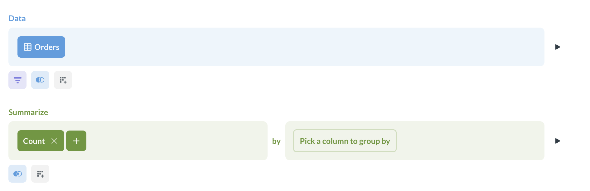
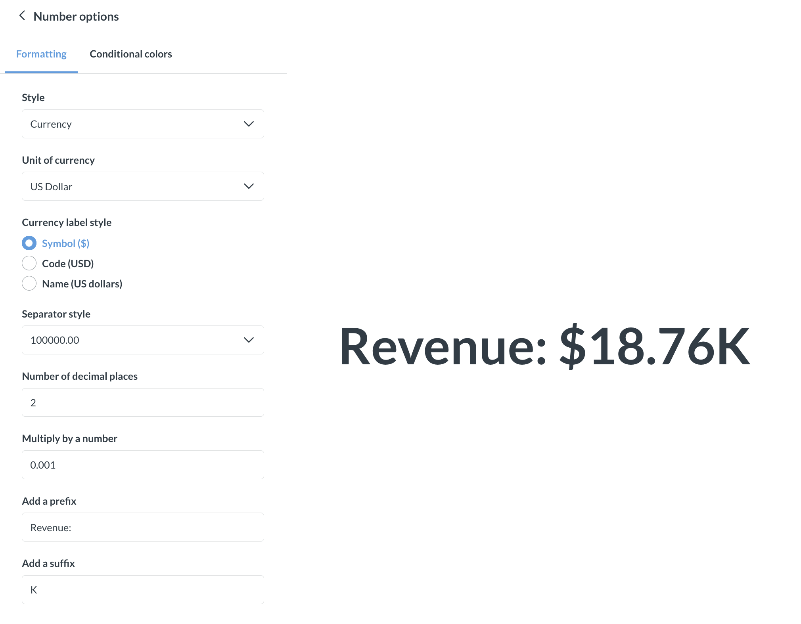
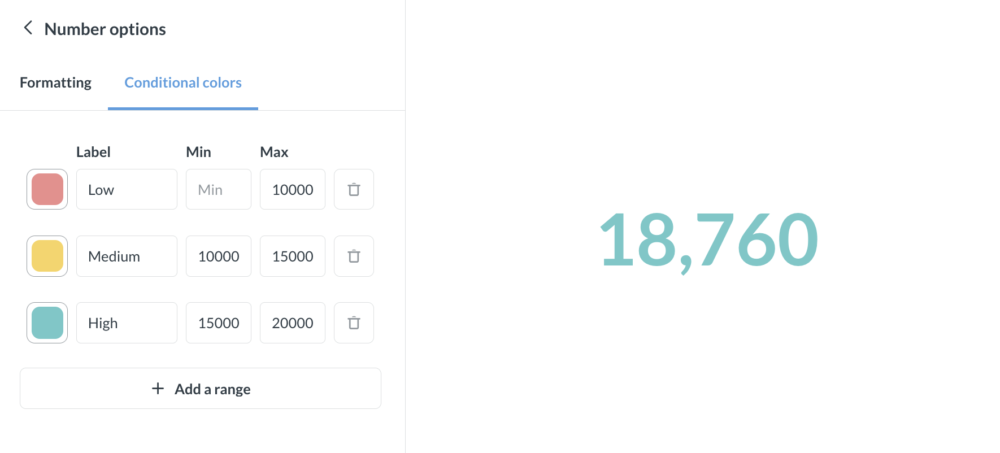

# Numbers

The **Numbers** option is for displaying a single number, nice and big.

If you also want to display the change in the number from period to period, you can use the [Trend chart](../visualizations/trend.md) instead.

## Create a number chart

To create a number chart, you need a query that returns a single record with at least one number in it, like "Count of orders".

1. Build a query that returns at least one number. You can build it either in the [query builder](../query-builder/editor.md) or in the [native query editor](../native-editor/writing-sql.md).

   

2. Run the query:

   - If you're in the query builder, click "Visualize";
   - If you're in the native editor, click "Run query".

3. If the "Number" visualization has not already been applied by default, change the visualization type by clicking on the **Visualization** button in the bottom left and selecting "Number" from the sidebar.

   

4. If your query returns multiple values, you might need to manually select which value to display as the big number. Open visualization setting by clicking on the **gear** button in the bottom left, and select the **Field to show** in the **Formatting** settings.

## Number chart settings

To open the chart settings, click on the **Gear** icon at the bottom left of the screen.

### Formatting options

You can use formatting options to do things like:

- **Adding character prefixes or suffixes** to it (so you can do things like put a currency symbol in front or a percent at the end),
- **Setting the number of decimal places** you want to include
- **Multiplying your result by a number** (like if you want to multiply a decimal by 100 to make it look like a percent). If you want to _divide_ by a number, then just multiply it by a decimal (e.g, if your result is `100`, but you want it to display as `1`, simply multiply it by 0.01).
- ...and others:

  

### Conditional colors

You can tell Metabase to change the color of the big number based on the number's value (for example, make the number red if the value is less than 50, and green if it's more than 50).

Go to the **Conditional colors** tab option in chart settings and add the intervals and the corresponding colors. You can leave the lower and/or upper bounds empty.

