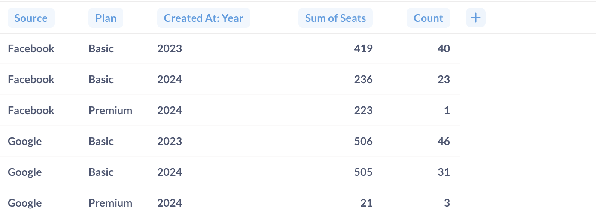
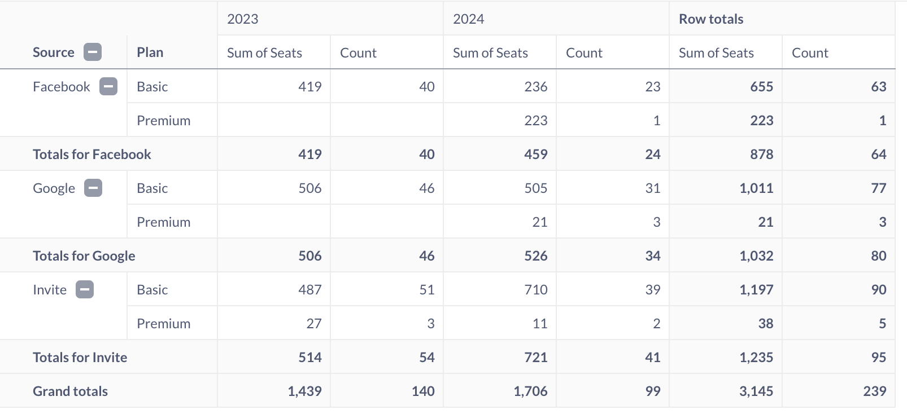
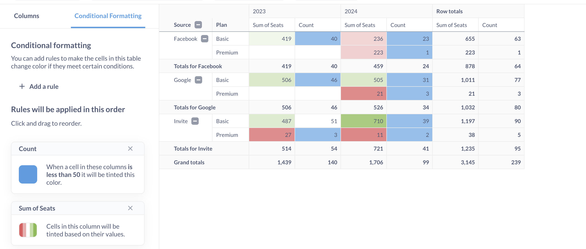
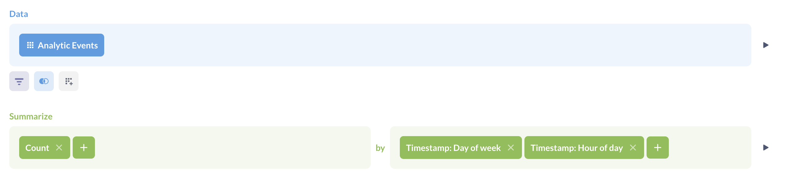
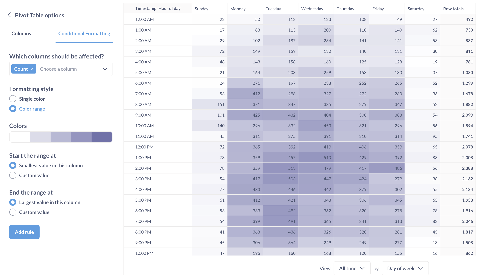

# Pivot tables

> Pivot tables are currently only supported for questions built in the [query builder](../query-builder/editor.md). Pivot tables are not supported for NoSQL databases like MongoDB.

Pivot tables allow you swap rows and columns, group data, and include subtotals in your table. You can group one or more metrics by one or more dimensions.



## Pivot tables vs. regular tables

Your typical, basic table is a grid of cells. Every dimension (also known as attribute, "group by") is represented by a column. Each record is represented as a row. For example, in the table below, `Source`, `Plan`, and `Created at` are dimensions/attributes for metric values `Sum of Seats` and `Count`:

A pivot table is a table that has dimensions in both rows and columns, and metric values in the cells. Pivot tables can include summary rows with totals across for those dimensions:

The reason they're called pivot tables is because you can rotate ("pivot") a column 90 degrees so that the values in that column become column headings themselves. Pivoting values into column headings is useful when analyzing data across multiple attributes, like time, location, and category. You can pivot multiple rows to columns and vice versa, or not pivot any at all.

Pivot table is the only Metabase visualization type (besides the plain table, of course) can display several metrics simultaneously along several dimensions.

## How to create a pivot table

To create a pivot table, you'll need to use the query builder. Currently, you can't build pivot tables for questions written in SQL, because Metabase would need to modify your SQL code to calculate subtotals. If you need to use SQL, the workaround here is to create your question in two steps: first do all the complex things you need to do in SQL, save the results as a question, then use that saved SQL question as the starting point for a new query builder question which summarizes that data.

1. Create a question in the query builder that has a summary with at least one breakout, for example "`Count` of orders by `Category` and `Month`".

   You can have multiple metrics in the query (for example, "`Count` _and `Average of Total` of orders_ by `Category` and `Month`")

   

2. Click on **Visualize**.
3. To change the visualization to the pivot table, click on the **Visualization** icon in the bottom left and select **Pivot table** in the sidebar.
4. To configure fields displayed as rows and columns in the pivot table, click on the **gear** icon and assign fields to one of three "buckets": **rows**, **columns** or **measures**.

   - **Rows** and **Columns** should contain the dimensions, or breakouts - in other words, the fields you're grouping by, like `Category` or `Created at`.
   - **Measures** should contain your summaries, or metrics - things like `Count` or `Average of Total`.

   

   You can put multiple fields in the "rows" and "columns" buckets, but note that the order of the fields changes how Metabase displays the table: each additional field will nest within the previous field.

Currently, all the dimension and metrics in your query must appear as either rows, columns, or measures in the pivot table (although you can [collapse rows to their totals](#totals-and-grand-totals)). If you don't want to display a breakout or metric in the pivot table, you'll need to remove it from the query - you can't hide it from the pivot table.

## Totals and grand totals

Where it makes sense, Metabase will automatically include subtotals for grouped rows.

For example, as in the image above, because we've grouped our rows first by `Source`, then by `Plan`, Metabase will list each plan for each `Source`, and then aggregate the metric(s) for that source..

To collapse a group on a pivot table, you can click on the minus (–) button next to the group's heading (or the plus (+) button to expand it). When you save a pivot table, Metabase will remember which groups were expanded and which were collapsed.

You can ask Metabase to hide the totals by going to pivot table settings (**gear** icon) and toggling off "Show row/column totals".

## Conditional formatting in pivot tables

You can add colors to pivot tables based on conditions, or using a range of values:

Metabase won't format totals or grand totals.

Conditional formatting for pivot tables works the same way as for regular tables, so see [Conditional formatting](./table.md#conditional-table-formatting)

## Using pivot tables as heatmaps

You can use conditional formatting in pivot tables to mimic a "heat map" of values by dimensions:

1. Create a query builder question with a summary block that has:

- One metric that defines the intensity of the cells in heatmap
- Two breakouts to define the horizontal and vertical components of the map

2. Visualize the query as a pivot table.
3. Add a **"Color range"** conditional formatting.

For example, to build a heatmap of hourly activity by day of the week, use a query with breakouts by hour of day and day of the week:

Use pivot table with conditional formatting:

## Pivot table exports

There are special considerations when exporting pivot tables as XLSX files. See [Exporting pivot tables](../exporting-results.md#exporting-pivot-tables).

## Pivot table limitations

- Pivot tables are only available for SQL databases.
- All metrics and dimensions specified in the query will be displayed in the pivot table.
- Pivot tables are only available for questions built with the query builder.
- The query builder question must have a summary block.

If you must use SQL, and your SQL query doesn't have parameters, you can save that SQL query , then use its [results as the starting point](../native-editor/writing-sql.md#explore-sql-question-results-using-the-query-builder) for a query builder question to build a question. The trick here is to do your aggregation and grouping in the query builder. That is, use the SQL question to grab the raw data you want to work with (maybe [create a model](../../data-modeling/models.md)), then start a new question in the query builder to filter, summarize, and group that data.
