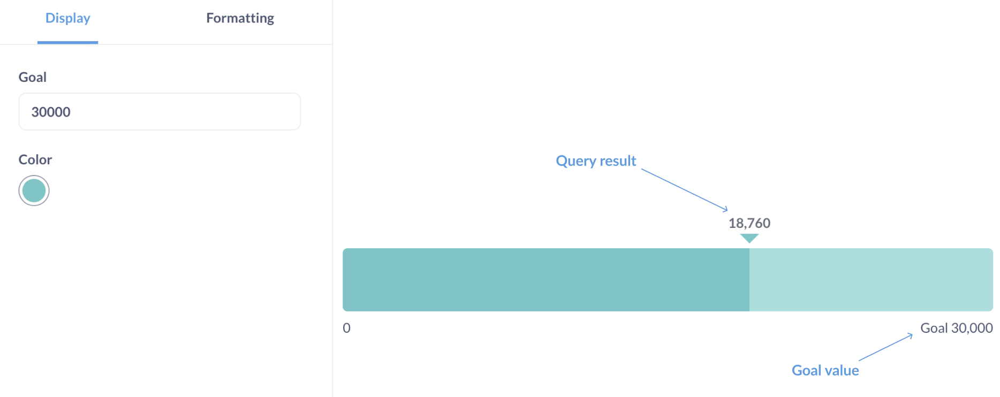
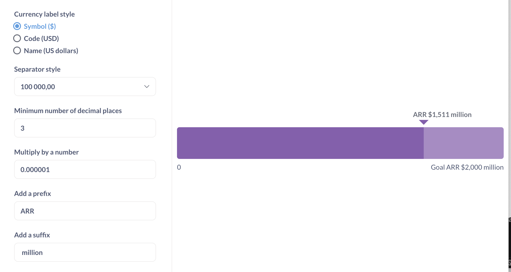

# Progress bars

**Progress bars** are for comparing a single number to a goal value that you set.

## When to use a progress bar

Progress bars are useful when you want to show the movement of a metric toward a goal, like assessing performance of a KPI, or tracking the percentage of of completion on a project.

Progress bars give you an option to set up an alert whenever the result of a question reaches the goal set in the progress bar settings. See [Progress bar alerts](../alerts.md#progress-bar-alerts).

## How to create a progress bar

To create a progress bar you'll need:

- A query that returns a single number, like "Sum of order quantity". Progress bar doesn't work with breakouts.

  You can also use a query that returns several metrics in a single row:

  | Sum of Quantity | Average Quantity | Max Quantity |
  | --------------- | ---------------- | ------------ |
  | 4910            | 17.32            | 173          |

In this case, the progress bar chart will use the metric in the first column ("Sum of quantity"). To change the metric, go to the editor and drag the metric you want to the first position in the Summarize block.

- A goal value. The goal value should be a positive number. Currently, Metabase only supports setting a static goal (you can't set a goal based on another query).

  The goal is set in the [chart options](#progress-bar-options).

## Progress bar options

To open the chart options, click on the gear icon at the bottom left of the screen.

Format options will apply to both the result of the query and the goal value:

Selecting "**Style**: Percent" in format options will only change how the result of the query is formatted: for example, `17` will be formatted as `1700%`. If you instead want to display the query result as a percentage of the goal, you'll need to calculate that percentage in your query. For example, to display the count of orders as a percentage of the goal of `20`, use [custom expressions](../query-builder/expressions.md) to return "Count of orders divided by 20", and format the result as a percentage.

## Limitations and alternatives

- Progress bars assume that your objective is to _increase_ a metric. If the objective is to decrease or reduce a metric, consider using the [gauge chart](gauge.md).

- Progress bars don't support breakouts. If you'd like to display progress of a metric towards a goal across a breakout, consider using a [bar or line chart with a goal line](line-bar-and-area-charts.md#goal-lines).

## Further reading

- [Gauge charts](./gauge.md)
- [Goal lines on bar and line charts](./line-bar-and-area-charts.md#goal-lines)
- Tutorial: [Which chart should I use?](https://www.metabase.com/learn/metabase-basics/querying-and-dashboards/visualization/chart-guide)
