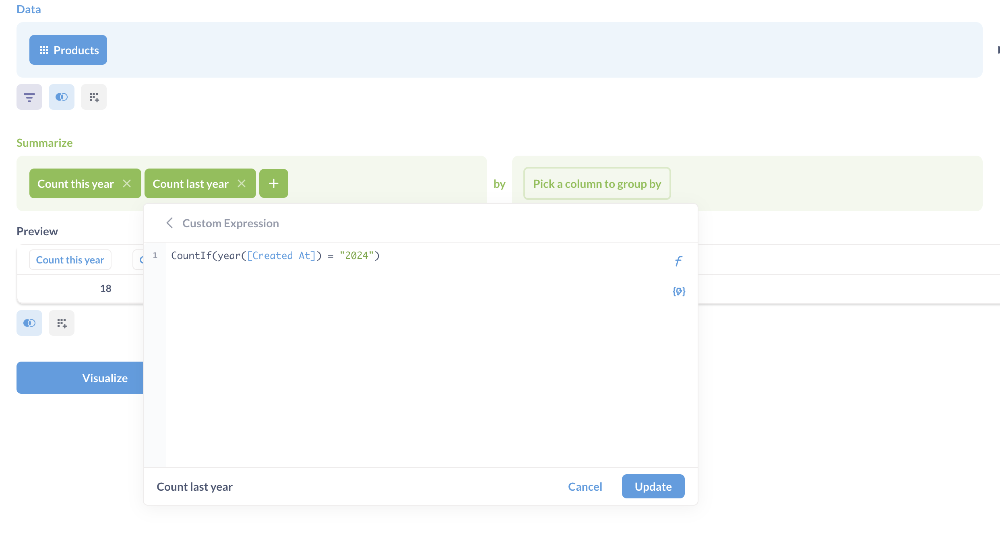
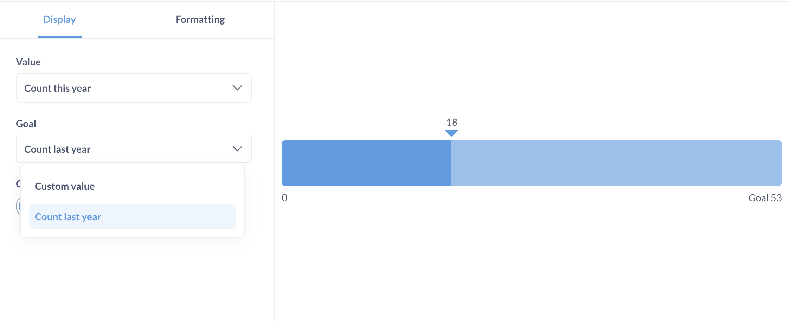
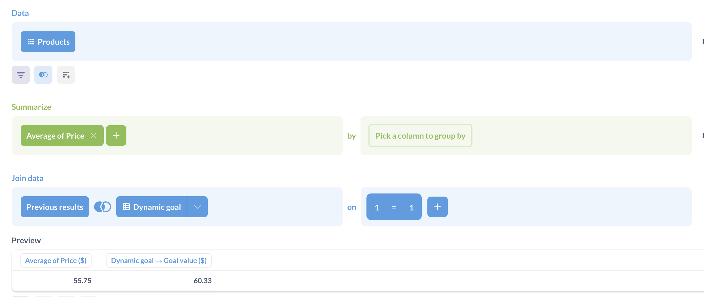

# Progress bars

**Progress bars** are for comparing a single number to a goal value that you set.

## When to use a progress bar

Progress bars are useful when you want to show the movement of a metric toward a goal, like assessing performance of a KPI, or tracking the percentage of completion on a project.

Progress bars give you an option to set up an alert whenever the result of a question reaches the goal set in the progress bar settings. See [Progress bar alerts](../alerts.md#progress-bar-alerts).

## Data shape for the progress bar

To create a progress bar you'll need:

- A query that returns a single row with one or more numeric columns, like "Sum of order quantity". Progress bars don't work with breakouts.

  | Sum of Quantity | Average Quantity | Max Quantity |
  | --------------- | ---------------- | ------------ |
  | 4910            | 17.32            | 173          |

- A goal value. The goal value can be a positive number or a value from another column in the same query, see [Set progress bar goal](#set-goal-for-a-progress-bar).

  The goal is set in the [chart options](#progress-bar-options).

  

## Create a progress bar

Once you built the query that returns data in the appropriate shape, you can create a progress bar:

1. Visualize the query results.

   By default, Metabase might display results as a table or a number, but you can switch the visualization type.

2. While viewing a visualization, click the **Visualization** button in the bottom left of the screen and switch visualization to **Progress**.

3. To set the bar's goal and metric, click the **gear** icon in the bottom left to open the settings sidebar.
4. In the "Display" bar in the settings sidebar, choose the column to use as a metric and the column or number to use as a goal. See [Set a goal](#set-goal-for-a-progress-bar).

   If your query only returns one number, you'll only be able to set a constant goal.

## Set goal for a progress bar

You can set a constant goal (e.g., 5000) or a custom goal based on another column.

### Use a constant goal

To set a constant goal for the progress bar:

1. While viewing the progress bar, click the **Gear** icon in bottom left to open settings.
2. On the display tab, click the **Goal** dropdown and select **Custom value**.

   If your query result contains only a single column, you won't see the column dropdown, and instead you'll just see a field to enter your constant goal.

3. Enter the goal value.

### Use another column as the goal

The custom goal has to come from a column in the same query, so your query has to return the result in the form of:

| Value | Goal |
| ----- | ---- |
| 4910  | 5000 |

If you're using the query builder, you might need to compute both the metric and the goal as aggregations, so [custom aggregations](../query-builder/expressions-list.md#aggregations) might be handy.

For example, if you want to build a progress bar comparing count of orders this year (the metric) vs count of orders last year (the goal) you can make use of [`CountIf()`](../query-builder/expressions/countif.md) to build a query returning conditional counts based on years:

Note that both columns are computed fields here, one for 2024 and one for the current year.

Once you have a column that you want to use, set it as a goal:

1. While viewing the progress bar visualization, click on the **Gear** icon in bottom left to open settings.
2. On the display tab, select the columns you want to serve as the value and the goal.

### Use another query's result as the goal

To use the result of another query as the goal value for the progress bar, you'll first need to bring this value into your query as a column, then select that newly added column as the goal value in progress bar settings. In the query builder, you can bring in a result from another question using a join on `1=1`:

1. Create a separate question returning a single number: your dynamic goal.
2. Create a new question. This question should return the metric you want to compare to the goal. This is the question you'll visualize as a progress bar.
3. [Join](../query-builder/join.md) this question to the question containing your dynamic goal from step 1. Join the question using a custom expression `1` for both sides of the join. See [joins with custom expressions](../query-builder/join.md#joins-with-custom-expressions).

   This join should add the dynamic goal as a new column to your query.

   

4. Set the visualization to a [progress bar](#create-a-progress-bar) and [set the dynamic goal column as the goal](#use-another-column-as-the-goal).

## Progress bar options

To open the chart options, click on the gear icon at the bottom left of the screen.

Format options will apply to both the result of the query and the goal value:

Selecting "**Style**: Percent" in format options will only change how the result of the query is formatted: for example, `17` will be formatted as `1700%`. If you instead want to display the query result as a percentage of the goal, you'll need to calculate that percentage in your query. For example, to display the count of orders as a percentage of the goal of `20`, use [custom expressions](../query-builder/expressions.md) to return "Count of orders divided by 20", and format the result as a percentage.

## Progress bar alerts

You can tell Metabase to send alerts when the progress bar goes above or below the goal. See [progress bar alerts](../alerts.md#progress-bar-alerts).

## Limitations and alternatives

- Progress bars assume that your objective is to _increase_ a metric. If the objective is to decrease or reduce a metric, consider using the [gauge chart](gauge.md).

- Progress bars don't support breakouts. If you'd like to display progress of a metric towards a goal across a breakout, consider using a [bar or line chart with a goal line](line-bar-and-area-charts.md#goal-lines).

## Further reading

- [Gauge charts](./gauge.md)
- [Goal lines on bar and line charts](./line-bar-and-area-charts.md#goal-lines)
- Tutorial: [Which chart should I use?](https://www.metabase.com/learn/metabase-basics/querying-and-dashboards/visualization/chart-guide)
