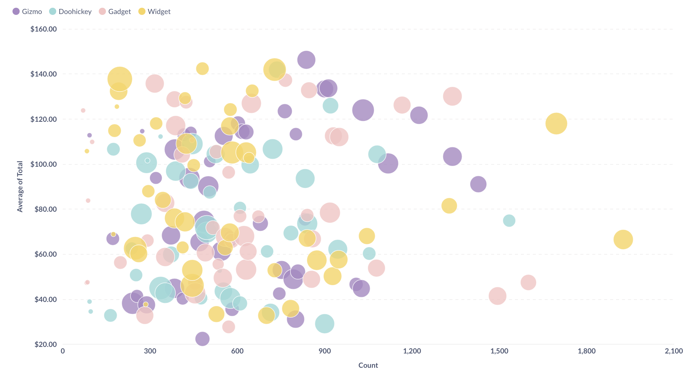
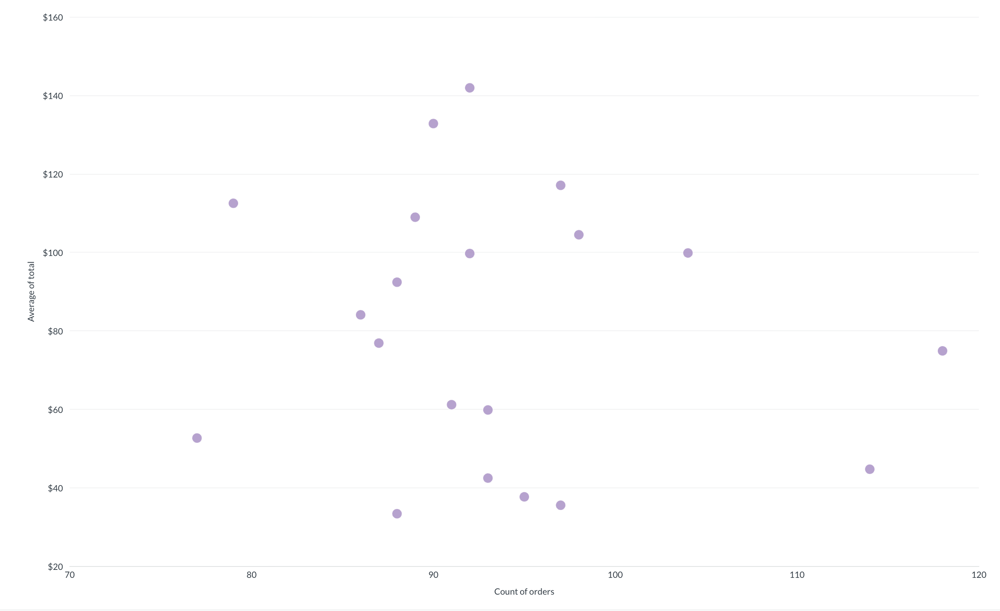
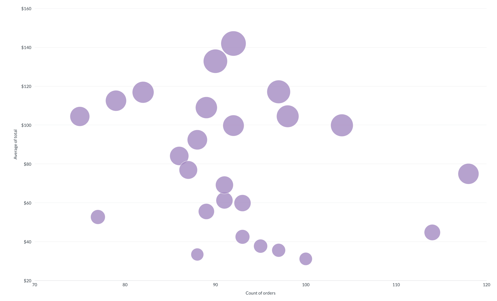
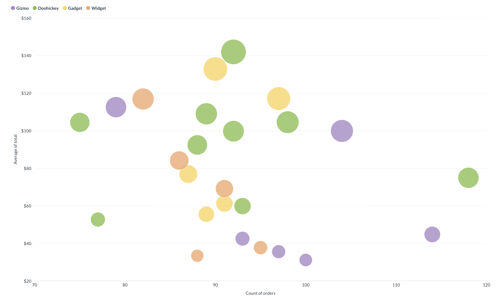

# Scatterplots and bubble charts

Scatterplots and bubble charts visualize the relationship between values. 

Scatterplots show two numeric values per data point, while bubble charts show three by using the size of each dot to represent a third value. In Metabase, both chart types use the same **Scatter** visualization type. Adding a bubble size column turns a scatterplot into a bubble chart.

## How to create a scatterplot or bubble chart

You can create a scatterplot or bubble chart from a few different data shapes, depending on whether you want to add bubble sizing or colored series.

### Create a scatterplot

1. Create a question that returns two numeric columns. For example, summarize `Count of orders` and `Average of total` grouped by `Product ID`:

    | Product ID | Count of orders | Average of total |
    | ---------- | --------------- | ---------------- |
    | 1          | 93              | 42.48            |
    | 2          | 98              | 104.48           |
    | 3          | 77              | 52.68            |
    | 4          | 89              | 108.95           |
    | 5          | 97              | 117.08           |

    You can also use one numeric column grouped by a category or time dimension. For example, summarize `Average of total` grouped by `Product Category`:

    | Product Category | Average of total |
    | ---------------- | ---------------- |
    | Gizmo            | 84.12            |
    | Doohickey        | 76.95            |
    | Gadget           | 92.40            |
    | Widget           | 88.27            |

2. In the visualization picker, select **Scatter**.

Each row in the result becomes a single dot on the chart. One column maps to the x-axis and the other to the y-axis.

### Create a bubble chart

1. Create a question that returns three numeric columns. For example, summarize `Count of orders`, `Average of total`, and `Sum of total` grouped by `Product ID`:

    | Product ID | Count of orders | Average of total | Sum of total |
    | ---------- | --------------- | ---------------- | ------------ |
    | 1          | 93              | 42.48            | 3,950.53     |
    | 2          | 98              | 104.48           | 10,238.92    |
    | 3          | 77              | 52.68            | 4,056.36     |
    | 4          | 89              | 108.95           | 9,696.46     |
    | 5          | 97              | 117.08           | 11,356.66    |

    You can also use two numeric columns grouped by a category or time dimension. For example, summarize `Average of total` and `Sum of total` grouped by `Product Category`:

    | Product Category | Average of total | Sum of total |
    | ---------------- | ---------------- | ------------ |
    | Gizmo            | 84.12            | 425,000      |
    | Doohickey        | 76.95            | 312,400      |
    | Gadget           | 92.40            | 587,200      |
    | Widget           | 88.27            | 401,800      |

    You can also use one numeric column grouped by two category or time dimensions. For example, summarize `Average of total` grouped by `Product ID` and `Product Category`:

    | Product ID | Product Category | Average of total |
    | ---------- | ---------------- | ---------------- |
    | 1          | Gizmo            | 42.48            |
    | 2          | Doohickey        | 104.48           |
    | 3          | Doohickey        | 52.68            |
    | 4          | Doohickey        | 108.95           |
    | 5          | Gadget           | 117.08           |

2. In the visualization picker, select **Scatter**.
3. In chart settings, select a numeric column from the **Bubble size** menu.

Each row in the result becomes a single dot on the chart. One column maps to the x-axis, one to the y-axis, and the bubble size column determines the size of the dot.

### Add a category for colored series

1. Create a question with the data shape for a scatterplot or bubble chart. Include a category column for the colored series. For example, summarize `Count of orders` and `Average of total` grouped by `Product ID` and `Product Category`:

    | Product ID | Product Category | Count of orders | Average of total |
    | ---------- | ---------------- | --------------- | ---------------- |
    | 1          | Gizmo            | 93              | 42.48            |
    | 2          | Doohickey        | 98              | 104.48           |
    | 3          | Doohickey        | 77              | 52.68            |
    | 4          | Doohickey        | 89              | 108.95           |
    | 5          | Gadget           | 97              | 117.08           |

2. In the visualization picker, select **Scatter**.

Each category becomes its own colored series. The example chart shows the Gizmo, Doohickey, Gadget, and Widget series.

## Scatterplot and bubble chart settings

To open chart settings, click the **Gear** icon in the bottom left of the visualization.

### Data

In chart settings, click the **Data** tab to configure which columns appear on the chart.

- **X-axis:** The column(s) to plot on the x-axis
- **Y-axis:** The column(s) to plot on the y-axis
- **Bubble size:** The column that determines the size of each dot (leave empty for a standard scatterplot)

### Display

In chart settings, click the **Display** tab to edit how the chart looks.

To add a goal line, enable the **Goal line** toggle. Use the **Goal value** and **Goal label** fields to set the value and label.

> You can't set [alerts](../alerts.md) on goal lines in scatterplots or bubble charts.

To stack series on top of each other, enable the **Stack series** toggle.

To show extra information when hovering over a dot, add columns to **Additional tooltip columns**.

### Axes

In chart settings, click the **Axes** tab to edit the chart axes.

#### X-axis

Use the following options for the x-axis:

- **Show label:** Enable the toggle to display the x-axis label.
- **Label:** Name the x-axis label.
- **Show lines and tick marks:** Select how to display the x-axis line, tick marks, and labels. Choose between **Hide**, **Show**, **Compact**, **Rotate 45°**, and **Rotate 90°**.
- **Scale:** Select how values are spaced along the x-axis. Choose between **Linear**, **Power**, **Log**, **Histogram**, and **Ordinal**.

#### Y-axis

Use the following options for the y-axis:

- **Show label:** Enable the toggle to display the y-axis label.
- **Label:** Name the y-axis label.
- **Split y-axis when necessary:** When enabled, Metabase displays separate y-axes for series with very different value ranges.
- **Auto y-axis range:** When enabled, Metabase sets the y-axis range automatically based on your data. When disabled, use the **Min** and **Max** fields to set custom values.
- **Unpin from zero:** When enabled, the y-axis can start at a value other than zero.
- **Scale:** Select how values are spaced along the y-axis. Choose between **Linear**, **Power**, and **Log**.
- **Show lines and tick marks:** Select how to display the y-axis line, tick marks, and labels. Choose between **Hide**, **Show**, **Compact**, **Rotate 45°**, and **Rotate 90°**.
- **Number of tick marks:** Set how many tick marks appear on the y-axis. Defaults to **auto**.

## Limitations and alternatives

- If you only have one numeric value to plot, or if you want to show how a value changes over time, consider a [bar chart, histogram, or line chart](./line-bar-and-area-charts.md) instead.
- Scatterplots can become hard to read with very large datasets because of overlapping dots. For large datasets, consider aggregating your data, or using a [heat map](./pivot-table.md#using-pivot-tables-as-heatmaps) or [box plot](./box-plot.md) instead.
- You can't set [alerts](../alerts.md) on goal lines in scatterplots or bubble charts.