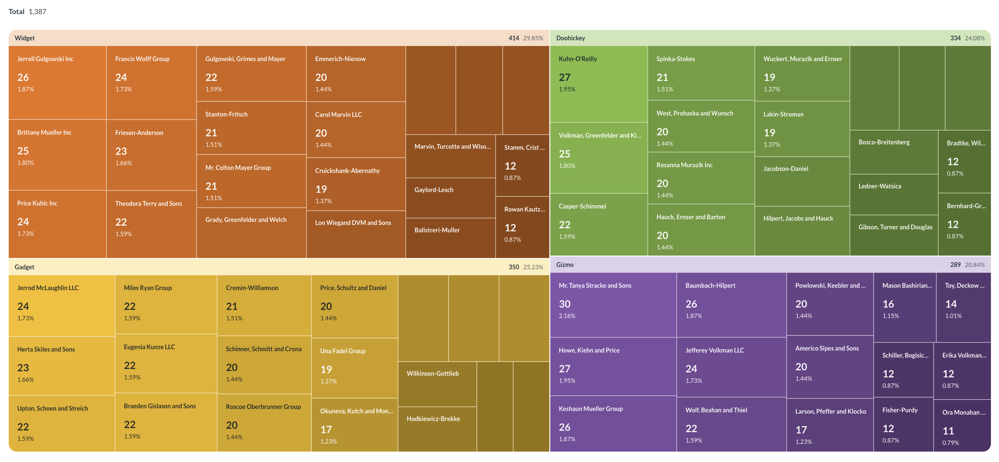
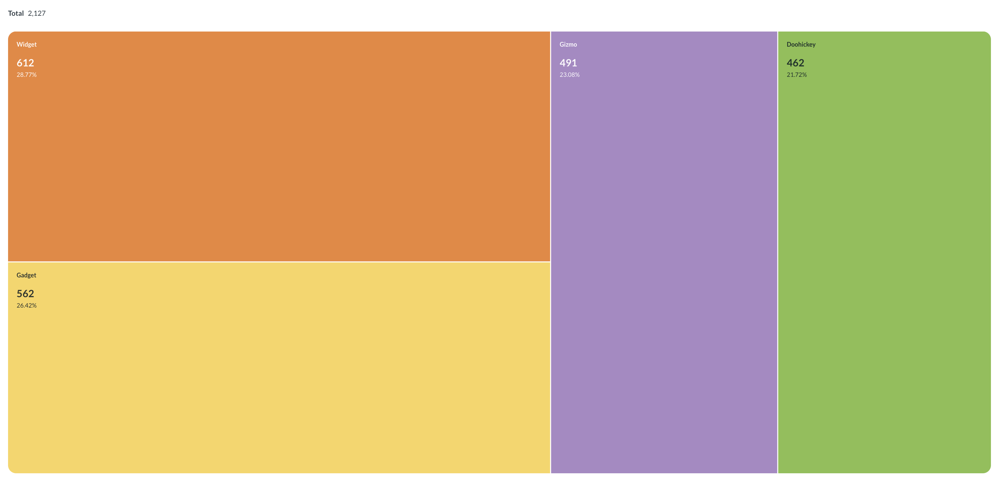

# Treemaps

Treemap visualizations display hierarchical data (a tree) as nested rectangles. The rectangles at the lowest level of the hierarchy are called leaves. The value of a metric determines the size of each leaf. Larger values take up more area than smaller values.

When you group by two dimensions, the first dimension determines the parent categories. The second dimension nests inside the parent categories as leaves.

This treemap groups a metric, the count of orders, by two dimensions. The first dimension is product category (the larger rectangles), and the second is vendor (the nested leaves within each category).

## When to use a treemap

Use a treemap to compare how a total breaks down by one categorical dimension, or by a second categorical dimension nested within the first.

Treemaps show how much each category contributes to a total. They work best when you have many categories to break down, where a pie chart splits into thin slices and a bar chart runs long. A treemap keeps many categories readable in a compact space, and it can nest a second dimension inside the first. For example, you can show order counts by product category, then break each category down by vendor.

Treemaps are a weaker choice for comparing categories against each other, because area is harder to judge than bar length. For a single dimension with only a few categories, use a [pie chart](./pie-or-donut-chart.md) or a [bar chart](./line-bar-and-area-charts.md).

## Data shape for a treemap

To create a treemap, create a question that returns a single metric grouped by one or two dimensions.

When you group a metric by one dimension, the treemap shows a flat set of leaves with no parent categories. Here's the data shape for a treemap of order count by category:

| Category  | Count |
| --------- | ----- |
| Widget    | 612   |
| Gadget    | 562   |
| Gizmo     | 491   |
| Doohickey | 462   |

When you group a metric by two dimensions, the treemap nests the second dimension inside the first. The first dimension determines the outer rectangles and their colors. The second dimension determines the leaves nested inside the outer rectangles. The value of the metric determines each leaf's size.

Here's the data shape for a treemap of order count by category (the parent categories) and vendor (the leaves):

| Category  | Vendor                     | Count |
| --------- | -------------------------- | ----- |
| Widget    | Jerrell Gulgowski Inc      | 26    |
| Widget    | Brittany Mueller Inc       | 25    |
| Gadget    | Jerrod McLaughlin LLC      | 24    |
| Gadget    | Miles Ryan Group           | 22    |
| Gizmo     | Mr. Tanya Stracke and Sons | 30    |
| Doohickey | Kuhn-O'Reilly              | 27    |

## Build a query for a treemap

To build a nested treemap:

1. In the query builder, click **Summarize**.
2. Select a metric, such as **Count of rows**.
3. Group by a first dimension, such as **Category**.
4. Add a second grouping, such as **Vendor**.
5. In the visualization picker, select **Treemap**.

The order of the groupings matters. The first grouping determines the outer rectangles, and the second grouping determines the leaves nested in each outer rectangle.

Click a parent category to zoom into that category.

## Drill-through

- **Parent category**: Click a parent category to zoom into that category. To return to the full treemap, click the back arrow.
- **Leaf**: Click a leaf to view the underlying records, break out by another dimension, view automatic insights, or filter by its value.

[Drill-through](./drill-through.md) options are limited for questions written in SQL.

## Treemap settings

To open chart settings, click the **Gear** icon in the bottom left of the visualization.

### Data

In chart settings, click the **Data** tab to configure the chart's groupings and value.

- **Grouping:** The dimension that determines the parent categories. To set a custom color for a parent category, click the color swatch next to the category's name. To rename a parent category, click the **...** next to the category's name.
- **Sub-grouping:** The dimension that nests inside each parent category as leaves. Requires a query with at least two dimensions.
- **Value:** The metric that determines the size of each leaf. To format the value, click the **...** to open the formatting menu. You can set the number style, separator style, number of decimal places, a multiplier, and a prefix or suffix.

### Display

In chart settings, click the **Display** tab to show or hide labels and values. You can toggle **Show parent labels**, **Show parent values**, **Show leaf labels**, and **Show leaf values**.

## Limitations and alternatives

- Treemaps display a single metric grouped by one or two dimensions. If your query returns more than one metric, the treemap uses the metric you select in the **Value** slot.
- When a query returns more than two dimensions, the treemap uses the dimensions in the **Grouping** and **Sub-grouping** slots and combines any unused dimensions into each leaf. A treemap doesn't nest beyond two levels.
- When one leaf is far larger than the other leaves, the small leaves can become too small to see or select.
- Treemaps favor part-to-whole comparison. To compare category values against each other, use a [bar chart](./line-bar-and-area-charts.md), or use a [pie chart](./pie-or-donut-chart.md) for a small number of categories.
