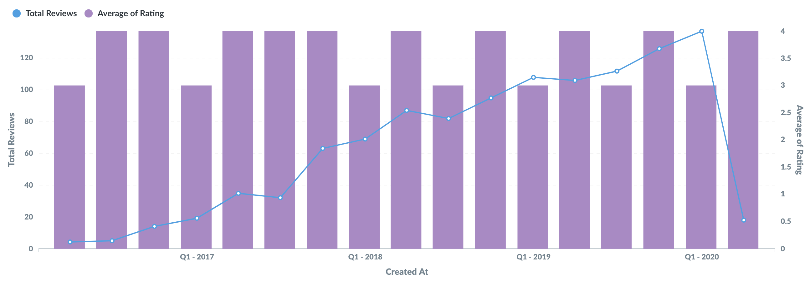
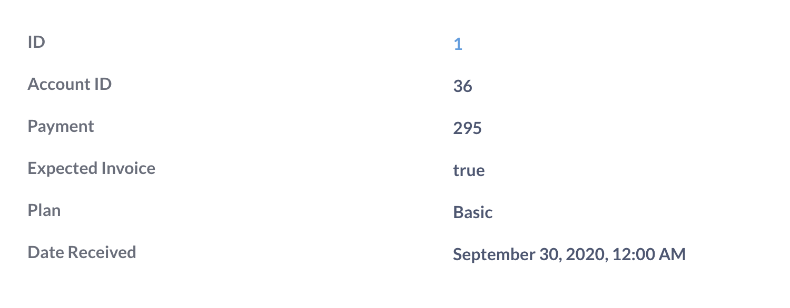
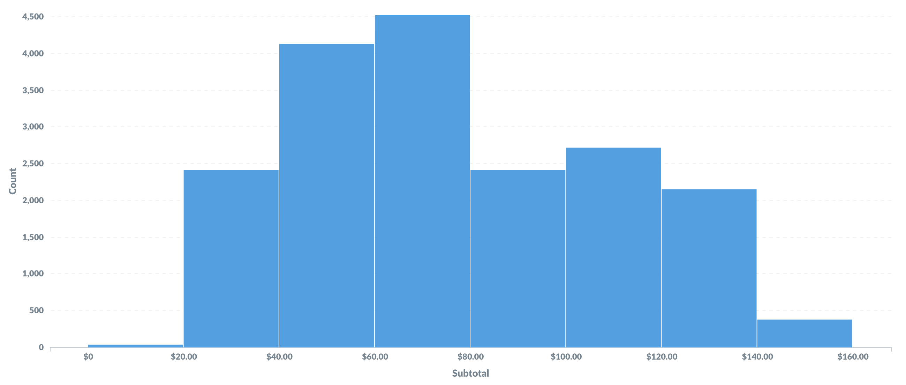

# Visualizing data

While tables are useful for looking up information or finding specific numbers, it's usually easier to see trends and make sense of data using charts.

To change how the answer to your question is displayed, click on the **Visualization** button in the bottom-left of the screen to open the visualization sidebar.

If a particular visualization doesn’t really make sense for your answer, that option will appear in the "Other charts" section. You can still select one of these other charts, though you might need to fiddle with the chart options to make the chart work with your data.

Not sure which visualization type to use? Check out [Which chart should you use?](https://www.metabase.com/learn/metabase-basics/querying-and-dashboards/visualization/chart-guide)

## Visualization options

Each visualization type has its own advanced options.

To change the settings for a specific chart, for example a row chart, you could either:

- Click on the gear icon in the bottom left of the chart (next to the **Visualization** button, or
- Click on **Visualization** in the bottom left of the chart, then hover over the currently selected chart and click on the **gear** icon that pops up.

## Area charts

[Area charts](./line-bar-and-area-charts.md) are useful when comparing the proportions of two metrics over time. Both bar and area charts can be stacked.

## Bar charts

[Bar charts](./line-bar-and-area-charts.md) are great for displaying a number grouped by a category (e.g., the number of users you have by country).

## Combo charts

[Combo charts](./combo-chart.md) let you combine bars and lines (or areas) on the same chart.

## Detail

The [Detail](./detail.md) visualization shows a single result record (row) in an easy-to-read, two-column display.

## Funnel charts

[Funnels](./funnel.md) are commonly used in e-commerce or sales to visualize how many customers are present within each step of a checkout flow or sales cycle. At their most general, funnels show you values broken out by steps, and the percent decrease between each successive step.

## Gauges

[Gauges](./gauge.md) allow you to show a single number in the context of a set of colored ranges that you can specify.

## Line charts

[Line charts](./line-bar-and-area-charts.md) are best for displaying the trend of a number over time, especially when you have lots of x-axis values. For more, check out our [Guide to line charts](https://www.metabase.com/learn/metabase-basics/querying-and-dashboards/visualization/line-charts) and [Time series analysis](https://www.metabase.com/learn/metabase-basics/querying-and-dashboards/time-series) tutorials.

## Maps

When you select the [Map](./map.md) visualization, Metabase will automatically try and pick the best kind of map to use based on the table or result set.

## Numbers

The [Numbers](./numbers.md) option is for displaying a single number, nice and big.

## Pie, donut, and sunburst charts

A [pie chart or donut chart](./pie-or-donut-chart.md) can be used when breaking out a metric by a single dimension, especially when the number of possible breakouts is small, like accounts by plan.

A [sunburst chart](./pie-or-donut-chart.md) is a pie chart with more than one ring to show the data broken out by additional dimensions.

## Pivot tables

[Pivot tables(./pivot-table.md) allow you swap rows and columns, group data, and include subtotals in your table. You can group one or more metrics by one or more dimensions.

## Progress bars

[Progress bars](./progress-bar.md) are for comparing a single number to a goal value that you set.

## Row charts

[Row charts](./line-bar-and-area-charts.md) are good for visualizing data grouped by a column that has a lot of possible values, like a Vendor or Product Title field.

## Tables

The [Table](./table.md) option is good for looking at tabular data (duh), or for lists of things like users or orders.

## Trends

The [Trend](./trend.md) visualization is great for displaying how a single number has changed between two time periods.

## Histograms

If you have a bar chart like Count of Users by Age, where the x-axis is a number, you'll get a special kind of bar chart called a [histogram](./line-bar-and-area-charts.md) where each bar represents a range of values (called a "bin").

## Sankey charts

[Sankey charts](./sankey.md) show how data flows through multi-dimensional steps.

## Waterfall charts

[Waterfall charts](./waterfall-chart.md) are a kind of bar chart useful for visualizing results that contain both positive and negative values.

## Scatterplots and bubble charts

[Scatterplots](./scatterplot-or-bubble-chart.md) are useful for visualizing the correlation between two variables, like comparing the age of your people using your app vs. how many dollars they've spent on your products.

## Styling and formatting data in charts

You can access formatting options for the columns used in a chart. Just open the visualization settings (click on the gear in the bottom left of a chart next to **Visualization**).

Options differ depending on the chart, and can include settings for the chart's data, its display, and its axes.

See also [Formatting defaults](../../data-modeling/formatting.md).

## Further reading

- [Charts with multiple series](../../dashboards/multiple-series.md)
- [Appearance](../../configuring-metabase/appearance.md)
- [BI dashboard best practices](https://www.metabase.com/learn/metabase-basics/querying-and-dashboards/dashboards/bi-dashboard-best-practices.html)
