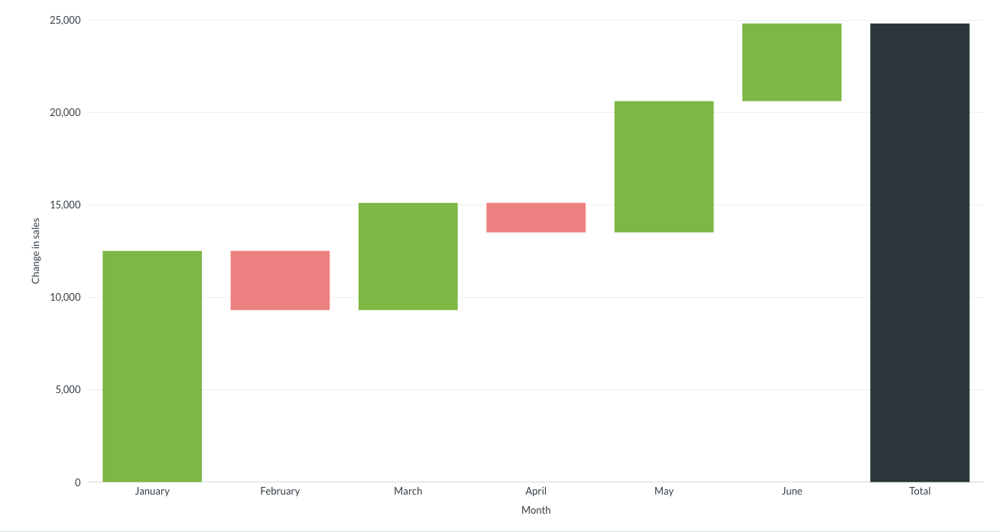

# Waterfall charts

Waterfall charts are a type of bar chart for visualizing data with both positive and negative values. Each bar shows an increase or decrease, and a final bar on the right shows the running total.

## When to use a waterfall chart

Use a waterfall chart to show how a starting value changes through a series of increases and decreases to arrive at a final total. 

Waterfall charts are useful for financial breakdowns, inventory changes, or anywhere you need to show how a value changes step by step.

## Data shape for a waterfall chart

To create a waterfall chart, create a question that returns a single metric grouped by a single dimension, such as time or category.

Waterfall charts work best when each row represents a *change* in some value rather than the raw value itself. For example, use the change in sales from one month to the next, rather than the monthly sales totals.

Here's the data shape for the example chart above:

| Month      | Change in sales |
| ---------- | --------------- |
| January    |  12,500         |
| February   | -3,200          |
| March      |  5,800          |
| April      | -1,600          |
| May        |  7,100          |
| June       |  4,200          |

Green bars represent months where sales increased, and red bars represent months where sales decreased. The dark bar at the end shows the net change across all six months.

Here's another example grouped by category instead of time:

| Category    | Net revenue |
| ----------- | ----------- |
| Gizmo       | 18,400      |
| Doohickey   | -2,100      |
| Widget      | 9,700       |
| Gadget      | -4,500      |

## Build a query for a waterfall chart

Your data might contain raw values like monthly sales totals but not the change in sales from one month to the next:

| Month      | Sales   |
| ---------- | ------- |
| January    | 50,000  |
| February   | 46,800  |
| March      | 52,600  |

To compute the change from one row to the next, use the `Offset` [custom expression](../query-builder/expressions.md) in a custom aggregation. `Offset` returns the value of an expression from another row, either earlier or later in the result set.

To compute the change in sales from the previous month:

1. In the query builder, click **Summarize**.
2. Group by **Created At: Month**.
3. Add a **Custom Expression** with the formula: `Sum([Sales]) - Offset(Sum([Sales]), -1)`. Name the column "Change in sales".

The resulting question returns the data shape you need for a waterfall chart.

If your data already contains the changes you want to plot (for example, individual transactions with positive and negative amounts), you can skip this step and use the data directly.

## Waterfall chart settings

To open chart settings, click the **Gear** icon in the bottom left of the visualization.

### Display

In chart settings, click the **Display** tab to edit how the chart looks.

To add a goal line to your waterfall chart, enable the **Goal line** toggle. Use the **Goal value** and **Goal label** fields to set the goal value and label.

> You can't set [alerts](../alerts.md) on goal lines in waterfall charts.

Set the colors for each bar type:

- **Increase color:** The color for bars that represent positive values (defaults to green)
- **Decrease color:** The color for bars that represent negative values (defaults to red)
- **Total color:** The color for the final total bar (defaults to black)

To display the value for the final total bar, enable the **Show total** toggle.

To display values for all bars, enable the **Show values on data points** toggle.

### Axes

In chart settings, click the **Axes** tab to edit the chart axes.

#### X-axis

Use the following options for the x-axis:

- **Show label:** Enable the toggle to display the x-axis label.
- **Label:** Name the x-axis label.
- **Show lines and tick marks:** Display the x-axis line and tick marks.

#### Y-axis

Use the following options for the y-axis:

- **Show label:** Enable the toggle to display the y-axis label.
- **Label:** Name the y-axis label.
- **Auto y-axis range:** When enabled, Metabase sets the y-axis range automatically based on your data. When disabled, use the **Min** and **Max** fields to set custom values.
- **Scale:** Choose how values are spaced along the y-axis. Choose between **Linear**, **Power**, and **Log**.
- **Show lines and tick marks:** Display the y-axis line and tick marks.
- **Number of tick marks:** Set how many tick marks appear on the y-axis. Defaults to **auto**.

## Limitations and alternatives

- If your data only contains positive values, or if you don't need to track a running total, consider a [bar chart](./line-bar-and-area-charts.md) instead.
- If you want to show progress toward a single value, consider a [progress bar](./progress-bar.md) or [gauge chart](./gauge.md) instead.
- Waterfall charts only support a single metric grouped by a single dimension. You can't add breakouts or display multiple series.
- You can't set [alerts](../alerts.md) on goal lines in waterfall charts.