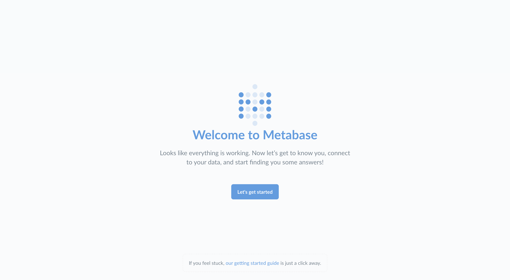

***

## título: Configuración de la metabase

# Configuración de la metabase

Esta guía le ayudará a configurar Metabase una vez que la haya instalado. Si aún no ha instalado Metabase, puede [obtén la Metabase aquí](https://metabase.com/start/).

Inicie Metabase por primera vez y verá esta pantalla:

Continúe y haga clic en **Comencemos**.

## Configuración de una cuenta de administrador

Lo primero que tendrás que hacer es configurar una cuenta de administrador. La cuenta que creas cuando instalas Metabase por primera vez es una cuenta de administrador de forma predeterminada, ¡útil! Si ha instalado Metabase en un servidor de producción, debe tener mucho cuidado de recordar la contraseña de esta cuenta, ya que se utilizará para agregar otros usuarios, conectarse a bases de datos, configurar el correo electrónico y más. También puede crear cuentas de administrador adicionales más adelante.

Por ahora, vamos a crear una cuenta para nosotros mismos para explorar Metabase. Escribe tu información y, cuando estés listo para continuar, haz clic en el botón **Próximo** botón.

## Recopilación de la información de la base de datos

En este punto, deberá recopilar cierta información sobre la base de datos que desea utilizar con Metabase. No podremos conectarnos a su base de datos sin ella, pero le gustaría lidiar con todo esto más tarde, está bien: simplemente haga clic en **Agregaré mis datos más adelante**. La metabase viene con un [Base de datos de ejemplo](/glossary/sample_database) con el que puedes jugar para tener una idea de cómo funciona Metabase.

Si está listo para conectarse, esto es lo que necesitará:

*   El **nombre de host** del servidor donde vive la base de datos
*   El **puerto** El servidor de base de datos utiliza
*   El **nombre de la base de datos**
*   El **nombre de usuario** Se utiliza para la base de datos
*   El **contraseña** Se utiliza para la base de datos

Si no tiene esta información a mano, la persona responsable de administrar la base de datos debe tenerla.

## Conéctese a su base de datos

Ahora que tiene la información de su base de datos, puede conectarse a su base de datos. Datos dulces, dulces por fin. Simplemente continúe y ponga su información en este formulario y haga clic en **Próximo**.

Para obtener más información sobre cómo conectarse a bases de datos, consulte [Agregar y administrar bases de datos](./administration-guide/01-managing-databases.md).

## Preferencias de datos de uso

Una última cosa rápida que tendrá que decidir es si está bien que recopilemos información anónima sobre cómo usa el producto: nos ayuda a mejorar Metabase. Como dice la caja:

*   Metabase nunca recopila nada sobre sus datos ni cuestiona los resultados.
*   Toda la colección es completamente anónima.
*   La colección se puede desactivar en cualquier momento de la configuración de administración.

Si está listo para comenzar a usar Metabase, continúe y haga clic en **Próximo**.

## Mantenerse en contacto

En este punto, ya está todo listo y listo para usar Metabase.  Como nos gusta mantenernos en contacto con nuestros amigos, ¡hicimos que fuera fácil suscribirse a nuestro boletín (correos electrónicos poco frecuentes) con un solo clic!

Una vez que haya terminado aquí, simplemente siga el enlace a **Llévame a Metabase**.  Y si decidiste saltarte el boletín de noticias, es genial, todavía nos gustas :)

## Introducción a Metabase

Para obtener un tutorial sobre cómo ponerse en marcha con preguntas y paneles, diríjase a [Aprende Metabase](/learn/getting-started/getting-started.html).

Para obtener información sobre cómo agregar miembros del equipo, conectar bases de datos adicionales, configurar las opciones de la metabase y mucho más, consulte el [Guía del administrador](./administration-guide/start.md).
