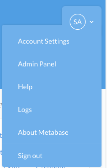

If you come across something that looks like a bug, we suggest collecting the following information to help us reproduce the issue.

1. Server logs
2. Javascript console logs
3. Can it be reproduced on the sample dataset?
4. Your Metabase version
5. Where Metabase is running (Docker image, AWS Elastic Beanstalk, etc)
6. What browser version

## Helpful tidbits

### Accessing the Metabase server logs
While you can always look for the logs Metabase leaves on your server file system (or however you collect logs), if you are logged into Metabase with an admin account, you can also access them from the drop down menu in the upper right hand corner.

### Checking for Javascript errors in Chrome
Metabase will print debugging information and errors to your browsers Javascript Console. 

You can open the javascript console in Chrome by following the instructions at 
https://developers.google.com/web/tools/chrome-devtools/console/

### Checking for Javascript errors in Firefox

Metabase will print debugging information and errors to your browsers Javascript Console. 

You can open the javascript console in Mozilla by following the instructions at 
https://developer.mozilla.org/en-US/docs/Tools/Web_Console

### Checking for Javascript errors in Safari

Metabase will print debugging information and errors to your browsers Javascript Console. 

You can open the javascript console in Safari by following the instructions at 

https://developer.apple.com/library/content/documentation/AppleApplications/Conceptual/Safari_Developer_Guide/Introduction/Introduction.html

### Checking for Javascript errors in Internet Explorer

Metabase will print debugging information and errors to your browsers Javascript Console. 

You can open the javascript console in Internet Explorer by following the instructions at 

https://msdn.microsoft.com/en-us/library/gg589530(v=vs.85).aspx

For many versions this can also be accessed by pressing the F12 key on your keyboard. 