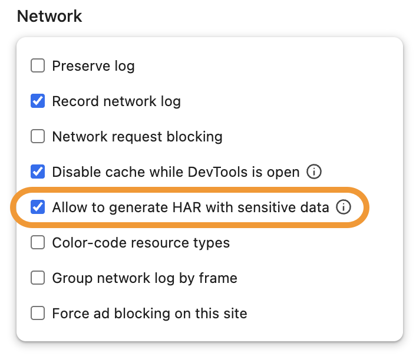

# Creating a HAR file for troubleshooting

HAR (short for _HTTP Archive_) files record network requests generated by your browser. HAR files can be helpful when troubleshooting issues with Metabase performance.

> The instructions below include steps for creating **HAR files that contain sensitive information** that you submit during the recording. Sensitive information includes session cookies and authentication information. Only record this information when specifically instructed, and when it is needed for diagnosing issues with sessions or authentication, etc. Before sharing such a HAR file with anyone, review the file contents in a text editor.

To create the HAR file, follow the instructions for your web browser:

- [Chrome or Edge](#create-a-har-file-in-google-chrome-and-microsoft-edge)
- [Firefox](#create-a-har-file-in-firefox)
- [Safari](#create-a-har-file-in-safari)

## Create a HAR file in Google Chrome and Microsoft Edge

1. Open Chrome/Edge **Developer tools**.
   You can right-click anywhere on the page and select "Inspect".

2. In Developer tools, switch to the **Network** tab.
   The network log recording should start automatically.

3. Click on the small **gear icon** in the top bar of the developer tools to open Settings. Scroll down to the **Network** section and enable **Allow to generate HAR files with sensitive data**

   

4. With the Network tab open and recording in progress, repeat the steps to reproduce the issue.

5. Once you're finished reproducing the issue, click the download icon on the far right of the toolbar just below the tab bar. Choose **Export HAR (with sensitive data)…** and save the file.

## Create a HAR file in Firefox

1. Open Firefox **Developer tools**. You can right-click anywhere on the page and select "Inspect".

2. In Developer tools, switch to the **Network** tab.

3. With the Network tab open and recording in progress, repeat the steps to reproduce the issue.

4. Once you're finished reproducing the issue, right-click anywhere in the table of network calls and select **Save All As HAR**.

## Create a HAR file in Safari

1. If you haven't yet, enable the **Develop** menu by going to **Safari > Settings > Advanced**, and select **Show features for web developers**.

2. Open the Safari developer tools by going to **Develop > Show Web Inspector** or by right-clicking anywhere on the page and selecting **Inspect Element** from the context menu.

3. In Developer tools, switch to the **Network** tab. The network log recording should start automatically.

4. With the Network tab open and recording in progress, repeat the steps to reproduce the issue.

5. Once you're finished reproducing the issue, click on **Export** in the top right of the Network tab.
