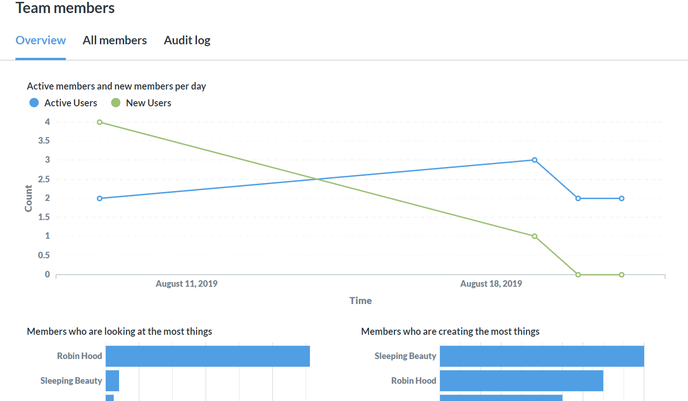
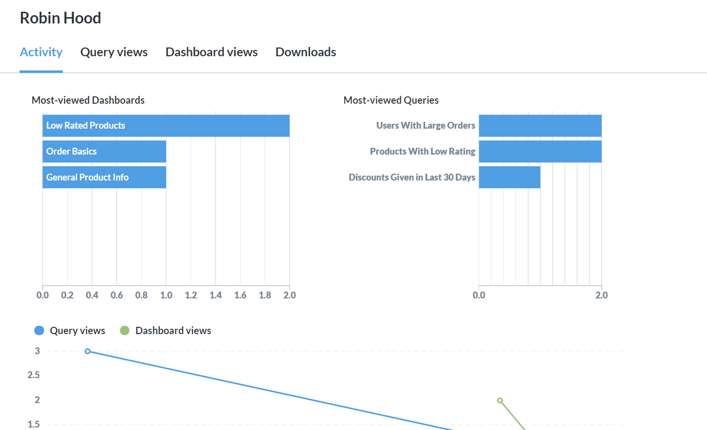
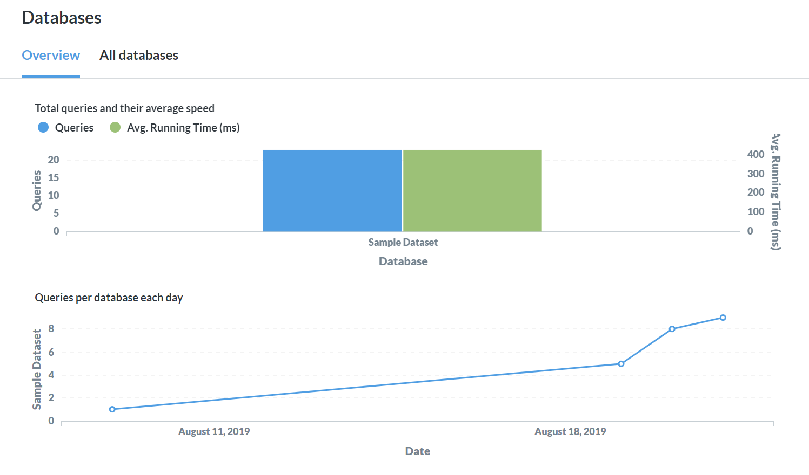
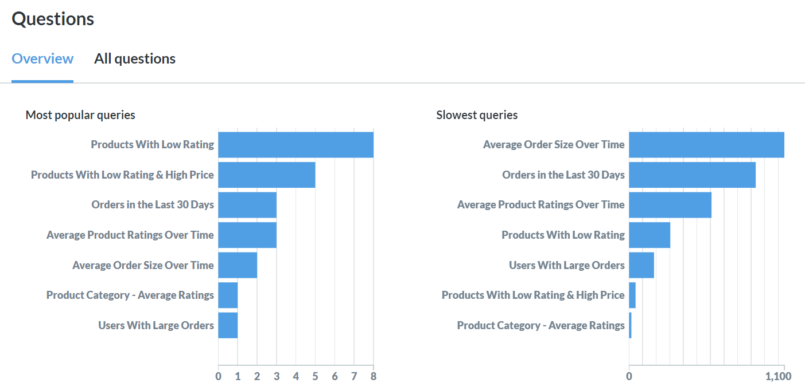
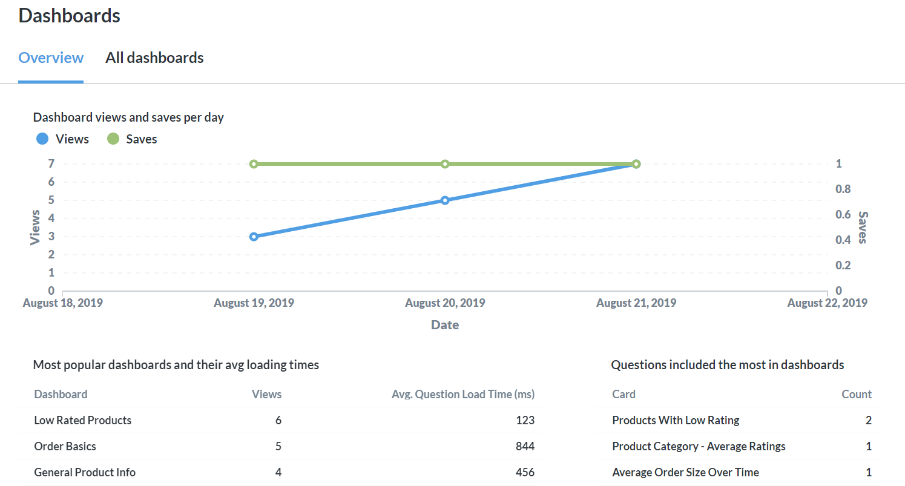

# Auditing tools

> Auditing tools are deprecated. Instead, check out the (much better) [Usage analytics](./usage-analytics.md).



As an administrator of Metabase, you already know the importance of using data to understand how people interact with your products or services. With the Audit tool, you can use Metabase to understand how people in your organization use Metabase. It's, well, meta!

To view the audit logs, go to the top right of the screen and click on the **gear** icon > **Admin settings** > **Audit**. There's a lot of data available, not only about your people, but also about your questions, dashboards, databases and more! We'll walk you through each of the sections below.

## People

### Team members

Use the __People__ section to gain a better understanding of how people are interacting with Metabase. You'll want to pay attention to the __Overview__ tab, especially when you first launch Metabase at your organization — it will give you data around how many active and newly created accounts you have each day. Further down the page, you'll see charts showing you which people are most engaged.

The __Team Members__ panel has a view of other options for viewing your team's usage data. The __All Members__ tab will give you a list of your team members, and stats about their activity, such as when they were last active.

The __Audit Log__ tab will display, in chronological order, each query, who viewed it, and when. Note that if the person didn't save their query, its name will be listed as `Ad-hoc`. Each query name can be clicked to view more details about the person's interactions with it, including a full revision history. You'll also be able to view the query in Metabase. Note that this link will always show the latest version of the query - use the revision history to see changes over time.

Throughout the People section, names can be clicked to access the profile of a specific person’s activity. This profile includes:

- Dashboard views
- Query views
- Downloads
- Subscriptions and Alerts

## Data

The Data section focuses on your databases, schemas and tables, and is divided into corresponding sections. Look here if you're trying to uncover queries and schemas that need optimization. Each section provides visualizations around the use and speed of querying against your databases, schemas or tables. You will also be able to view lists of stats about all of your databases, schemas and tables.

## Items

The __Items__ section focuses on questions, dashboards, downloads, and Subscriptions and Alerts.

### Questions

The Questions section will show you your most popular queries, as well as your slowest queries. If queries you think are important aren't appearing on your most popular queries list, you may want to make sure your team is focusing on the right things.

If important queries are appearing on the list of slowest queries, you will want to look at optimizing them. One option is to adjust your [caching settings](../configuring-metabase/caching.md), but there are plenty of other options as well. To help you determine if your optimization efforts are heading in the right direction, use the `Query views and speed per day` visualization at the bottom of the page.

A list of all of your questions is available as well, and you can see various data points about each question at a glance:

- Query Runs
- Average Runtime
- Cache Duration
- Total Runtime
- Database
- Table
- Collection
- Public Link

You can also click on any question to drill into a more detailed profile showing:

- View activity
- Revision History
- A full audit log of who viewed the question, and when

### Dashboards

The __Dashboards__ section helps you understand what dashboards people are looking at, and to make sure they're having a smooth experience. If you notice that a popular dashboard has a high average question loading time, you can investigate further using the Questions section outlined above.

A list of all of your dashboards is available as well, and you can see various data points about each dashboard at a glance, such as:

- Number of views
- Average question execution time(ms)
- Number of cards
- Saved by
- Cache duration
- Public link
- Saved on
- Last edited on

### Downloads

Use the __Downloads__ section to understand which people are downloading (or exporting) data, and the size (number of rows) of the downloads they're performing. This section contains some visualizations, as well as a list of all downloads.

### Subscriptions and Alerts

Here admins can get an overview of all of the [dashboard subscriptions][dashboard-subscriptions] and [alerts][alerts] that are currently active for that Metabase.

- Dashboard name (or Question name for Alerts)
- Recipients
- Type (e.g., email or Slack)
- Collection
- Frequency
- Created By
- Created At
- Filters

Admins can add and remove people from a subscription or alert by clicking on the item's __Recipients__ number. Admins can also delete the subscription or alert entirely by clicking on the **X** on the relevant line.

Everyone can view all of their subscriptions and alerts by clicking on the **gear** icon in the upper right and navigating to **Account settings** > **Notifications**.

For more, see [how permissions work with alerts and subscriptions](../permissions/notifications.md).

[alerts]: ../questions/sharing/alerts.md
[dashboard-subscriptions]: ../dashboards/subscriptions.md
