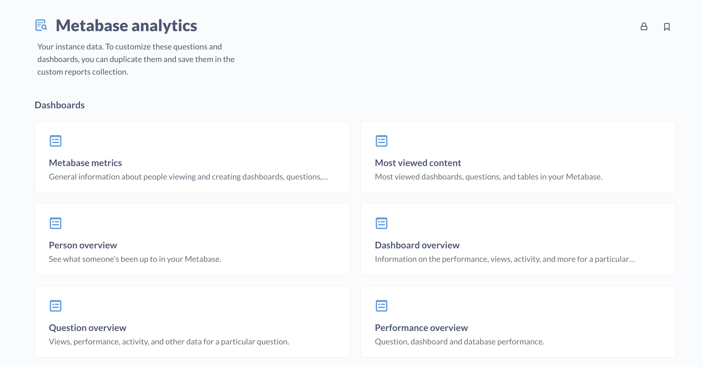

# Usage analytics



The **Metabase Analytics** collection is a special collection that contains view-only questions, dashboards, and models that help you understand how people are using your Metabase.

These resources are useful for:

- **Understanding Usage**: Understand how people use your Metabase (e.g., new questions, most active people and groups, and so on).
- **Auditing activity**: Know who viewed or did what and when, including tracking dashboard and question views, queries, downloads, and other activity like changing settings or inviting people to your Metabase.
- **Improving operations**: Know the slowest dashboards and questions, how your database's are performing, who's consuming the most resources, and so on.

Some things to keep in mind with this special Metabase analytics collection:

- Metabase analytics is a view-only collection. Even admins can't curate it. It is eternal.
- By default, only admins can view the Metabase analytics collection (though admins can grant other groups view access to it). If you're upgrading from a version older than 48, people in groups with [monitoring access](../usage-and-performance-tools/usage-analytics.md) will also get access to the Metabase analytics collection. But after that initial grandfathering in, the monitoring access privilege is unrelated to the Metabase analytics collection; you'll need to specifically grant groups access to the Metabase analytics collection.
- You can duplicate any item in the Metabase analytics collection, modify the item to your liking, and save the item to another collection.
- Metabase creates some default user accounts that you might see in your usage analytics, like `internal@metabase.com`. See [Default accounts](../people-and-groups/managing.md#default-user-accounts) for more information.

## Permissions

By default, only admins can see the Metabase analytics collection. You can manage permissions for the collection in **Admin settings** > **Permissions** > **Collections**.

There are only two access types for the Metabase analytics collection: **View** and **No access**.

Additionally, this Metabase analytics collection has a default sub-collection called "Custom reports" which you can use to save duplicated/modified questions, dashboards, and models. This sub-collection inherits the same permissions, but it's not view-only; admins have curate access by default, and can grant other groups view access.

## Viewing usage insights for a question, dashboard, or model

> Only people in groups with view access to the Metabase analytics collection will see this Usage insights option.

To view usage analytics for a question, dashboard, or model:

- Visit the item.
- Click on the dot menu (**...**).
- Select **Usage insights**.

Metabase will take you to the relevant usage dashboard and plug in the item's ID.

## Creating custom reports

You can duplicate any of the questions, dashboards and models in the Metabase analytics collection and tweak them to your liking, but you'll need to save them to a different collection.

### Custom reports collection

While you _can_ save custom questions, models, and dashboards wherever you like (except for the Metabase analytics collection), we recommend that you save your custom Metabase analytics reports in the conveniently named "Custom reports" sub-collection. That way these items inherit the same permissions as the parent Metabase analytics collection.

There is one thing to know about the Custom reports collection: its metadata resets whenever Metabase restarts. While you are able to temporarily rename the Custom reports collection, or give it a description or an Official badge, Metabase will drop this collection's metadata when it restarts. But rest assured that Metabase will preserve any questions, models, events, or dashboards that you add to the Custom reports collection.

## Dashboards

The Metabase Analytics collection includes a set of read-only dashboards.

### Metabase metrics dashboard

General information about people viewing and creating dashboards, questions, subscriptions, and alerts. Cards include:

- Active users last week
- Question views last week
- Questions created last week
- Dashboards created last week
- Alerts and subscriptions created last week
- Weekly active users
- Question views per week
- Most active users
- Most active creators
- Most viewed dashboards
- Most viewed cards

### Most viewed content dashboard

View the most relevant content in your Metabase. Cards include:

- Most viewed dashboards
- Most viewed questions
- Most viewed tables

### Person overview dashboard

See what someone's been up to in your Metabase. Cards include:

- Member of
- Active alerts
- Questions created per month
- Question views per month
- Most viewed dashboards
- Most viewed questions
- Last viewed dashboards
- Last viewed questions
- Last viewed tables
- Recent activity
- Last queries

### Dashboard overview dashboard

Information about dashboards, questions, models, and tables. Cards include:

- Dashboard metadata
- Dashboard views per month
- Question performance
- Most active people on this dashboard
- Questions in this dashboard
- Most active people on this dashboard
- Questions in this dashboard
- Recent activity on dashboard
- Subscriptions on this dashboard

### Question overview dashboard

Views, performance, activity, and other data for a particular question. Cards include:

- Question metadata
- Question views per month
- Question performance
- Most active people on this question
- Dashboards with this question
- Last activity on this question
- Alerts on this question

### Performance overview dashboard

Question, dashboard and database performance. Cards include:

- Slowest dashboards
- Dashboards consuming most resources
- Slowest questions
- Questions consuming the most resources
- Dashboards with more questions in the same tab
- Users consuming the most resources

### Content with cobwebs dashboard

Dashboards and questions that you could consider archiving. Cards include:

- Dashboards without recent reviews
- Questions without recent reviews
- Questions that don't belong to a dashboard

## Models

The Metabase analytics collection includes a bunch of useful models based on Metabase's application database.

## Activity log model

Each row of this model describes one event of a particular topic. Fields include:

- ID
- Topic
- Timestamp
- End Timestamp
- User ID
- Model
- Model ID
- Details

The topics include:

- alert-create
- alert-delete
- card-create
- card-delete
- card-update
- dashboard-add-cards
- dashboard-create
- dashboard-delete
- dashboard-remove-cards
- install
- metric-create
- metric-delete
- metric-update
- segment-create
- segment-delete
- segment-update
- setting-update
- subscription-create
- subscription-delete
- user-joined

## View log model

Tracks views cards (which includes models), dashboards, and tables. Fields include:

- ID
- Timestamp
- User ID
- Entity Type (card, dashboard, or table)
- Entity ID
- Entity Qualified ID

## Query log model

Information about all queries Metabase ran across all dashboards. Fields include:

- Entity ID
- Started At
- Running Time Seconds
- Result Rows
- Is Native
- Query Source
- Error
- User ID
- Card ID
- Card Qualified ID
- Dashboard ID
- Dashboard Qualified ID
- Pulse ID
- Database ID
- Database Qualified ID
- Cache Hit
- Action ID

Query sources include:

- action
- ad-hoc
- collection
- csv-download
- dashboard
- embedded-dashboard
- embedded-csv-download
- embedded-json-download
- embedded-question
- embedded-xlsx-download
- json-download
- map-tiles
- metabot (experimental)
- public-dashboard
- public-question
- pulse (which includes dashboard subscriptions and alerts)
- question
- xlsx-download

## Alerts model

All alerts, both active and archived.

- Entity ID
- Entity Qualified ID
- Created At
- Updated At
- Creator ID
- Card ID
- Card Qualified ID
- Alert Condition
- Schedule Type
- Schedule Day
- Schedule Hour
- Archived
- Recipient Type
- Recipients
- Recipient External

### Content model

Questions, dashboards, models, events, and collections.

- Entity ID
- Entity Qualified ID
- Entity Type
- Created At
- Updated At
- Creator ID
- Name
- Description
- Collection ID
- Made Public By User
- Is Embedding Enabled
- Archived
- Action Type
- Action Model ID
- Collection Is Official
- Collection Is Personal
- Question Viz Type
- Question Database ID
- Question Is Native
- Event Timestamp

Entity types include:

- action
- collection
- dashboard
- event
- model
- question

## People model

Everyone in your Metabase, including deactivated accounts. Fields include:

- User ID
- Email
- First Name
- Last Name
- Full Name
- Date Joined
- Last Login
- Updated At
- Is Admin
- Is Active
- SSO Source
- Locale

## Dashboard subscriptions model

Which subscriptions are active, who created them, who's subscribed to them, when they're sent, and more.

- Entity ID
- Entity Qualified ID
- Created At
- Updated At
- Creator ID
- Archived
- Dashboard Qualified ID
- Schedule Type
- Schedule Day
- Schedule Hour
- Recipient Type
- Recipients
- Recipient External
- Parameters

## Dashboard cards model

Each row is a dashboard card: either a question card or a text card. Fields include:

- ID
- Dashboard ID
- Dashboardtab ID
- Question ID
- Created At
- Updated At
- Size X
- Size Y
- Visualization Settings
- Parameter Mappings

## Databases model

Information about your connected data sources. Fields include:

- Entity ID
- Entity Qualified ID
- Created At
- Updated At
- Name
- Description
- Database Type
- Metadata Sync Schedule
- Cache Field Values Schedule
- Timezone
- Is On Demand
- Auto Run Queries
- Cache Ttl
- Creator ID
- Db Version

## Tables model

List of all tables across all connected data sources. Fields include:

- Entity ID
- Entity Qualified ID
- Created At
- Updated At
- Name
- Display Name
- Description
- Active
- Database ID
- Schema
- Is Upload

## Fields model

All fields from all connected data sources. Fields include:

- Entity ID
- Entity Qualified ID
- Created At
- Updated At
- Name
- Display Name
- Description
- Base Type
- Visibility Type
- Fk Target Field ID
- Has Field Values
- Active
- Table ID

## System tasks model

Describes the last 14 days of Metabase internal processes tasks.

- ID
- Task
- Database Qualified ID
- Started At
- Ended At
- Duration Seconds
- Details
