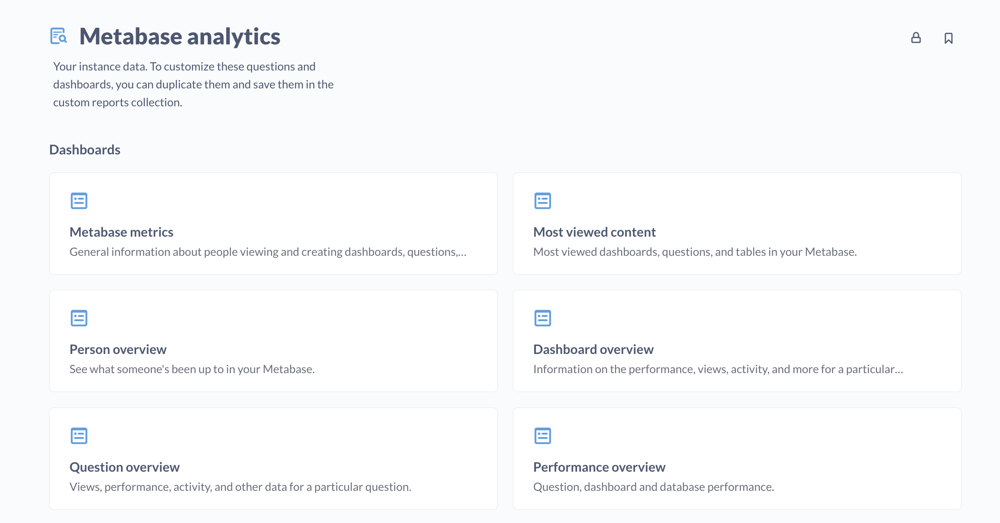

# Usage analytics



The **Usage analytics** collection is a special collection that contains view-only questions, dashboards, and models that help you understand how people are using your Metabase.

You can find the **Usage analytics** collection under **collections** in the left navigation sidebar. You can also create custom reports.

These resources are useful for:

- **Understanding Usage**: Understand how people use your Metabase (e.g., new questions, most active people and groups, and so on).
- **Auditing activity**: Know who viewed or did what and when, including tracking dashboard and question views, queries, downloads, and other activity like changing settings or inviting people to your Metabase.
- **Improving operations**: Know the slowest dashboards and questions, how your database's are performing, who's consuming the most resources, and so on.

> Metabase creates some default user accounts that you might see in your usage analytics, like `internal@metabase.com`. See [Default accounts](../people-and-groups/managing.md#default-user-accounts).

## Access to Usage analytics

You can find the **Usage analytics** collection under **collections** in the navigation sidebar. By default, only admins can see the Usage analytics collection, but admins can grant other groups view access to it. You can manage permissions for the collection in **Admin** > **Permissions** > **Collections**.

There are only two access types for the Usage analytics collection: **View** and **No access**. Even admins can't curate Usage analytics.

Additionally, this Usage analytics collection has a default sub-collection called "Custom reports" which you can use to save duplicated/modified questions, dashboards, and models. This sub-collection inherits the same permissions, but it's not view-only; admins have curate access by default, and can grant other groups view access.

> If you're upgrading from a version older than 48, people in groups with monitoring access will also get access to the Usage analytics collection. But after that initial grandfathering in, the monitoring access privilege is unrelated to the Usage analytics collection; you'll need to specifically grant groups access to the Usage analytics collection.

## Viewing usage insights for a question, dashboard, or model

> Only people in groups with view access to the Usage analytics collection will see this Usage insights option.

To view usage analytics for a question, dashboard, or model:

- Visit the item.
- Click on the info button in the upper right.
- Click **Insights**.

Metabase will take you to the relevant usage dashboard and plug in the item's ID.

## How long Metabase keeps usage data

By default, Metabase will keep the data about [activity](./usage-analytics-reference.md#activity-log), [views](./usage-analytics-reference.md#view-log), and [query execution](./usage-analytics-reference.md#query-log) for **720 days**. Twice a day, Metabase will delete rows older than this threshold. You can change this limit by adjusting the environment variable [`MB_AUDIT_MAX_RETENTION_DAYS`](../configuring-metabase/environment-variables.md#mb_audit_max_retention_days).

If you're on the Metabase Open Source Edition, or on the [Metabase Cloud Starter plan](https://www.metabase.com/pricing/), Metabase doesn't collect [Activity](./usage-analytics-reference.md#activity-log) and [View](./usage-analytics-reference.md#view-log) data. If you upgrade to a Pro or Enterprise plan, either self-hosted or Cloud, you'll only see View and Activity data in Usage Analytics _starting from the time when you upgraded_.

## Creating custom reports

You can duplicate any of the questions, dashboards and models in the Usage analytics collection and tweak them to your liking, but you'll need to save them to a different collection.

### Custom reports collection

While you _can_ save custom questions, models, and dashboards wherever you like (except for the Usage analytics collection), we recommend that you save your custom Usage analytics reports in the conveniently named "Custom reports" sub-collection. That way these items inherit the same permissions as the parent Usage analytics collection.

There is one thing to know about the Custom reports collection: its metadata resets whenever Metabase restarts. While you are able to temporarily rename the Custom reports collection, or give it a description or an Official badge, Metabase will drop this collection's metadata when it restarts. But rest assured that Metabase will preserve any questions, models, events, or dashboards that you add to the Custom reports collection.

## Dashboards and models

The Usage analytics collection ships a set of read-only dashboards and models that you can browse from the **collections** sidebar.

For dashboards and models specifically about Metabot and LLM usage, see [AI usage auditing](../ai/usage-auditing.md).

See also the [Usage analytics reference](./usage-analytics-reference.md).

### Performance overview on MySQL or MariaDB

If you're using MySQL or MariaDB as your application database, the Performance overview dashboard won't display results for the cards showing 50th and 90th percentile query running times, because MySQL and MariaDB don't support the [Percentile aggregation](../questions/query-builder/expressions-list.md#percentile). We recommend using PostgreSQL as your application database.
