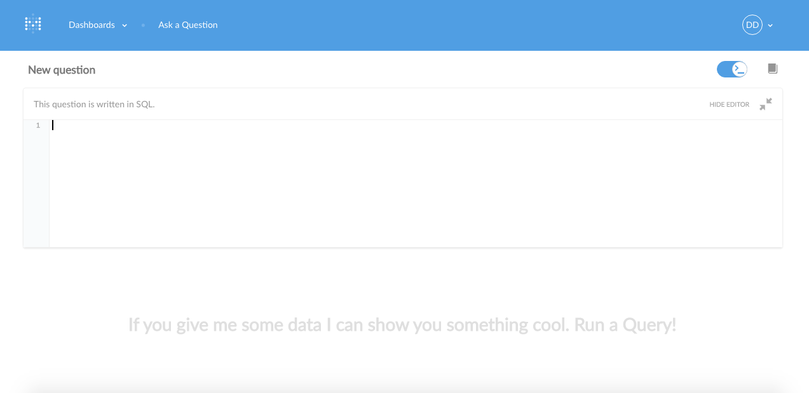

#User Guide

> **This guide will teach you:**
>
> What Metabase does
> The basics of database terminology
> What Metabase questions are made up of
> How to ask basic questions
> How to visualize the answers to questions
> How to share answers with others through dashboards
> Tips on creating useful dashboards

## Overview
---
### What is Metabase?
Metabase is an open source business intelligence server.  

It lets you ask questions based on your own data.  Answers are displayed in formats that make sense, whether that's a bar graph or a detailed table.  

You can mark your questions to be saved for later, making it easy to come back to them.  Or you can group questions into visual dashboards.  Metabase makes it easy to share questions and dashboards with the rest of your team. 

### A Short Overview of Databases
Before you jump into working with Metabase, it's helpful to know a few key database terms. 

A database is a **collection of tables**.

#### Tables
Tables contain one or more **columns** and one or more **rows**. 
A row is made up of cells and each cell has a value that corresponds to the column it falls under.  

Here's an example of a table:

| Name| Age |
| ---- | --- |
| John | 25 |
| Jenny | 31 |

Here the columns would be `Name` and `Age`. The first row would contain two cells, one with `John` and one with `25` (John's age).

#### Columns
All the cells in a column contain the same type of information.  For example, in the sample table above, the `Name` column contains names in each cell, while the `Age` column lists ages.  

Each field has a type that describes what kind of data is stored in the field.

Examples of types:

* **String Types** (TEXT, CHAR, VCHAR, etc.)  - These fields store things like names, addresses, or anything else that is text.

* **Numerical Types** (Integer, Float, DoubleFloat, Decimal, etc.) - These fields store numbers. Integers are whole numbers; floats and decimals are ways to store numbers with decimals in them. Numerical types store things like age, bank account balances, costs, latitudes, and longitudes. 

* **Time Types** (Timestamp, etc.) - These fields are a special format of a number used to store dates and times (or both). Sometimes databases store an integer timestamp which is either seconds or milliseconds, such as `00:00:00 Coordinated Universal Time (UTC), Thursday, 1 January 1970`. This convention  allows for compact storage of timestamps. 
* **IDs** (also called **primary keys**) - This field uniquely identifies each row.  For example, imagine a car reservation app where you can book a car in advance.  The ID of the reservation could be the reservation number (no two reservations would share the same reservation number).

**Customer**

| ID | Name| Age |  
| ---- | --- | --- |
| 11| John | 25 |
| 12| Jenny | 31 |

In the above table, the `ID` field is an ID (primary key). The `Name` field is a string type and the `Age` field is a numerical type (specifically an Integer).   

#### Relationships
Tables can contain references to other tables. 

For example, in our hypothetical car booking app, we would have two tables, one for reservations (let's call it **Reservation**) and one for customers, (we'll call this one **Customer**).  

To connect the reservation data to the corresponding customer data, you can use a `Foreign Key`.  A **`Foreign Key`** is a field used in databases when the contents of its field are the same value as the ID value of a connected row in another table. 
 
For example, in our hypothetical car booking app, we could connect each reservation to the customer that made the reservation by having the `Customer` column of the reservation contain the same value as the `ID` column of the customer who made the reservation.

**Reservation**

| Customer | Date | Car | 
| ---- | --- | --- | 
| 11 | 12/20/2015 | Toyota Camry |
| 12 | 1/2/2016 | Range Rover |

**Customer**

| ID | Name| Age |  
| ---- | --- | --- |
| 11| John | 25 |
| 12| Jenny | 31 |

If we wanted to analyze our hypothetical app's database with Metabase, we could ask a question, like: 

-- Example of a join --

##Asking Questions
---
Metabase's two core concepts are questions and their corresponding answers.  Everything else is based around this functionality.  To ask Metabase a question, use the query interface bar.  

Questions are made up of a number of parts:

###Source Data
---
Source data comes from a table in your database.  Typically, users use a single table from their database as the starting point for their questions.  

###Filtering your Data 
---
You can filter your data by any field in the table you're working with or any connected tables through foreign keys. Filters narrow down the source data to an interesting subset, like "active users" or "bookings after June 15th, 2015."  

Different fields can have different filters based on them.
There are four universal operators that can be applied to any field.  These operators are:

* *is a value,* eg. "Status is 'closed'"
* *is not a value* eg. "Status is not 'closed'"
* *is null*, i.e. it isn't set in the record
* *is not null*

Some fields have a limited number of possible operators. Metabase will pick up on this and limit the choices in the filter selection to only valid values.
Some fields (eg. price) will have many possible operators.

Fields that are comparable, like numbers or dates, can also be filtered using the following operators:

* *Less than* a value you enter
* *Greater than* a value you enter
* *Between* two values you enter

If filtering by dates, a datepicker will appear to allow you to input dates easily.

###Answer Output
---
Metabase can output the answer to your query in seven different ways.  
#### Raw Data: 
Raw Data is a table with the answer listed in rows.  It's useful when you want to see the actual data you're working with (rather than an aggregate sum) or when you're exploring a small table with a limited number of records.  

Filter your query by field to see segments of interesting users, venues, or groups, etc. Raw data is an output of each individual record that matches your question's criteria.   
####Other Output Options
What's a *metric*? It's a number that is derived from your source table and takes into consideration any filters or elements you asked Metabase to apply to your question.  Instead of listing an answer in terms of raw data, Metabase can give the answer to certain questions in metric format.  

####Basic Metrics
* **Count:** Total of number of rows in the answer.  Each row corresponds to a separate record.

* **Sum:** Sum of all the values in a column
* **Average:** Average of all the values in a column

####Advanced Metrics
* **Number of Distinct Values:** Number of a column's unique values among all the rows in the answer (Ex. number of different types of items sold in store—*not to be confused with the total number of items sold*)

* **Cumulative Sum:** Additive sum of all the columns (Ex. total revenue over time)
* **Standard Deviation:** Number which expresses how much the values of a column vary among all rows in the answer 

###Breaking Out Metrics: Add a group
---
Metrics are a single number. Often you'll want to know more detailed information. 

For example, the sum of all invoiced amounts is a metric.  It's natural to want to look at this metric across time or another dimension, such as whether the invoices are paid or not. 

You can do this by adding a **Group** element to your question.  You can break out your answer by any date or time dimension in your table, as well as any category field. 

If you apply a *single dimension* to your question, you get a table where the leftmost column is the dimension and the rightmost column is the value of the metric for that dimension's value.
*Two dimension* breakouts are equivalent to a pivot table in Excel and are one of the workhorses of the business intelligence world.
If you break out by additional dimensions, you will add columns to the left of the dimension.

###Advanced Options
---
Click on the three dots on the right hand side of the query interface bar to set advanced settings.  

* Limit your results to 1, 10, 25, 100, or more entries
* Sort by a column: either by clicking on the column header or by selecting the column in the advanced section

####Digging into Individual Records

Click on a record's ID to see more information about a given person, venue, etc.  You can see all fields related to that ID and all connected tables that are hidden for readability in the standard dispaly.  

##Asking more Advanced Questions in SQL
---

If you ever need to ask questions that can't be expressed  using our interactive GUI (guided user interface) query builder, you can use **SQL**.

*What's SQL?* 

* SQL (pronounced "sequel") is short for Structured Query Language and is a widely used standard for getting data from databases. To learn more about it read: [SQL Tutorial](http://www.w3schools.com/sql/default.asp)

Even if you don't understand SQL or how to use it, it's worthwhile to understand how to use it inside Metabase because sometimes other people will share SQL based questions that are useful to you.

###Using SQL
You can switch a card from GUI mode to SQL mode by clicking on the "**>_**" button in the upper right hand corner.  

You can write SQL directly into the text box that appears.

To try it out, type the command `select count(*), date from purchases group by date`. Don't worry if you don't understand this just yet. Click 'run query' and note the table that comes back is the same as if you had graphed "count" broken out by "date". 

Questions asked using SQL can be saved, downloaded, or added to a dashboard just like questions asked using the GUI.

##Visualizing results
---
While tables are useful for looking up information or finding specific numbers, it's usually easier to see trends and make sense of data overall using graphs.

Answers to questions can be visualized in a number of ways:

* Number
* Table
* Line
* Bar
* Pie
* Area
* Maps 
   * United States Map - Creating a map of the United States from your database requires your results to contain a column field with states.  GeoJSON is the default output format.  
   * Country Map - To visualize your results in the format of a country map, your result must contain a column that is a country.  The default output format is GeoJSON.  
   * Pin Map - To generate a pin map, your account administrator to configure a Google Maps API key and for your data set to contain a marked latitude and longitude column.    

To change how the answer to your query is displayed, click on the visualization button beneath the query interface bar to access the dropdown menu.  

If a particular output format is not sensible for your query, the format option will appear faded on the dropdown menu.  
 
Once a question is answered, you can save, favorite, or download the answer. 

##Saving Questions
---
###How to Save a Question
After entering a question, click the blue **Save** Button above the query interface bar to save a question.  

A pop-up box will appear asking you to input information about the question. 

After you save a question, the query interface bar will change.  Instead of the **Save** button, you will have three new options.  Clicking the **Star** favorites the question.  Click the middle **Double Square** button to delete the saved question.  Click the **Dashboard +** icon to add your saved question to a Dashboard.  

##Dashboards
---
###What is a dashboard?
A **dashboard** is a collection of saved questions that you want to refer back to regularly.  It displays groups of questions and their corresponding answers.  Questions on a dashboard are meant to be consumed together.  Each question is on its own card that you can move or resize as you see fit.  

For example, you could have a dashboard devoted to metrics about the number of reservations.  It could show the number of reservations by day of week, time of day, geographical region, and more.  

Have a few key performance indicators that you want to be able to easily check?  Make a dashboard featuring questions that show your key metrics and share it with your team.  

You can make as many dashboards as you want.  **Public dashboards** (public only to those within your organization!) can show canonical KPIs that your whole team regularly checks in on.  Use your **personal dashboards** for projects or for keeping track of your own areas of interest.
##How to add a Question to a Dashboard
After saving a question, click the **"Dashboard +"** icon to add a question to a dashboard. 

##How to Create a Dashboard
Once you have a question saved, you can create a dashboard.  Click "Create a new dashboard" (*See Figure 5*).  Enter a name and description for your dashboard, as well as configure its privacy settings.  

Once you successfully create your dashboard, the following pop-up will appear.  

You can view your Dashboard by clicking the link or by selecting dashboard from the dropdown menu at the top of the screen.  

After creating your first dashboard and adding your first question, your dashboard will look similar to this: 

##How to Arrange Dashboards
To make changes to a dashboard, clicking the **Dashboard Grid** button will allow you to resize, reorder, or remove individual question cards. 

The lines around the card will change from solid to dotted, signifying that you are in edit mode.  

* To resize a card, click on its borders.  You can also use the handle in the lower right corner, which will let you drag your cursor to resize the card.  
* To reorder your cards, click and drag the card to where you want it to be.  Other cards will rearrange as you move the card to its new place to make room for it.  
* To remove a question card, click the **X** icon on the card.  

##How to Delete a Dashboard
Deleting a dashboard does not delete the individual question cards on a dashboard.  Deleting a dashboard deletes the grouping of the questions (but not the questions themselves).  

To delete a dashboard, click the **Edit** button next to the title of your dashboard at the top of the screen.  

A popup screen will appear that will allow you to choose to delete the dashboard, or change its settings.  

Be careful when deleting public dashboards - make sure other users in your organization do not need the dashboard.

##Tips on Creating Helpful Dashboards
To make a dashboard that is actually helpful, decide what you want the dashboard to tell you about your data.  What questions will give you insight into what you want to know?  

Once you know what questions you want to know the answer to, make a question card for each question and save them.  Then save the cards to the dashboard.  Once you have the cards you want, structure the cards so that users can easily consume the information.  Place the most important cards near the top of the dashboard or make them bigger than the other cards.  Doing so, will naturally draw users' attention to the cards.

If you have more than 10 cards on a dashboard, consider breaking the dashboard into two separate ones.  You don't want to overwhelm users with too much information and each dashboard should revolve around one theme.  Remember you can make as many dashboards as you want - there's no limit!

##Getting Help on your Data Model
---
You can get to the data model reference at any time by clicking on the **Book** icon in the top righthand corner of the screen.

After clicking the icon, the **Data Reference** tab will open.  It lists all the databases you have access to and the tables inside them. 
 

Click on the table you would like to explore further to see a description of it and a list of all the fields it contains. 

If you click on a field of interest, you will see a description of the field's contents, as well as suggestions for queries based on that field.   

In addition to looking at a table's fields, you can also look at its connections if your table includes any.  Click on **Connections** to view them (located next to **Field** button).

 
  