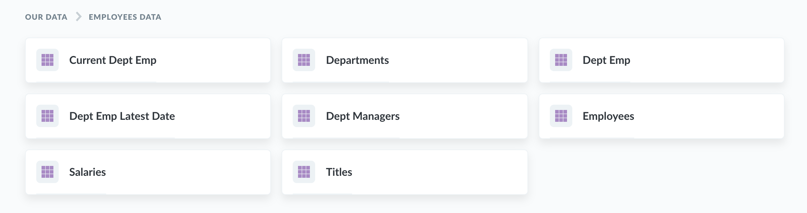

## What is Metabase?

Metabase is an open source business intelligence tool. It lets you ask questions about your data, and displays answers in formats that make sense, whether that's a bar chart or a detailed table.

Your questions can be saved for later, making it easy to come back to them, or you can group questions into great looking [dashboards](./07-dashboards.md). Metabase also makes it easy to share questions and dashboards with the rest of your team.

## Finding your way around

So, you've [gotten Metabase up and running](../operations-guide/start.md) and [connected it to your data](../administration-guide/01-managing-databases.md). It's time to give you the lay of the land.

### The home page

Fresh out of the box, Metabase will show you a few things on the home page:

- A prompt to [connect your data to Metabase](../administration-guide/01-managing-databases.md) (if you haven't already).
- Some [automatic explorations](14-x-rays.md) of your tables that you can look at and save as a dashboard if you like any of them. (Administrators can permanently hide this section by clicking the **X** that appears on hover.)
- An area where things you or your teammates create will show up, along with a link to see all the dashboards, questions, and pulses you have.
- A list of the databases you've connected to Metabase. (As with X-rays, administrators can permanently hide this section by clicking the **X** that appears on hover. You can always click on **Browse Data** from the main nav bar to see your databases and tables.)

Once you've created some [dashboards](07-dashboards.md), any of them that you pin in the main "Our analytics" collection will show up on the homepage for all of your teammates, so that when they log in to Metabase they'll know right where to go.

### Browse your data

If you connected your database to Metabase during setup, you'll see it listed at the bottom of the homepage along with the sample database that Metabase comes with. Click on a database to see its contents. You can click on a table to see its rows, or you can also click on the bolt icon to x-ray a table and see an automatic exploration of it, or click on the book icon to go to the data reference view for that table to learn more about it.

### Explore your analytics

As you and your team create dashboards and collections, they'll start to show up on the homepage. Click on a [collection](./collections.md) in the "Our analytics" section to see its contents, or click **Browse all items** to see everything you and your team have made. [More about exploring](03-basic-exploration.md)

### Make something new

Click the **+ New** button in the top-right of Metabase to create a new:

- **Question** using Metabase's [graphical query builder](04-asking-questions.md).
- **SQL query** to ask a question using the [SQL editor](./writing-sql.md).
- **Dashboard** to create a [dashboard](./07-dashboards.md) to gather and arrange questions and text cards on a grid. You can add filters to dashboards, and share and embed them, and subscribe to them via email or Slack. See [Dashboards](./07-dashboards.md).
- **Collections** to create a new [collection](./collections.md) that organizes questions, dashboards, and models.

To [create a new model](./models.md), ask a question using either the query builder or the SQL editor, then convert the results to a model.

### Use search to quickly find things

The search bar at the top of the screen helps you find tables, dashboards, collections, saved questions, metrics, segments, and pulses in an instant.

## Next: Exploring Metabase

Now that we've covered the basics of what Metabase is and can do, let's look at [dashboards and questions](03-basic-exploration.md) that your teammates have already made.