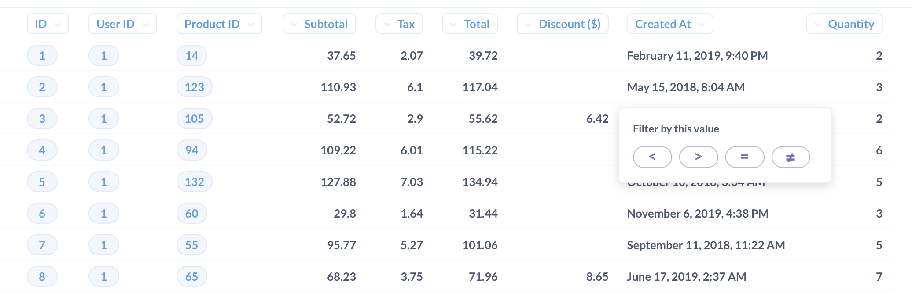
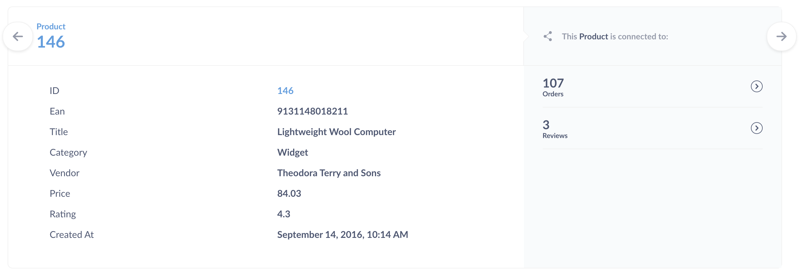

## Exploring in Metabase

#### See what your teammates have made

As long as you're not the very first user in your team's Metabase, the easiest way to start exploring your data is by looking at dashboards, charts, and lists that your teammates have already created. The best place to start is by checking out any dashboards that might be pinned on your home page, or in collections you have access to.

#### Browse your data

Alternatively, you can dive right in to exploring the data in Metabase by clicking on one of the databases at the bottom of the home page or clicking the **Browse data** button in the top nav bar, and then selecting a database and clicking on one of its tables to see it. You can also click on the bolt icon on any table to see an automatic exploration of its data. Give it a try!

To learn more, see [Exploring data with Metabase's data browser](https://www.metabase.com/learn/basics/questions/data-browser.html).

#### Exploring collections

Collections in Metabase are a lot like folders. They're where all your team's dashboards and charts are kept. To explore a collection, just click on one in the **Our analytics** section of the home page, or click on `Browse all items` to see everything.

If your teammates are cool, they'll have pinned some important dashboards or questions within your collections; if so, those important or useful items will show up in a different color at the top of a collection. Any dashboards that are pinned in the top-level, **Our Analytics** collection will also show up on the Metabase homepage.

Collections have a list of any other items that are saved within them, and you can see what other collections are saved inside of the current one by checking out the navigation sidebar.

#### Exploring dashboards

Dashboards are a set of questions and text cards that you want to be able to refer back to regularly. [Learn more about dashboards](07-dashboards.md).

If you click on a part of a chart, such as a bar in a bar chart, or a dot on a line chart, you'll see a the **Action menu**, with actions you can take to dive deeper into that result, branch off from it in a different direction, or create an [X-ray](14-x-rays.md) to see an automatic exploration of the data.

In this example of orders by product category over time, clicking on a dot on this line chart gives us the ability to:

- **Zoom in**: See orders for a particular category over a shorter time range.
- **View these Orders**: See a list of the orders for a particular month
- **Break out by a category**:  See things like the Gizmo orders in June 2017 broken out by the status of the customer (e.g., `new` or `VIP`). Different charts will have different breakout options, such as **Location** and **Time**.

> Note that while charts created with SQL don't currently have the action menu, you can add SQL questions to a dashboard and customize their click behavior. You can send people to a [custom destination](https://www.metabase.com/learn/building-analytics/dasboards/custom-destinations.html) (like another dashboard or an external URL), or have the clicked value [update a dashboard filter](https://www.metabase.com/learn/building-analytics/dashboards/cross-filtering.html).

Clicking on a table cell will often allow you to filter the results using a comparison operator, like =, >, or <. For example, you can click on a table cell, and select the less than operator `<` to filter for values that are less than the selected value.

Lastly, clicking on the ID of an item in a table gives you the option to go to a detail view for that single record. For example, you can click on a customer's ID to see the profile view for that customer.

When you add questions to a dashboard, you can have even more control over what happens when people click on your chart. In addition to the default action menu, you can add a [custom destination](https://www.metabase.com/learn/building-analytics/dasboards/custom-destinations.html) or [update a filter](https://www.metabase.com/learn/building-analytics/dashboards/cross-filtering.html). Check out [interactive dashboards](interactive-dashboards.md). to learn more.

#### Exploring saved questions

In Metabase parlance, every chart on a dashboard is called a "question." Clicking on the title of a question on a dashboard will take you to a detail view of that question. You'll also end up at this detail view if you use one of the actions mentioned above.

When you're looking at the detail view of a question, you can use all the same actions mentioned above. You can also click on the headings of tables to see more options, like summing the values of a column, or filtering based on that column.

One of our personal favorite ways to explore is with the **Distribution** option. This will show you how many rows there are in a given table, grouped by the column you clicked on. So if you have a Users table, if you click on an Age column and select Distribution, you'll see a bar chart with the count of users you have in each age bracket.

---

## Next: Asking custom questions

So what do you do if you can't find an existing dashboard or question that's exactly what you're looking for? Let's learn about [asking our own new questions](04-asking-questions.md).
