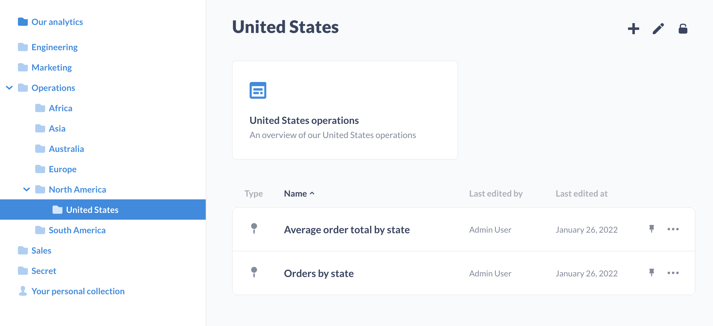
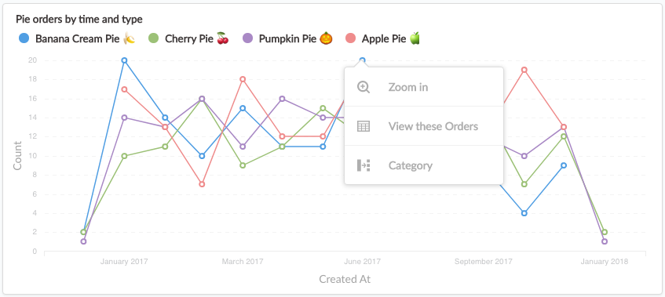
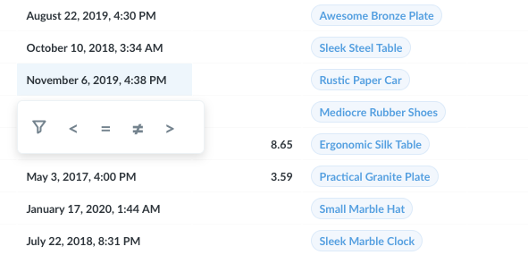
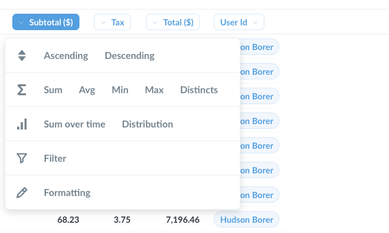

## Exploring in Metabase

#### See what your teammates have made

As long as you're not the very first user in your team's Metabase, the easiest way to start exploring your data is by looking at dashboards, charts, and lists that your teammates have already created. The best place to start is by checking out any dashboards that might be pinned on your home page or in the collections you have access to.

#### Browse your data

Alternatively, you can dive right in to exploring the data in Metabase by clicking on one of the databases at the bottom of the home page or clicking the "Browse data" button in the top nav bar, and then selecting a database and clicking on one of its tables to see it. You can also click on the bolt icon on any table to see an automatic exploration of its data. Give it a try!

#### Exploring collections

Collections in Metabase are a lot like folders. They're where all your team's dashboards and charts are kept. To explore a collection just click on one in the "Our analytics" section of the home page, or click on `Browse all items` to see everything.

If your teammates are cool, they'll have pinned some important dashboards or questions within your collections; if so, those important or useful items will show up nice and large at the top of a collection. Any dashboards that are pinned in the top-level, "Our Analytics" collection will also show up on the Metabase homepage.

Collections also have a list of any other items that are saved within them, as well as a list of other collections that are saved inside the current one.

#### Exploring dashboards

Dashboards are simply collections of charts and numbers that you want to be able to refer back to regularly. [Learn more about dashboards](07-dashboards.md).

If you click on a part of a chart, such as a bar in a bar chart, or a dot on a line chart, you'll see a menu with actions you can take to dive deeper into that result, to branch off from it in a different direction, or to [x-ray](14-x-rays.md) it to see an automatic exploration of the thing you clicked on.

In this example of pie orders by type over time, clicking on a dot on this line chart gives us the ability to:

- **Zoom in** — i.e., see just the banana cream pie orders in June 2017 over time
- **View these Orders** — which lets us see a list of banana cream pie orders in June 2017
- **Break out by a category** — this lets us do things like see the banana cream pie orders in June 2017 broken out by the status of the customer (e.g., `new` or `VIP`, etc.) or other different aspects of the order. Different charts will have different break out options, such as Location and Time.

**Note that charts created with SQL don't currently have these action options.**

Other charts as well as table cells will often also allow you to go to a filtered view of that chart or table. For example, You can click on one of the inequality symbols to see that chart where the value of the Subtotal column is less than \$100, or where the Purchased-at timestamp is greater than (i.e., after) April 1, 2017.

Lastly, clicking on the ID of an item in a table gives you the option to go to a detail view for that single record. (E.g., you can click on a customer's ID to see the profile view for that one customer.)

#### Exploring saved questions

In Metabase parlance, every chart on a dashboard is called a "question." Clicking on the title of a question on a dashboard will take you to a detail view of that question. You'll also end up at this detail view if you use one of the actions mentioned above.

When you're looking at the detail view of a question, you can use all the same actions mentioned above. You can also click on the headings of tables to see more options, like summing the values of a column, or filtering based on that column.

One of our personal favorite ways to explore is with the Distribution option. This will show you how many rows there are in a given table, grouped by column you clicked on. So if you have a Users table, if you click on an Age column and select Distribution, you'll see a bar chart with the count of users you have in each age bracket.

---

## Next: Asking custom questions

So what do you do if you can't find an existing dashboard or question that's exactly what you're looking for? Let's learn about [asking our own new questions](04-asking-questions.md)
