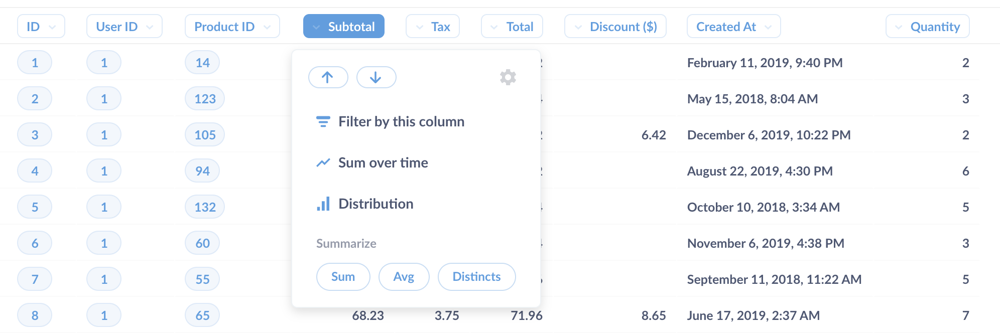

### Exploring in Metabase
As long as you're not the very first user in your team's Metabase, the easiest way to get started is by exploring charts and dashboards that your teammates have already created.

#### Exploring dashboards
Click on the `Dashboards` nav item to see all the dashboards your teammates have created. Dashboards are simply collections of charts and numbers that you want to be able to refer back to regularly. (You can learn more about dashboards [here](07-dashboards.md))

If you click on a part of a chart, such as a bar in a bar chart, or a dot on a line chart, you'll see a menu with actions you can take to dive deeper into that result, or to branch off from it in a different direction.

In this example of pie orders by type over time, clicking on a dot on this line chart gives us the ability to:
- Zoom in — i.e., see just the banana cream pie orders in June 2017 over time
- View these Orders — which lets us see a list of banana cream pie orders in June 2017
- Break out by a category — this lets us do things like see the banana cream pie orders in June 2017 broken out by the status of the customer (e.g., `new` or `VIP`, etc.) or other different aspects of the order. Different charts will have different break out options, such as Location and Time.

Other charts as well as table cells will often also allow you to go to a filtered view of that chart or table. You can click on one of the inequality symbols to see that chart where, for example, the value of the Subtotal column is less than $100, or where the Purchased-at timestamp is greater than (i.e., after) April 1, 2017.

Lastly, clicking on the ID of an item in table gives you the option to go to a detail view for that single record. (E.g., you can click on a customer's ID to see the profile view for that one customer.)

**Note that charts created with SQL don't currently have these action options.**

#### Exploring saved questions
In Metabase parlance, every chart on number on a dashboard is called a "question." Clicking on the title of a question on a dashboard will take you to a detail view of that question. You'll also end up at this detail view if you use one of the actions mentioned above. You can also browse all the questions your teammates have saved by clicking the `Questions` link in the main navigation.

When you're viewing the detail view of a question, you can use all the same actions mentioned above. You can also click on the headings of tables to see more options, like viewing the sum of the values in a column, or finding the minimum or maximum value in it.

Additionally, the question detail page has an Explore button in the bottom-right of the screen with options that change depending on the kind of question you're looking at. (Note that the Explore button disappears if your cursor stops moving.)

Here's a list of all the actions:
* Table actions
  - `Count of rows by time` lets you see how many rows there were in this table over time.
  - `Summarize this segment` gives you options of various summarization functions (sum, average, maximum, etc.) you can use on this table to arrive at a number.
* Chart and pivot table actions
  - `Break outs` will be listed depending on the question, and include the option to break out by a category, location, or time. For example, if you're looking at the count of total orders over time, you might be able to further break that out by customer gender, if that information is present.
  - `View this as a table` does what it says. Every chart has a table behind it that is providing the data for the chart, and this action lets you see that table.
  - `View the underlying records` shows you the un-summarized list of records underlying the chart or number you're currently viewing.

---

## Next: Asking new questions
So what do you do if you can't find an existing dashboard or question that's exactly what you're looking for? Let's learn about [asking our own new questions](04-asking-questions.md)
