## Asking custom questions
---
Metabase's two core concepts are questions and their corresponding answers. Everything else is based around questions and answers. To ask Metabase a question, click the New Question button at the top of the screen.

### Ways to start a new question

If an administrator has [defined some metrics](../administration-guide/07-segments-and-metrics.md), when you click on the `Ask a question` button in the top bar you'll see a screen like this one:

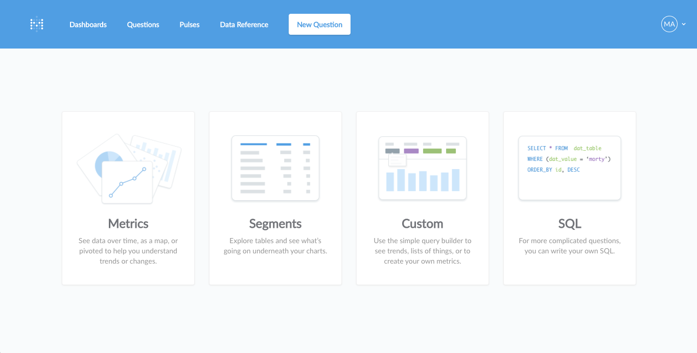

You can start your new question:
- from an existing metric
- from scratch with the Question Builder interface
- using the SQL / native query editor

Asking a new question about a **metric** is often a great place to start.

#### Asking a new question about a metric

A **metric** is a numeric measurement of something your company wants to track, like revenue, the total number of users, or the number of events that have occurred. So if you have a question like, "how many users have we had in the last 30 days?", then you could start by finding a metric like "Total Users" from your company's list of metrics, and then filtering it down to the time period you care about. Clicking on the metric option will show you a list of your company's metrics:

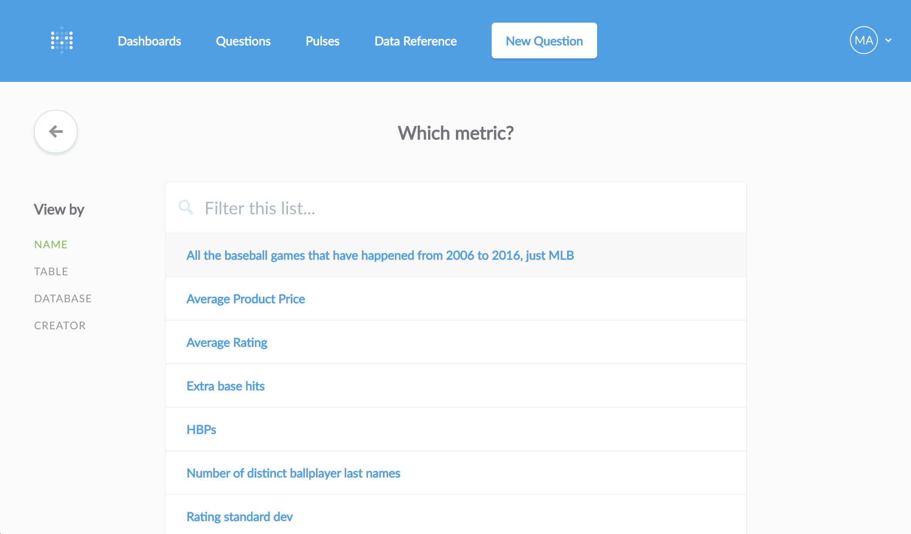

 Clicking on a metric will show you that number. From there, you can click directly on the number to break it out in interesting ways — like by day, by state, by customer, etc.:

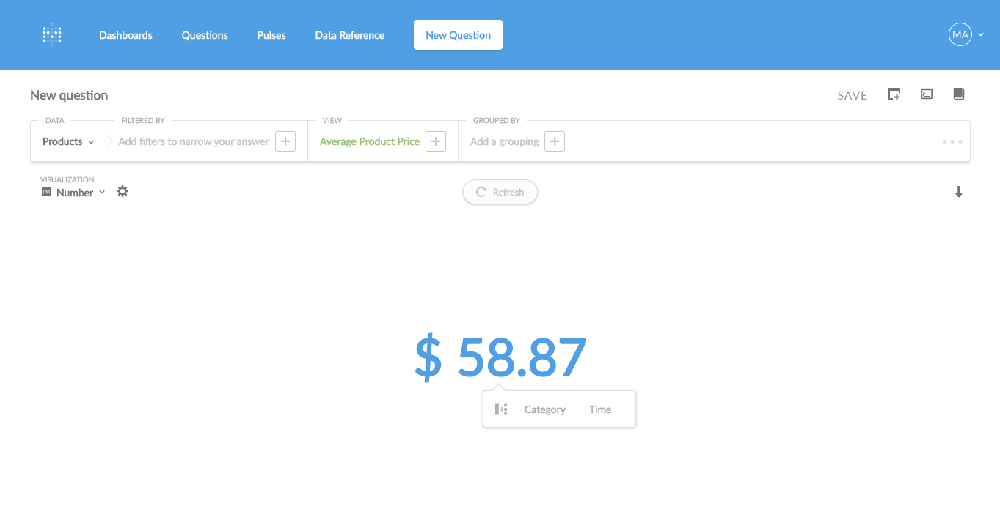

You can also use the Action Menu in the bottom-right of the screen to choose a break out, or to see the table data that the metric uses:

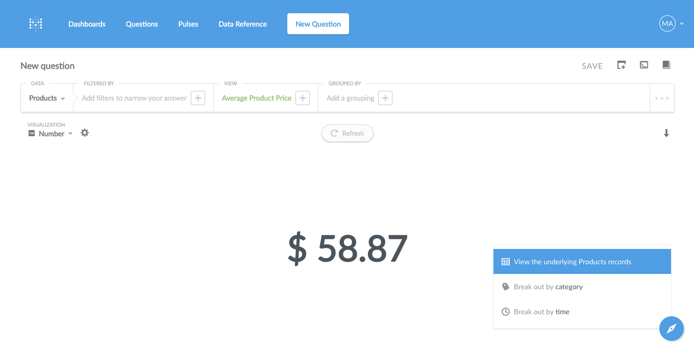

#### Asking a new question about a table

Another quick way to start a new question is by clicking on one of your connected databases at the bottom of the homepage, and picking a table that you have a question about. You'll immediately see the table and the graphical question builder so that you can keep exploring.

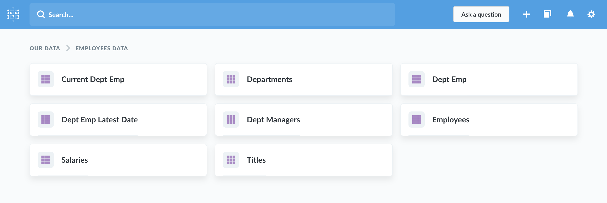

When viewing a table you can also click on the headings of columns to see options for ways to explore more, like clicking on the Age column of your Users table to see how many Users you have per age group (that's called a "distribution"):

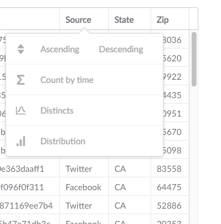

You can also use the Action Menu when viewing a table to see any metrics in it, or to summarize the table.

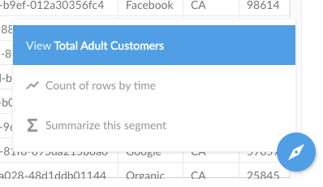

#### Asking a new custom question

If you have a question that isn't covered by an existing question, you can create a new custom question using the Question Builder interface by clicking "Custom." Or, if you're an advanced user, you can click "SQL" to go straight to the SQL/native query editor.

### Using the Question Builder interface

Metabase has a simple graphical question builder that looks like this:

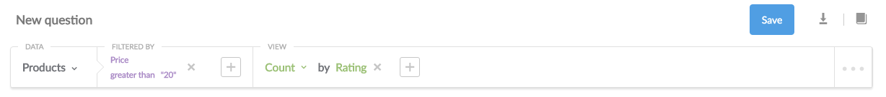

The question builder is made up of four distinct sections, from left to right:
- **Data**, where you pick the source data you want to ask a question about
- **Filters**, where you can optionally add one or more filters to narrow down your source data
- **View**, where you choose what you want to see — raw table data, a basic metric, or a "common" metric that an administrator has defined
- **Groupings**, where you can group or break out your metric by time, location, or other categories

#### Source data
---
All of the data in databases are in tables. Typically, tables will be named for the thing that each row in the table contains. For example, in a Customers table, each row in the table would represent a single customer. This means that when you’re thinking about how to phrase your question, you’ll need to decide what your question is about, and which table has that information in it.

The first dropdown menu in the question builder is where you’ll choose the database and table you want.

##### Using saved questions as source data

If you've [saved some questions](06-sharing-answers.html), in the Data menu you'll see the option to use one of your saved questions as source data. What this means in practice is that you can do things like use complex SQL queries to create new tables that can be used in a question just like any other table in your database.

You can use most saved questions as source data, provided you have [permission](../administration-guide/05-setting-permissions.html) to view that question. You can even use questions that were saved as a chart rather than a table.

**Note:** there are some kinds of saved questions that can't be used as source data:
- BigQuery questions
- Druid questions
- Google Analytics questions
- Mongo questions
- questions that use `Cumulative Sum` or `Cumulative Count` aggregations
- questions that have columns that are named the same or similar thing, like `Count` and `Count 2`

#### Filters
---
Filtering your data lets you exclude information that you don’t want. You can filter by any field in the table you're working with, or by any tables that are connected through a foreign key. Filters narrow down the source data to an interesting subset, like "active users" or "bookings after June 15th, 2015."

Different fields will have different filter options based on what kind of data type they are. There are four universal filter options, or “operators,” that can be applied to any field. These operators are:

* *is a value,* e.g., "Status is 'closed'"
* *is not a value,* e.g., "Status is not 'closed'"
* *is null*, i.e., the cell in the field is empty
* *is not null*, i.e., the cell in the field isn’t empty

Some fields have a limited number of possible operators. Metabase will pick up on this and limit the choices in the filter selection to only valid values. Some fields (e.g., a number field like Price) will have many possible operators.

Fields that are comparable, like numbers or dates, can also be filtered using the following operators:

* *Less than* a value you enter
* *Greater than* a value you enter
* *Between* two values you enter

##### Filtering by dates

If filtering by dates, a date picker will appear to allow you to select dates easily, and will default to the previous 30 days.

Click on the first dropdown to change the kind of date filter you're using. The rest of the popup menu will change depending on this first selection.

One important thing to understand when filtering by time or dates like this is the difference between specific and relative dates:

**Specific dates** are things like November 1, 2010, or June 3 – July 12, 2017; they always refer to the same date(s).

**Relative dates** are things like "the past 30 days," or "the current week;" as time passes, the dates these refer to change. Relative dates are a useful way to set up a filter on a question so that it stays up to date by showing you for example how many users visited your website in the last 7 days.

##### Using segments
If your Metabase administrators have created special named filters for the table you're viewing they’ll appear at the top of the filter dropdown in purple text with a star next to them. These are called "segments," and they're shortcuts to filters that are commonly used in your organization. They might be called things like “Active Users,” or “Most Popular Products.”

#### Selecting answer output in the View section
---
The next section of the question builder is where you select what you want the output of your answer to be, under the View dropdown. You’re basically telling Metabase, “I want to view…” Metabase can output the answer to your question in four different ways:

##### 1. Raw data
Raw Data is just a table with the answer listed in rows.  It's useful when you want to see the actual data you're working with, rather than a sum or average, etc., or when you're exploring a small table with a limited number of records.

When you filter your data to see groups of interesting users, orders, etc., Raw Data will show you an output of each individual record that matches your question's criteria.

##### 2. Basic metrics

What's a *metric*? It's a number that is derived from your source table and takes into consideration any filters you asked Metabase to apply to your question. So when you select one of these metrics, your answer will come back in the form of a number. You can add additional metrics to your question using the `+` icon next to your selected metric.

The different basic metrics are:

* **Count of rows:** The total of number of rows in the answer. Each row corresponds to a separate record. If you want to know how many orders in the Orders table were placed with a price greater than $40, you’d filter by “Price greater than 40,” and then select Count, because you want Metabase to count how many orders matched your filter.
* **Sum of …:** Sum of all the values in a column. This is really easy to get mixed up with Count — just remember that Count counts each *row*, but Sum adds up all the values in a single field. You’d use Sum to get your total revenue dollar amount, for example.
* **Average of …:** Average of all the values in a column.
* **Number of distinct values of…:** Number of unique values in all the cells of a single column. This would be useful to find out things like how many different *types* of products were sold last month (not how many were sold in total).
* **Cumulative sum of…:** This gives you a running total of a specific column. This will look exactly the same as Sum unless you break out your answer by day, week, month, etc. (See the next section about breaking out metrics.) An example would be total revenue over time.
* **Cumulative count of rows:** This gives you a running total of the number of rows in the table over time. Just like `Cumulative sum of…`, this will look exactly the same as `Count of rows` unless you break out your answer a time field.
* **Standard deviation of …:** A number which expresses how much the values of a column vary, plus or minus, from the average of that column.
* **Minimum of …:** The minimum value present in the selected field.
* **Maximum of …:** The maximum value present in the selected field.

##### 3. Common metrics

If your admins have created any named metrics that are specific to your company or organization, they will be in this dropdown under the **Common Metrics** section. These might be things like your company’s official way of calculating revenue.

##### 4. Custom expressions
Custom expressions allow you to do simple arithmetic within or between aggregation functions. For example, you could do `Average(FieldX) + Sum(FieldY)` or `Max(FieldX - FieldY)`, where `FieldX` and `FieldY` are fields in the currently selected table. You can either use your cursor to select suggested functions and fields, or simply start typing and use the autocomplete. If you are a Metabase administrator, you can now also use custom aggregation expressions when creating defined common metrics in the Admin Panel.

Currently, you can use any of the basic aggregation functions listed in #2 above in your custom expression, and these basic mathematical operators: `+`, `-`, `*` (multiply), `/` (divide). You can also use parentheses to clarify the order of operations.

#### Breaking out metrics: adding a grouping
---
Metrics are great by themselves if the answer you’re looking for is just a simple, single number. But often you'll want to know more detailed information than that. For example, the sum of all invoiced amounts is a metric. It's natural to want to look at this metric across time or another grouping, such as whether the invoices are paid or not.

You can do this by adding a **Grouping** to your question. You can break out your answer by any date or time in your table, or by any category field. These groupings are called *dimensions*.

If you apply a *single dimension* to your question, you get a table where the leftmost column is the dimension and the rightmost column is the value of the metric for that dimension's value. You can visualize this in several ways, like a line or bar graph, with the value as the y-axis, and the dimension as the x-axis.

*Two dimension* breakouts are equivalent to a pivot table in Excel, and are one of the workhorses of the business intelligence world. For example, we might want to know how many orders we had per state per month. If we want to try this with the Sample Dataset, we’d open the Orders table, skip the filters, then choose "Count or rows," and then add groupings by User:State and Created At: Month. The result is a table where the first row and column have the month and state information, and where the rest of the cells are the number of orders. (If you don't want your table to be pivoted, you can turn this option off by clicking the gear icon near the top-left of your table.)

If you add more dimensions, you will add columns to the left of the metric.

### Additional Options
---
Click on the three dots on the far right hand side of the question builder bar to open up these additional settings:

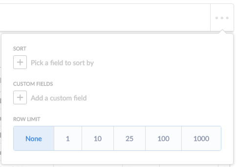

* Sort by a column: either by clicking on the column header or by selecting the column in the advanced section.
* Limit your results to 1, 10, 25, 100, or more rows.
* Create a custom field using math

#### Creating a custom field
A custom field is helpful if you need to create a new field based on a calculation, such as subtracting the value of one field from another.

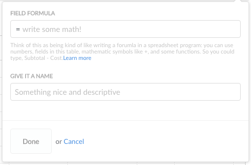

Say we had a table of baseball games, each row representing a single game, and we wanted to figure out how many more runs the home team scored than the away team (the “run differential”). If we have one field with the home team’s score, and another field with the away team’s score, we could type a formula like this:

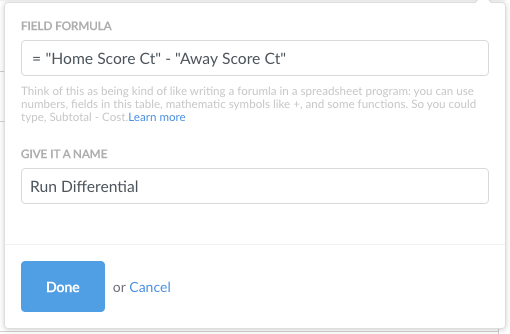

The words in the quotes are the names of the fields in our table. If you start typing in this box, Metabase will show you fields in the current table that match what you’ve typed, and you can select from this list to autocomplete the field name.

Right now, you can only use the following math operators in your formulas: `+`, `–`, `*` (multiplication), and `/` (division). You can also use parentheses to clarify the order of operations.

Once you’ve written your formula and given your new field a name, select `Raw Data` for your view, and click the `Get Answer` button to see your new field appended to your current table. It’ll be on the far right of the table. **Note that this new field is NOT permanently added to this table.** It will only be kept if you save a question that uses it.

Here’s our result:

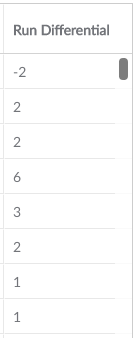

Now we can use this new field just like any other field, meaning we can use it to filter our question, add a grouping with it, or find out things like the average of this field. You can add multiple custom fields, and they’ll all show up at the top of drop downs within the question builder:

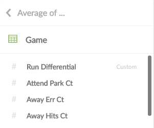

### Digging into individual records
---
Click on a record's ID number (or primary key) to see more information about a given user, order, venue, etc. You can see all fields related to that one record and all connected tables that are hidden in the table view for the sake of readability. Press the right or left arrow keys, or click on the arrows to the right or left of the screen to page through the other records in the current list.

## Asking more advanced questions in the SQL/native query editor
---
If you ever need to ask questions that can't be expressed using the question builder, you can use **SQL** instead.

### What's SQL?

SQL (pronounced "sequel") stands for Structured Query Language, and is a widely used standard for getting data from databases. To learn more about it, check out this [SQL Tutorial](http://www.w3schools.com/sql/default.asp).

Even if you don't understand SQL or how to use it, it's worthwhile to understand how to use it inside Metabase because sometimes other people will share SQL-based questions that might be useful to you.

### Using SQL
You can switch a card from question builder mode to SQL mode by clicking on the "**>_**" button in the upper right hand corner.

You can write SQL (or your database's native querying language) directly into the text box that appears.

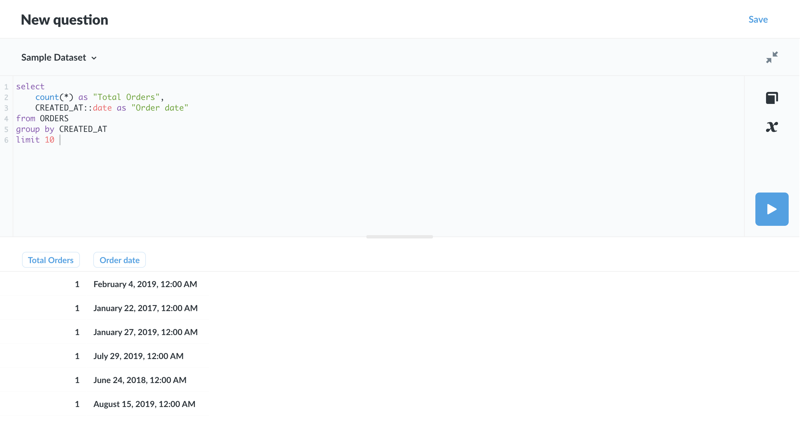

To try it out, type the command `select sum(subtotal), created_at from orders group by created_at`. Don't worry if you don't understand this just yet. Click **Run query** and note the table that comes back is the same as if you had asked for the sum of Subtotal in the Orders table, grouped by Created At.

Questions asked using SQL can be saved, downloaded, or added to a dashboard just like questions asked using the question builder.

---

## Next: Creating charts
Once you have an answer to your question, you can now learn more about [visualizing answers](05-visualizing-results.md).
