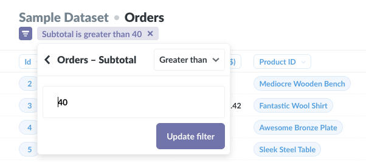

## Asking questions in Metabase

Metabase's two core concepts are questions and their corresponding answers. Everything else is based around questions and answers. To ask a question in Metabase, click the Ask a Question button at the top of the screen.

### Ways to start a new question

When you click the Ask a Question button, you'll see that there are three ways to ask a specific question in Metabase:

1. The simple question mode, which lets you filter, summarize, and visualize data.
2. [The custom question mode](custom-questions.md), which gives you a powerful notebook-style editor to create more complex questions that require joins, multiple stages of filtering and aggregating, or custom columns.
3. [The SQL/native query editor](writing-sql.md).

This page will cover the simple mode.

### Asking a simple question

After you select the Simple Question option, you'll need to pick some data that you have a question about. Just pick one of the databases that's connected to Metabase, and you'll see a list of all the tables inside of it. Pick the one that you have a question about; it could be a Users table, or maybe it's something like Events, Orders, or Downloads.

To ask a question about a table of data, we usually do some **filtering** and/or **summarizing**.

#### Filtering

Filtering just means narrowing things down based on certain criteria. You're probably already familiar with filtering when looking for something online, like when shopping. Maybe you only want to see olive-colored pants, or books where the author's last name is "Steinbeck," or pictures of people wearing olive-colored pants reading John Steinbeck.

You can do the same kind of thing with data in Metabase. Just click the Filter button in the top-right of the screen to open the filter sidebar. You'll see a list of all of the columns in this table, as well as columns from tables that are related to the one you're looking at. Depending on the column you pick, you'll see slightly different options for your filter.

Broadly speaking, there are three types of columns, each with their own set of filtering options:

1. **Numeric columns** let you add filters to only include rows in your table where this number is between two specific values, or is greater or less than a specific value, or is exactly equal to something.
2. With **text or category columns**, you can specify that you only want to include data where this column is or isn't a specific option, or you can exclude rows that don't have a value for this column.
3. **Date** columns give you a calendar or input box so that you can select specific time ranges, or choose all days before or after a certain date.

One important thing to understand when filtering on a date column is the difference between specific and relative dates:

**Specific dates** are things like November 1, 2010, or June 3 – July 12, 2017; they always refer to the same date(s).

**Relative dates** are things like "the past 30 days," or "the current week;" as time passes, the dates these refer to _change_. Relative dates are a useful way to set up a filter on a question so that it stays up-to-date by showing you for example how many users visited your website in the last 7 days.

##### Filtering by a segment

If your Metabase administrators have created special named filters for the table you're viewing, they’ll appear at the top of the filter dropdown in purple text with a star next to them. These are called "segments," and they're shortcuts to a combination of filters that are commonly used in your organization. They might be called things like “Active Users,” or “Most Popular Products.”

Once you're happy with your filter, click Done, and your data will be updated with your filter applied. If you want to edit your filter, just click the little purple token at the top of the screen. If you click on the X, you'll remove your filter. You can add as many filters as you need.

#### Summarizing

When we have a question like "how many people downloaded our app each day this week?" or "what's the average age of customers who visit each of our stores on the weekend?", we're asking for a **summary** of the data. A summary is usually made up of two parts: one or more _numbers_ we care about (called a "metric" in data-speak), and how we want to see that number _grouped_ or _broken out_. So in our first example:

- the metric is "how many people downloaded our app"
- we want that metric to be grouped by "each day"
- and "this week" is a filter

There are two very common ways you'll tend to summarize your data:

- Counting the number of rows in your table
- Getting the sum or average of a numeric column

And a lot of the time, you'll then **group** that number by:

- Time
- Place
- Some other category like operating system, gender, state, etc.

To do this in Metabase, click the Summarize button in the top-right of the screen, and the summary sidebar will open up.

##### Picking metrics

The sidebar has two main parts: the top is where you pick the number ("metric") you want to see, and the part below it is where you pick how to group that number (or how to "break it out").

By default the "count of rows" metric will be selected, since it's super common, but you can change it to something else by clicking on it. You can also select more than one metric to view: just click the "add a metric" button. You can remove any selected metric by clicking on the X icon. The different basic metrics are:

- **Count of rows:** the total of number of rows in the table, after any filters have been applied. If you're looking at your `Orders` table and want to know how many orders were placed with a price greater than \$40, you’d filter by “Price greater than 40,” and then select `Count of rows`, because you want Metabase to count how many orders matched your filter.
- **Sum of …:** the sum of all the values in a specific column.
- **Average of …:** the average of all the values in a single column.
- **Number of distinct values of…:** the number of unique values in all the cells of a single column. This is useful when trying to find out things like how many different _types_ of products were sold last month (not how many were sold in total).
- **Cumulative sum of…:** This gives you a running total for a specific column. In order for this metric to be useful you'll need to group it by a date column to see it across time.
- **Cumulative count of rows:** This gives you a running total of the number of rows in the table over time. Just like `Cumulative sum of…`, you'll need to group this by a date column in order for it to be useful.
- **Standard deviation of …:** A number which expresses how much the values of a column vary, plus or minus, from the average value of that column.
- **Minimum of …:** The minimum value present in the selected field.
- **Maximum of …:** The maximum value present in the selected field.

If your admins have created any named metrics that are specific to your company or organization, they will be in this dropdown under the **Common Metrics** section. These might be things like your company’s official way of calculating revenue.

##### Picking a grouping for your metrics

Depending on the grouping column you select, Metabase will show you what it thinks is the best default visualization or chart for this summary. So if you select a date column, you'll see a line chart like this:

When you click on a different grouping column than the one you currently have selected, the grouping will switch to use that column instead. But if you want to _add_ an additional grouping, just click the plus (+) icon on the right side of the column. To remove a grouping, click on the X icon.

Some grouping columns will give you the option of choosing how big or small to make the groupings. So for example, if you've picked a Date column to group by, you can click on the words `by month` to change the grouping to day, week, hour, quarter, year, etc. If you're grouping by a numeric column, like age, Metabase will automatically "bin" the results, so you'll see your metric grouped in age brackets, like 0–10, 11–20, 21–30, etc. Just like with dates, you can click on the current binning option to change it to a specific number of bins. It's not currently possible to choose your own ranges for bins, though.

Once you're done setting your metrics and groupings, click Done to close the Summarize sidebar and see your results in all their glory.

If you want to jump ahead and learn about [how to change the visualization](05-visualizing-results.md) of your results, by all means, feel free.

### Viewing an individual record's details

Click on a record's ID number (or primary key) to see more information about a given user, order, venue, etc. You can see all fields related to that one record and all connected tables that are hidden in the table view for the sake of readability. Press the right or left arrow keys, or click on the arrows to the right or left of the screen to page through the other records in the current list.

### Downloading Your Results

You can download or export the results of a question by clicking on the Download arrow in the lower right of the screen. Results can be downloaded into .csv, .xlsx, or .json files. The maximum download size is 1 million rows.

---

## Next: creating custom questions

If you have a question that's a bit more involved or specific, you can use the powerful notebook editor to craft a [custom question](custom-questions.md).
