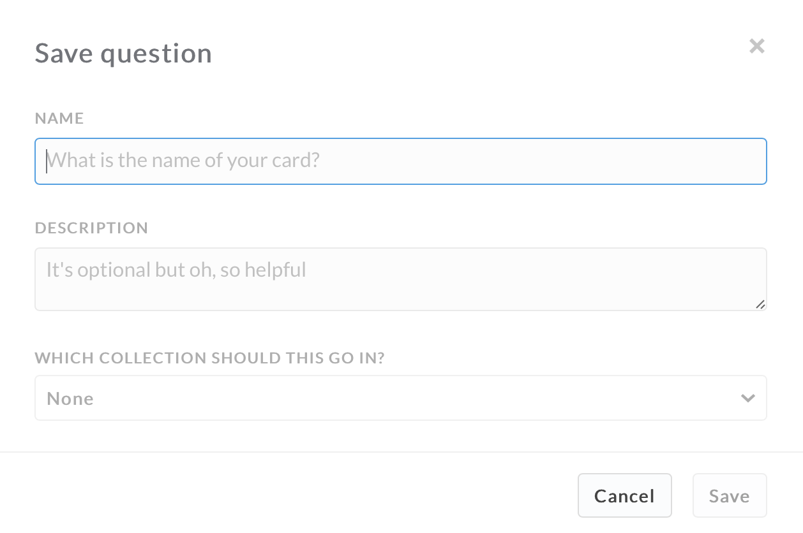
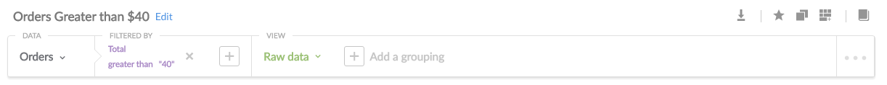
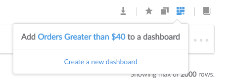
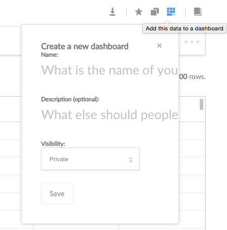
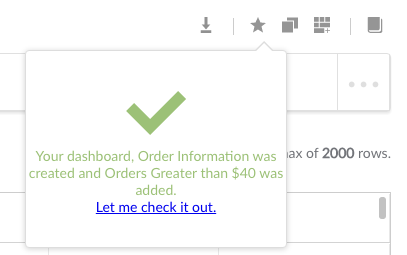
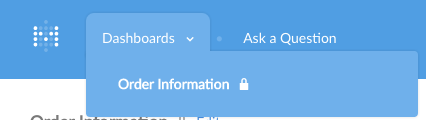
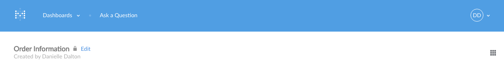
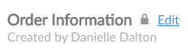
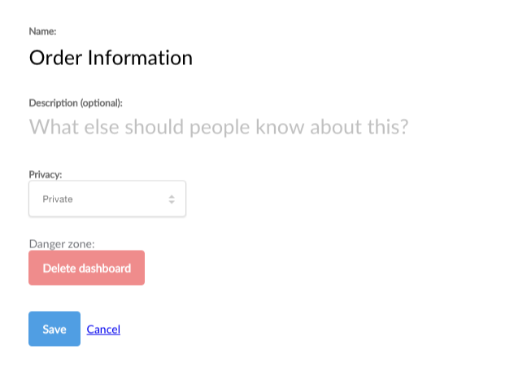

##Saving Questions
---
###How to Save a Question
After entering a question, click the blue **Save** Button above the query interface bar to save a question.  

A pop-up box will appear asking you to input information about the question. 

After you save a question, the query interface bar will change.  Instead of the **Save** button, you will have three new options.  Clicking the **Star** favorites the question.  Click the middle **Double Square** button to delete the saved question.  Click the **Dashboard +** icon to add your saved question to a Dashboard.  

##Dashboards
---
###What is a dashboard?
A **dashboard** is a collection of saved questions that you want to refer back to regularly.  It displays groups of questions and their corresponding answers.  Questions on a dashboard are meant to be consumed together.  Each question is on its own card that you can move or resize as you see fit.  

For example, you could have a dashboard devoted to metrics about the number of reservations.  It could show the number of reservations by day of week, time of day, geographical region, and more.  

Have a few key performance indicators that you want to be able to easily check?  Make a dashboard featuring questions that show your key metrics and share it with your team.  

You can make as many dashboards as you want.  **Public dashboards** (public only to those within your organization!) can show canonical KPIs that your whole team regularly checks in on.  Use your **personal dashboards** for projects or for keeping track of your own areas of interest.
##How to add a Question to a Dashboard
After saving a question, click the **"Dashboard +"** icon to add a question to a dashboard. 

##How to Create a Dashboard
Once you have a question saved, you can create a dashboard.  Click "Create a new dashboard" (*See Figure 5*).  Enter a name and description for your dashboard, as well as configure its privacy settings.  

Once you successfully create your dashboard, the following pop-up will appear.  

You can view your Dashboard by clicking the link or by selecting dashboard from the dropdown menu at the top of the screen.  

After creating your first dashboard and adding your first question, your dashboard will look similar to this: 

##How to Arrange Dashboards
To make changes to a dashboard, clicking the **Dashboard Grid** button will allow you to resize, reorder, or remove individual question cards. 

The lines around the card will change from solid to dotted, signifying that you are in edit mode.  

* To resize a card, click on its borders.  You can also use the handle in the lower right corner, which will let you drag your cursor to resize the card.  
* To reorder your cards, click and drag the card to where you want it to be.  Other cards will rearrange as you move the card to its new place to make room for it.  
* To remove a question card, click the **X** icon on the card.  

##How to Delete a Dashboard
Deleting a dashboard does not delete the individual question cards on a dashboard.  Deleting a dashboard deletes the grouping of the questions (but not the questions themselves).  

To delete a dashboard, click the **Edit** button next to the title of your dashboard at the top of the screen.  

A popup screen will appear that will allow you to choose to delete the dashboard, or change its settings.  

Be careful when deleting public dashboards - make sure other users in your organization do not need the dashboard.

Next, we'll offer up some suggestions on how to create useful dashboards, in our [Tips on Dashboards](06-dashboard-tips.md).