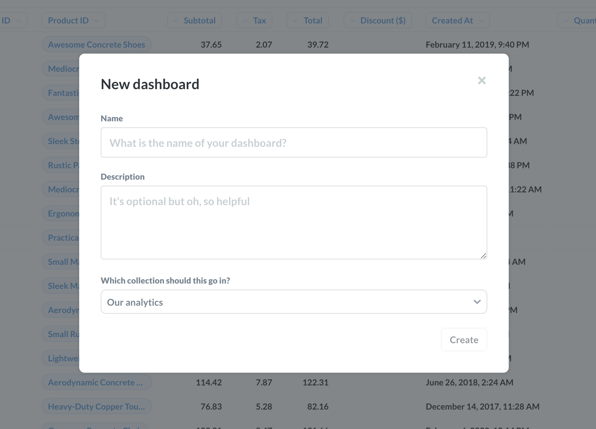
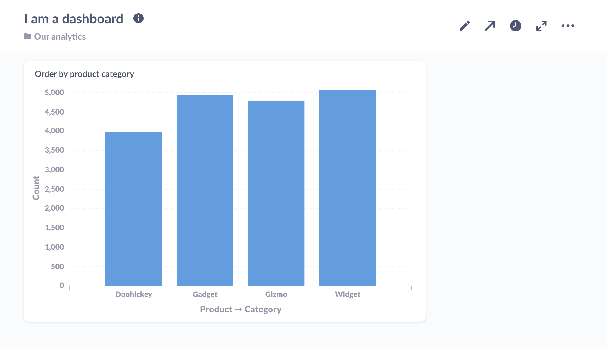
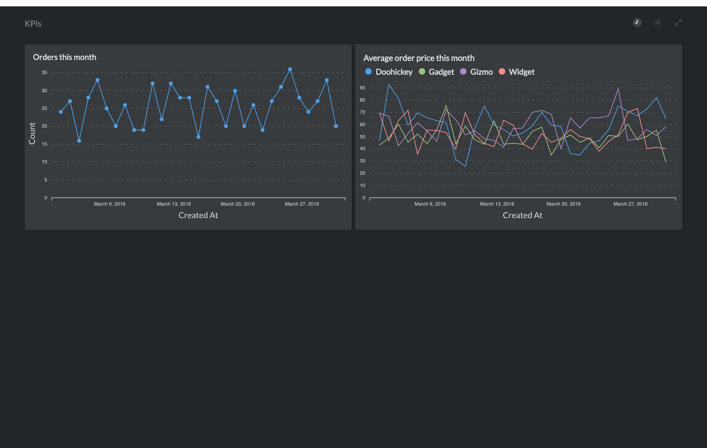
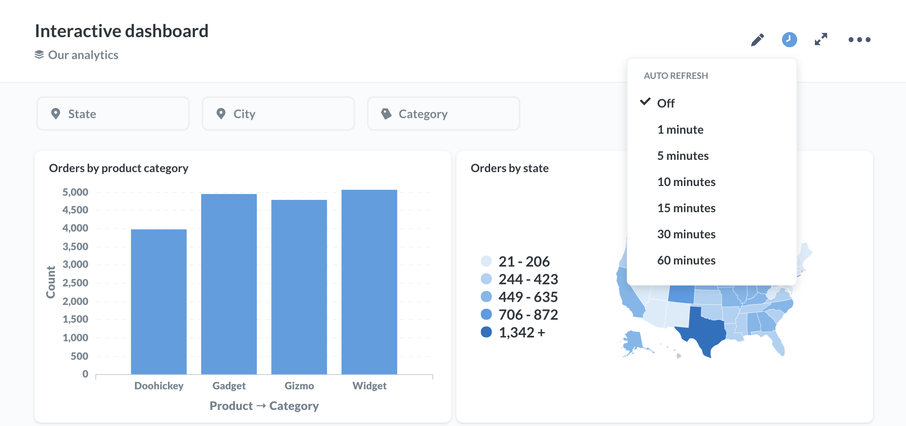

## Sharing Your Questions and Answers
---
### How to Save a Question
Whenever you’ve arrived at an answer that you want to save for later, click the **SAVE** button in the top right of the screen. This will also save the visualization option you’ve chosen for your answer.

A pop-up box will appear, you to give your question a name and a description. We suggest phrasing the names for your questions in the form of a question, such as, “How many customers did we have last month?” After saving your question, you'll be asked if you want to add it to a dashboard.

Now, whenever you want to refer to your question again, you can find it in the saved questions list by clicking on the Questions link from the main navigation. To edit your question, go to it and click the pencil icon in the top-right.

## Dashboards
---
### What is a dashboard?
A **dashboard** is a collection of saved questions that you want to refer back to and view regularly. It displays groups of questions and their corresponding answers.

Questions on a dashboard are meant to be viewed together, so they’re usually grouped by some kind of theme or topic, like Users, Inventory, or Reservations. A reservations dashboard could show the number of reservations by day of week, time of day, geographical region, and more.

Have a few key performance indicators that you want to be able to easily check? Make a dashboard featuring questions that show your key metrics and share it with your team.

You can make as many dashboards as you want. Go nuts.

### How to Create a Dashboard
Once you have a question saved, you can create a dashboard. Click the **Dashboards** dropdown at the top of the screen, then **Create a new dashboard**. Give your new dashboard a name and a description, then click **Create**, and you’ll be taken to your shiny new dashboard. You can always get to your dashboards from the dropdown at the very top of the screen.

### Adding saved questions to a dashboard
You can add a newly saved question to a dashboard directly from the window that pops up after you save the question, or by clicking the Add to Dashboard icon in the top-right of a question page. You can also go to one of your dashboards and click the plus icon in the top right to add any of your saved questions to the dashboard.

Once you add a question to your dashboard, it’ll look something like this:

### Arranging cards
Each question on a dashboard is in its own card that you can move around or resize as you see fit; just click the edit icon that looks like a pencil in the top-right of the dashboard screen.  

Once you're in edit mode you'll see a grid appear. You can move and resize the cards in the dashboard to your liking and they'll snap to the grid.

- To move cards just click and drag.
- To resize a card just click and drag the handle at the bottom right corner of the card.
- To remove a card, click the X icon in the top right corner.

Questions in your dashboard will automatically update their display based on the size you choose to make sure your data looks great at any size.

## Deleting a dashboard
Deleting a dashboard does not delete the individual saved questions on it — it just deletes the dashboard. Remember — dashboards are shared by everyone on your team, so think twice before you delete something that someone else might be using!

To delete a dashboard, click the pencil-looking **Edit** icon in the top right of the dashboard, then click **Delete**.

## Fullscreen dashboards

After you've made your ideal dashboard you may want to put it on a TV or present it in some other visible space to help keep your team up-to-date throughout the day.

To enter fullscreen mode just click the fullscreen icon in the top right of the dashboard.

Once you've entered fullscreen mode you can also switch the dashboard into "Night mode" for higher contrast.

## Auto refresh
If your data is more realtime in nature you can set your dashboard up to auto refresh.

You can set your dashboard to update in 1, 5, 10, 15, 30, and 60 minute intervals depending on how fresh you need the data to be.

Enabling auto refresh will re-run all the queries on the dashboard at the interval you choose, so keep the size of the dashboard and the complexity of the questions in mind when setting up auto refresh.

Combining fullscreen mode and auto refresh is a great way to keep your team in sync with your data throughout the day.

## Configuring dashboard using URL

It is possible to amend URL of the dashboard to automatically enter fullscreen, enable night mode or autorefresh the dashboard. This allows you to configure the dashboard even when you do not have any input access to the device where dashboard will be displayed, for example, scripted screens.

To configure dashboard using URL address, you can append it with hash keys like `fullscreen`, `night`, or `refresh`. Consider this example:

`https://metabase.mydomain.com/dash/2#refresh=60&fullscreen&night`

This URL will make dashboard enter night mode, fullscreen and refresh every 60 seconds.

---

Next, we'll offer up some suggestions on how to create useful dashboards, in our [Tips on Dashboards](06-dashboard-tips.md).
