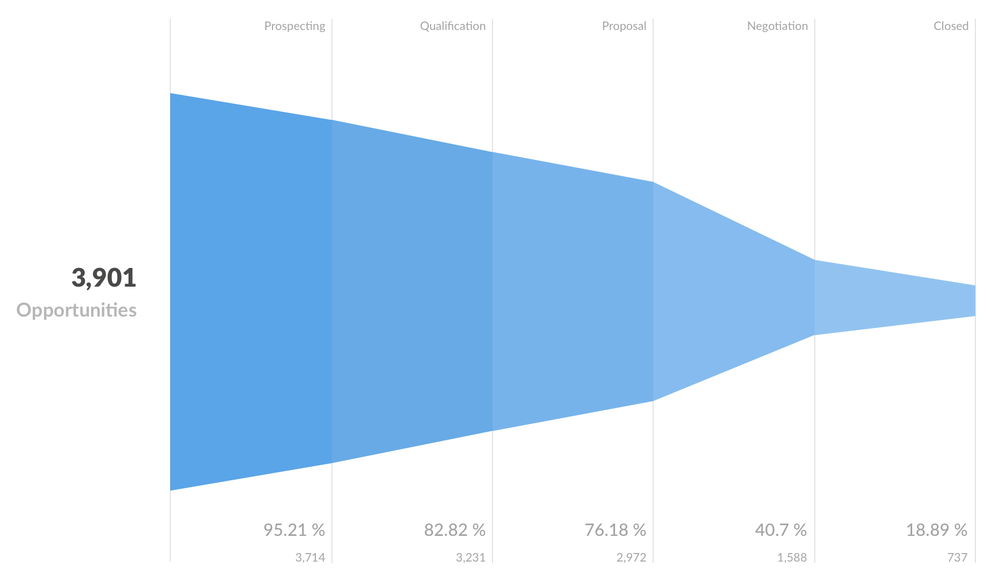

## Visualizing results
---
While tables are useful for looking up information or finding specific numbers, it's usually easier to see trends and make sense of data overall using charts.

In Metabase, an answer to a question can be visualized in a number of ways:

* Number
* Progress bar
* Table
* Line chart
* Bar chart
* Row chart
* Area chart
* Scatterplot or bubble chart
* Pie/donut chart
* Funnel
* Map

To change how the answer to your question is displayed, click on the Visualization dropdown menu beneath the question builder bar.

If a particular visualization doesn’t really make sense for your answer, the format option will appear grayed-out in the dropdown menu. You can still select a grayed-out option, though you might need to click on the chart options gear icon to make your selection work with your data.

Once a question is answered, you can save or download the answer, or add it to a dashboard or Pulse.

### Visualization types and options

Each visualization type has its own advanced options you can tweak. Just click the gear icon next to the visualization selector. Here's an overview of what you can do:

#### Numbers
This option is for displaying a single number, nice and big. The options for numbers include adding character prefixes or suffixes to it (so you can do things like put a currency symbol in front or a percent at the end), setting the number of decimal places you want to include, and multiplying your result by a number (like if you want to multiply a decimal by 100 to make it look like a percent).

#### Progress bars
Progress bars are for comparing a single number result to a goal value that you input. Open up the chart options for your progress bar to choose a goal for it, and Metabase will show you how far away your question's current result is from the goal.

#### Tables
The Table option is good for looking at tabular data (duh), or for lists of things like users or orders. The visualization options for tables allow you to add, hide, or rearrange fields in the table you're looking at.

##### Adding or hiding fields

Open up the visualization options and you'll see the Data tab, which displays all the fields currently being shown in the table, as well as more fields from linked tables that you can add to the current table view.

To hide a field, click the X icon on it; that'll send it down to the "More fields" area in case you want to bring it back. To add a linked field, just click the + icon on it, which will bring it to the "Visible fields" section. Click and drag any of the fields listed there to rearrange the order in which they appear.

**Note:** changing these options doesn't change the actual table itself; it just creates a custom view of it that you can save as a "question" in Metabase and refer back to later, share with others, or add to a dashboard.

##### Conditional formatting
Sometimes is helpful to highlight certain rows or columns in your tables when they meet a specific condition. You can set up conditional formatting rules by going to the visualization settings while looking at any table, then clicking on the `Formatting` tab.

When you add a new rule, you'll first need to pick which column(s) should be affected. For now, you can only pick numeric columns. Your columns can be formatted in one of two ways:

1. **Single color:** pick this if you want to highlight cells in the column if they're greater, less than, or equal to a specific number. You can optionally highlight the whole row of a cell that matches the condition you pick so that it's easier to spot as you scroll down your table.
2. **Color range:** choose this option if you want to tint all the cells in the column from smallest to largest or vice a versa.

You can set as many rules on a table as you want. If two or more rules disagree with each other, the rule that's on the top of your list of rules will win. You can click and drag your rules to reorder them, and click on a rule to edit it.

##### Pivoted tables
If your table is a result that contains one metric and two dimensions, Metabase will also automatically "pivot" your table, like in the example below (the example shows the count of orders grouped by the review rating for that order and the category of the product that was purchased; you can tell it's pivoted because the grouping field values are all in the first column and first row). You can turn this behavior off in the chart settings.

#### Line, bar, and area charts
Line charts are best for displaying the trend of a number over time, especially when you have lots of x-axis values. Bar charts are great for displaying a number grouped by a category (e.g., the number of users you have by country), and they can also be useful for showing a number over time if you have a smaller number of x-axis values (like orders per month this year).

Area charts are useful when comparing the proportions of two metrics over time. Both bar and area charts can be stacked.

#### Row charts
If you're trying to group a number by a field that has a lot of possible values, like a Vendor or Product Title field, try visualizing it as a row chart. Metabase will show you the bars in descending order of size, with a final bar at the bottom for items that didn't fit.

##### Histograms

If you have a bar chart like Count of Users by Age, where the x-axis is a number, you'll get a special kind of chart called a **histogram**, where each bar represents a range of values (called a "bin"). Note that Metabase will automatically bin your results any time you use a number as a grouping, even if you aren't viewing a bar chart. Questions that use latitude and longitude will also get binned automatically.

By default, Metabase will automatically choose a good way to bin your results. But you can change how many bins your result has, or turn the binning off entirely, by clicking on the number field you're grouping by in the Question Builder, then clicking on the area to the right of the field name:

##### Options for line, bar, and area charts

These three charting types have very similar options, which are broken up into the following:

* **Data** — choose the fields you want to plot on your x and y axes. This is mostly useful if your table or result set contains more than two columns, like if you're trying to graph fields from an unaggregated table. You can also add additional metric fields by clicking the `Add another series` link below the y-axis dropdown, or break your current metric out by an additional dimension by clicking the `Add a series breakout` link below the x-axis dropdown (note that you can't add an additional series breakout if you have more than one metric/series).
* **Display** — here's where you can make some cosmetic changes, like setting colors, and stacking bar or area charts. With line and area charts, you can also change the line style (line, curve, or step). We've also recently added the ability to create a goal line for your chart, and to configure how your chart deals with x-axis points that have missing y-axis values.
* **Axes** — this is where you can hide axis markers or change their ranges, and turn split axes on or off. You can also configure the way your axes are scaled, if you're into that kind of thing.
* **Labels** — if you want to hide axis labels or customize them, here's where to go.

#### Scatterplots and bubble charts
Scatterplots are useful for visualizing the correlation between two variables, like comparing the age of your users vs. how many dollars they've spent on your products. To use a scatterplot, you'll need to ask a question that results in two numeric columns, like `Count of Orders grouped by Customer Age`. Alternatively, you can use a raw data table and select the two numeric fields you want to use in the chart options.

If you have a third numeric field, you can also create a bubble chart. Select the Scatter visualization, then open up the chart options and select a field in the bubble size dropdown. This field will be used to determine the size of each bubble on your chart. For example, you could use a field that contains the number or count of items for the given x-y pair — i.e., larger bubbles for larger total dollar amounts spent on orders.

Scatterplots and bubble charts also have similar chart options as line, bar, and area charts.

#### Pie or donut charts
A pie or donut chart can be used when breaking out a metric by a single dimension, especially when the number of possible breakouts is small, like users by gender. If you have more than a few breakouts, like users by country, it's usually better to use a bar chart so that your users can more easily compare the relative sizes of each bar.

The options for pie charts let you choose which field to use as your measurement, and which one to use for the dimension (i.e., the pie slices). You can also customize the pie chart's legend, whether or not to show each slice's percent of the whole in the legend, and the minimum size a slice needs to be in order for it to be displayed.

#### Funnel
Funnels are commonly used in e-commerce or sales to visualize how many customers are present within each step of a checkout flow or sales cycle. At their most general, funnels show you values broken out by steps, and the percent decrease between each successive step. To create a funnel in Metabase, you'll need to have a table with at least two columns: one column that contains the metric you're interested in, and another that contains the funnel's steps.

For example, I might have an Opportunities table, and I could create a question that gives me the number of sales leads broken out by a field that contains stages such as `Prospecting`, `Qualification`, `Proposal`, `Negotiation`, and `Closed`. In this example, the percentages shown along the x-axis tell you what percent of the total starting opportunities are still present at each subsequent step; so 18.89% of our total opportunities have made it all the way to being closed deals. The number below each percent is the actual value of the count at that step — in our example, the actual number of opportunities that are currently at each step. Together, these numbers help you figure out where you're losing your customers or users.

#### Maps
When you select the Map visualization setting, Metabase will automatically try and pick the best kind of map to use based on the table or result set you're currently looking at. Here are the maps that Metabase uses:

* **United States Map** — Creating a map of the United States from your data requires your results to contain a column field with states. This lets you do things like visualize the count of your users broken out by state, with darker states representing more users.
* **Country Map** — To visualize your results in the format of a map of the world broken out by country, your result must contain a field with countries. (E.g., count of users by country.)

* **Pin Map** — If your table contains a latitude and longitude field, Metabase will try to display it as a pin map of the world. This will put one pin on the map for each row in your table, based on the latitude and longitude fields. You can try this with the Sample Dataset that's included in Metabase: start a new question and select the People table, use `raw data` for your view, and choose the Map option for your visualization. you'll see a map of the world, with each dot representing the latitude and longitude coordinates of a single person from the People table.

When you open up the Map options, you can manually switch between a region map (i.e., United States or world) and a pin map. If you're using a region map, you can also choose which field to use as the measurement, and which to use as the region (i.e. State or Country).

Metabase now also allows administrators to add custom region maps via GeoJSON files through the Metabase Admin Panel.

---

## Next: Sharing and organizing questions
Now let's learn about [sharing and organizing your saved questions](06-sharing-answers.md).
