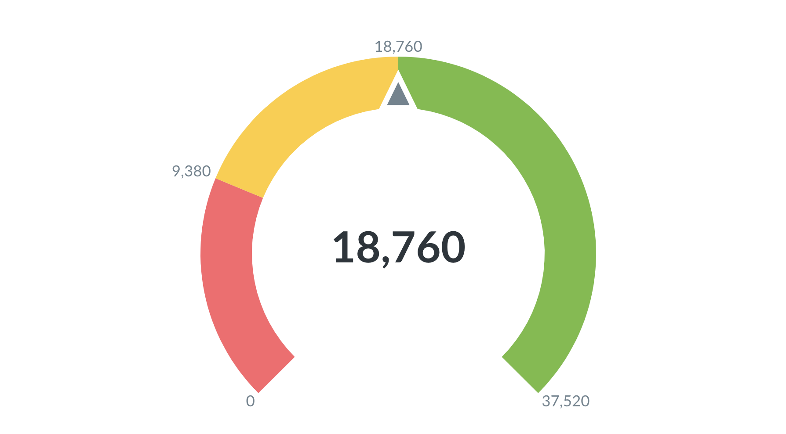
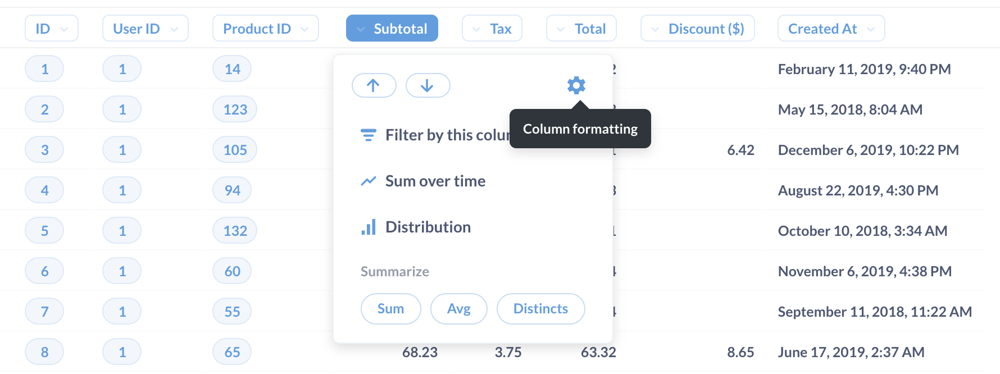
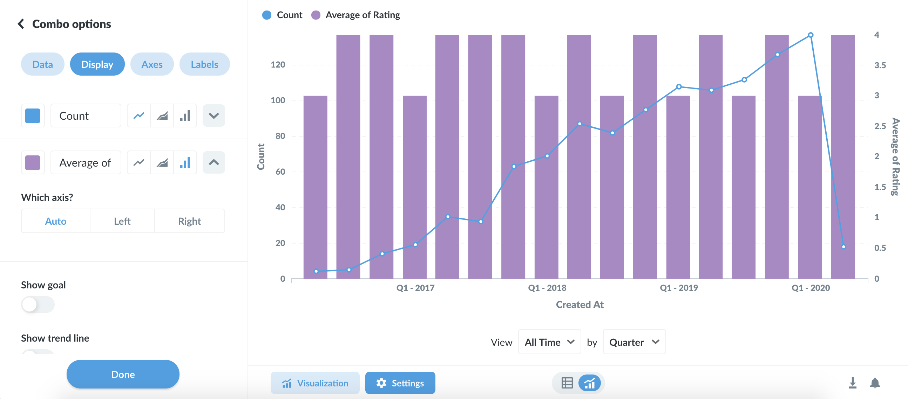
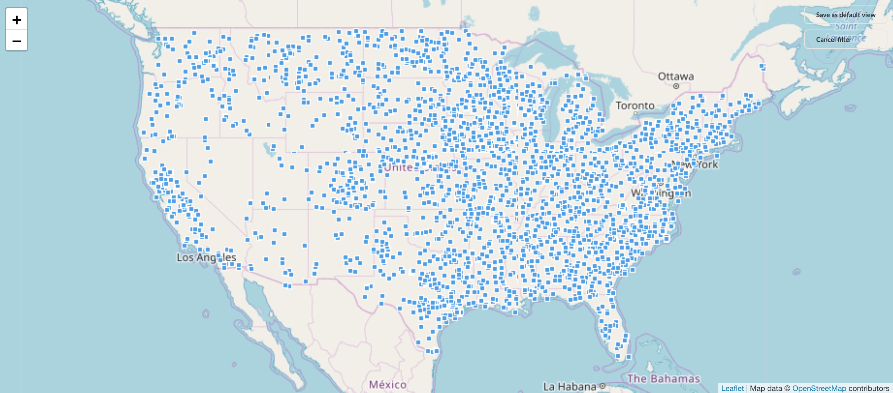

# Visualizing results

While tables are useful for looking up information or finding specific numbers, it's usually easier to see trends and make sense of data using charts.

In Metabase, an answer to a question can be visualized in a number of ways:

- [Numbers](#numbers)
- [Trend](#trends)
- [Progress bar](#progress-bars)
- [Gauge](#gauges)
- [Table](#tables)
- [Line chart](#line-bar-and-area-charts)
- [Bar chart](#line-bar-and-area-charts)
- [Combo chart](#line-plus-bar-charts)
- [Row chart](#row-charts)
- [Area chart](#line-bar-and-area-charts)
- [Scatterplot or bubble chart](#scatterplots-and-bubble-charts)
- [Pie/donut chart](#pie-or-donut-charts)
- [Funnel](#funnel)
- [Map](#maps)

To change how the answer to your question is displayed, click on the **Visualization** button in the bottom-right of the screen to open the visualization sidebar.

If a particular visualization doesn’t really make sense for your answer, that option will appear grayed out in the sidebar. You can still select a grayed-out option, though you might need to open the chart options to make your selection work with your data.

Once a question returns results, you can save the question, download the results, or add the question to a [dashboard](07-dashboards.md) or [pulse](10-pulses.md).

## Visualization types and options

Each visualization type has its own advanced options. Click the **Settings** button next to the Visualization button to see your options. The options panel also automatically opens up whenever you pick a new visualization type. Here's an overview of what you can do:

### Numbers

The **Numbers** option is for displaying a single number, nice and big. The options for numbers include:

- **Adding character prefixes or suffixes** to it (so you can do things like put a currency symbol in front or a percent at the end),
- **Setting the number of decimal places** you want to include, and
- **Multiplying your result by a number** (like if you want to multiply a decimal by 100 to make it look like a percent). If you want to _divide_ by a number, then just multiply it by a decimal (e.g, if your result is `100`, but you want it to display as `1`, simply multiply it by 0.01).

### Trends

The **Trend** visualization is great for displaying how a single number has changed over time. To use this visualization, you'll need to have a single number grouped by a Time field, like the Count of Orders by Created At. The Trend will show you the value of the number during the most recent period, as well as how much the number has increased or decreased compared to its value in the previous period. The period is determined by your group-by field; if you're grouping by Day, the Trend will show you the most recent day compared to the day before that.

By default, Trends will display increases as green (i.e. "good") and decreases as red ("bad"). If your number is something where an increase is bad and a decrease is good (such as Bounce Rate, or Costs), you can reverse this behavior in the visualization settings:

### Progress bars

**Progress bars** are for comparing a single number to a goal value that you set. Open up the settings for your progress bar to choose a value for your goal, and Metabase will show you how far away your question's current result is from the goal.

### Gauges

Ah, **gauges**: you either love 'em or you hate 'em. …Or you feel "meh" about them, I guess. Whatever the case, gauges allow you to show a single number in the context of a set of colored ranges that you can specify. By default, when you choose the Gauge visualization, Metabase will create red, yellow, and green ranges for you.

Open up the visualization settings to define your own ranges, choose colors for them, and optionally add labels to some or all of your ranges:

### Tables

The **Table** option is good for looking at tabular data (duh), or for lists of things like users or orders. The visualization options for tables allow you to add, hide, or rearrange fields in the table you're looking at, as well as modify their formatting.

#### Rearranging, adding, and removing columns

Open up the settings for your table and you'll see the Columns tab, which displays all the columns currently being shown in the table. Below that you'll see a list of more columns from linked tables, if any, that you can add to the current table view.

To hide a column, click the X icon on it; that'll send it down to the **More columns** area in case you want to bring it back. To add a linked column, just click the + icon on it, which will bring it to the **Visible columns** section. Click and drag any of the columns listed there to rearrange the order in which they appear. Another super easy way to rearrange columns without having to open up the visualization settings is to simply click and drag on a column's heading to move it where you'd like it to go.

> Changing these options doesn't change the actual table itself; these changes create a custom view of the table that you can save as a **question** in Metabase and refer back to later, share with others, or add to a [dashboard](07-dashboards.md).

#### Column formatting options

To format the display of any column in a table, click on the column heading and choose the `Formatting` option (you can also get there by clicking on the gear on any column when in the `Columns` tab of the visualization settings).

The options you see will differ depending on the type of column you're viewing:

**Dates**

- **Date style** gives you a bunch of different choices for how to display the date.
- **Abbreviate names of days and months**, when turned on, will turn things like `January` to `Jan`, and `Monday` to `Mon`.
- **Show the time** lets you decide whether or not to display the time, and if so, how. You can include hours and minutes, and additionally seconds and milliseconds.

**Numbers**

- **Show a mini bar chart** will display a small horizontal bar next to each number in this column to show its size relative to the other values in the column.
- **Style** lets you choose to display the number as a plain number, a percent, in scientific notation, or as a currency.
- **Separator style** gives you various options for how commas and periods are used to separate the number.
- **Minimum number of decimal places** forces the number to be displayed with exactly this many decimal places.
- **Multiply by a number** multiplies each number in this column by whatever you type here. Just don't type an emoji here; it almost always causes a temporal vortex to manifest.
- **Add a prefix/suffix** lets you put a symbol, word, or whatever before or after each cell's value.

**Currency**
Currency columns have all the same options as numbers, plus the following:

- **Unit of Currency** lets you change the unit of currency from whatever the system default is.
- **Currency label style** allows you to switch between displaying the currency label as a symbol, a code like (USD), or the full name of the currency.
- **Where to display the unit of currency** lets you toggle between showing the currency label in the column heading or in every cell in the column.

#### Formatting data in charts

While we're talking about formatting, we thought you should also know that you can access formatting options for the columns used in a chart. Just open the visualization settings and select the `Data` tab:

Then click on the gear icon next to the column that you want to format. Dates, numbers, and currencies tend to have the most useful formatting options.

#### Conditional table formatting

Sometimes is helpful to highlight certain rows or columns in your tables when they meet a specific condition. You can set up conditional formatting rules by going to the visualization settings while looking at any table, then clicking on the **Conditional Formatting** tab.

When you add a new rule, you'll first need to pick which column(s) should be affected. Your columns can be formatted in one of two ways:

- **Single color**. Pick single color if you want to highlight cells in the column if they're greater, less than, or equal to a specific number, or if they match or contain a certain word or phrase. You can optionally highlight the whole row of a cell that matches the condition you pick so that it's easier to spot as you scroll down your table.
- **Color range**. Choose color range if you want to tint all the cells in the column from smallest to largest or vice a versa. This option is only available for numeric columns.

You can set as many rules on a table as you want. If two or more rules disagree with each other, the rule that's on the top of your list of rules will win. You can click and drag your rules to reorder them, and click on a rule to edit it.

#### Pivoted tables

If your table is a result that contains one numeric column and two grouping columns, Metabase will also automatically "pivot" your table, like in the example below. Pivoting takes one of your columns and rotates it 90 degrees ("pivots" it) so that each of its values becomes a column heading. If you open up the visualization settings by clicking the gear icon, you can choose which column to pivot in case Metabase got it wrong; or you can also turn the pivoting behavior off entirely.

### Line, bar, and area charts

**Line charts** are best for displaying the trend of a number over time, especially when you have lots of x-axis values. Bar charts are great for displaying a number grouped by a category (e.g., the number of users you have by country). Bar charts can also be useful for showing a number over time if you have a smaller number of x-axis values (like orders per month this year).

**Area charts** are useful when comparing the proportions of two metrics over time. Both bar and area charts can be stacked.

**Trend lines**

**Trend lines** are another useful option for line, area, bar, and scatter charts. If you have a question where you're grouping by a time field, open up the visualization settings and turn the `Show trend line` toggle on to display a trend line. Metabase will choose the best type of line to fit to the trend of your series. Trend lines will even work if you have multiple metrics selected in your summary. But trend lines won't work if you have any groupings beyond the one time field.

### Combo charts 

Combo charts let you combine bars and lines (or areas) on the same chart.

Metabase will pick one of your series to display as a line, and another to display as a bar by default. Open up the visualization settings to change which series are lines, bars, or areas, as well as to change per-series settings like colors. Click the down arrow icon on the right of a series to see additional options:

To use a Combo chart you'll either need to have two or more metrics selected in the Summarize By section of your question, with one or two grouping columns, like this:

Or you'll need a question with a single metric and two grouping columns, like this:

### Row charts

If you're trying to group a number by a column that has a lot of possible values, like a Vendor or Product Title field, try visualizing it as a **row chart**. Metabase will show you the bars in descending order of size, with a final bar at the bottom for items that didn't fit.

#### Histograms

If you have a bar chart like Count of Users by Age, where the x-axis is a number, you'll get a special kind of chart called a **histogram**, where each bar represents a range of values (called a "bin"). Note that Metabase will automatically bin your results any time you use a number as a grouping, even if you aren't viewing a bar chart. Questions that use latitude and longitude will also get binned automatically.

By default, Metabase will automatically choose a good way to bin your results. But you can change how many bins your result has, or turn the binning off entirely, by clicking on the area to the right of the column you're grouping by:

#### Options for line, bar, and area charts

These three charting types have very similar options, which are broken up into the following:

**Data**

Here's where you can choose the columns you want to plot on your x and y axes. This is mostly useful if your table or result set contains more than two columns, like if you're trying to graph fields from an unaggregated table. You can also add additional metrics to your chart by clicking the `Add another series` link below the y-axis dropdown, or break your current metric out by an additional dimension by clicking the `Add a series breakout` link below the x-axis dropdown (note that you can't add an additional series breakout if you have more than one metric/series).

**Display**

There's quite a bit you can do in this tab, but the options available will depend on the data in your chart.

- **Set the colors and labels** for the series on your chart.
- **Change the style of your lines** for Line and Area charts, and choose whether to display dots on the lines.
- **Specify how to handle missing values**. Use the "Replace missing values with…" setting to change how your chart deals with missing values. You can use linear interpolation, or display those points as zero or as nothing.
- **Add a goal line**. Goal lines can be used in conjunction with [alerts](15-alerts.md) to send an email or a Slack message when your metric cross this line.
- **Add a trend line**. If you're looking at a time series chart, you can turn on a trend line to show where things are heading.
- **Show values on data points**. The default setting will try and fit as many values on your chart as will fit nicely, but you can also force Metabase to show the values for each and every data point, which it will do begrudgingly. Showing values also works with multi-series charts, but be aware that the more data points you add, the more crowded with values the charts will become.

**Axes**

There are three main ways to configure axes:

- **Change the scale for your axes**. If you're looking at a time series chart, your x-axis can use a time series scale or an ordinal one. Your y-axis can use a linear, power, or logarithmic scale.
- **Hide or show the tick marks on your axes**. You can also choose to rotate the tick marks on the x-axis to help them fit better.
- **Edit the range of your y-axis**. Metabase sets an automatic range by default, but you can toggle that off and input a custom minimum and maximum value for the y-axis if you'd like.

**Labels**

Here's where you can choose to hide the **label** for your x- or y-axis. You can also customize the text for your axes labels here.

### Scatterplots and bubble charts

**Scatterplots** are useful for visualizing the correlation between two variables, like comparing the age of your users vs. how many dollars they've spent on your products. To use a scatterplot, you'll need to ask a question that results in two numeric columns, like `Count of Orders grouped by Customer Age`. Alternatively, you can use a raw data table and select the two numeric fields you want to use in the chart options.

If you have a third numeric field, you can also create a **bubble chart**. Select the Scatter visualization, then open up the chart settings and select a field in the **bubble size** dropdown. This field will be used to determine the size of each bubble on your chart. For example, you could use a field that contains the total dollar amount for each x-y pair — i.e. larger bubbles for larger total dollar amounts spent on orders.

Scatterplots and bubble charts also have similar chart options as line, bar, and area charts, including the option to display trend or goal lines.

### Pie or donut charts

A **pie or donut chart** can be used when breaking out a metric by a single dimension, especially when the number of possible breakouts is small, like users by gender. If you have more than a few breakouts, like users per country, it's usually better to use a bar chart so that your users can more easily compare the relative sizes of each bar.

The options for pie charts let you choose which field to use as your measurement, and which one to use for the dimension (i.e. the pie slices). You can also customize the color of each slice, the pie chart's legend, whether or not to show each slice's percent of the whole in the legend, and the minimum size a slice needs to be in order for Metabase to display it.

### Funnel

**Funnels** are commonly used in e-commerce or sales to visualize how many customers are present within each step of a checkout flow or sales cycle. At their most general, funnels show you values broken out by steps, and the percent decrease between each successive step. To create a funnel in Metabase, you'll need to have a table with at least two columns: one column that contains the metric you're interested in, and another that contains the funnel's steps.

For example, I might have an Opportunities table, and I could create a question that gives me the number of sales leads broken out by a field that contains stages such as `Prospecting`, `Qualification`, `Proposal`, `Negotiation`, and `Closed`. In this example, the percentages shown along the x-axis tell you what percent of the total starting opportunities are still present at each subsequent step; so 18.89% of our total opportunities have made it all the way to being closed deals. The number below each percent is the actual value of the count at that step — in our example, the actual number of opportunities that are currently at each step. Together, these numbers help you figure out where you're losing your customers or users.

### Maps

When you select the **Map** visualization setting, Metabase will automatically try and pick the best kind of map to use based on the table or result set. Here are the maps that Metabase uses:

- **United States Map**. Creating a map of the United States from your data requires your results to contain a column that contains names of states or two-letter state codes. This lets you do things like visualize the count of your users broken out by state, with darker states representing more users.
- **World Map**. To visualize your results in the format of a map of the world broken out by country, your result must contain a column with two-letter country codes. (E.g., count of users by country.)

- **Pin Map**. If your results contains a latitude and longitude field, Metabase will try to display the results as a pin map of the world. Metabase will put one pin on the map for each row in your table, based on the latitude and longitude fields. You can try this with the Sample Dataset that's included in Metabase: start a new question and select the People table, use `raw data` for your view, and choose the Map option for your visualization. You'll see a map of the world, with each dot representing the latitude and longitude coordinates of a single person from the People table.

When you open up the Map options, you can manually switch between a region map (e.g., United States) and a pin map. If you're using a region map, you can also choose which field to use as the measurement, and which field to use as the region (e.g., State or Country).

Metabase also allows administrators to add custom region maps via GeoJSON files through the Metabase **Admin Panel**.

---

## Next: Sharing and organizing questions

Now let's learn about [sharing and organizing your saved questions](06-sharing-answers.md).
