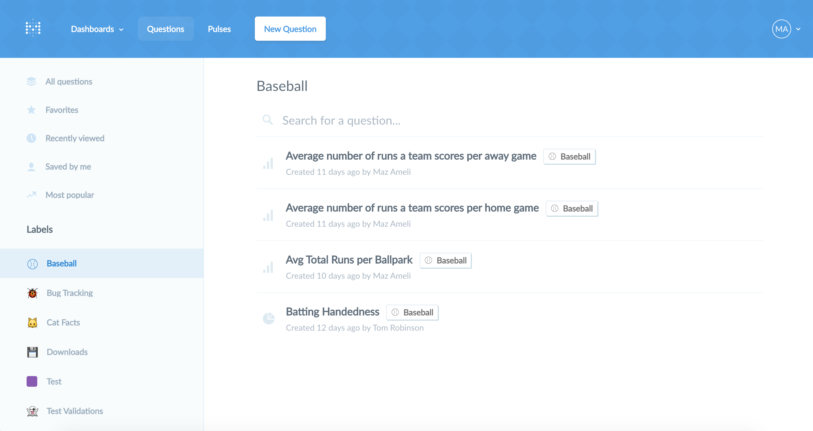

## Sharing your questions and answers
---

### How to save a question
Whenever you’ve arrived at an answer that you want to save for later, click the **SAVE** button in the top right of the screen. This will also save the visualization option you’ve chosen for your answer.

A pop-up box will appear, you to give your question a name and a description. We suggest phrasing the names for your questions in the form of a question, such as, “How many customers did we have last month?” After saving your question, you'll be asked if you want to add it to a dashboard.

Now, whenever you want to refer to your question again you can find it in the saved questions list by clicking on the **Questions** link from the main navigation. To edit your question, go to it and click the pencil icon in the top-right.

### Sharing questions with public links
If your Metabase administrator has enabled [public sharing](../administration-guide/12-public-links.md) on a saved question or dashboard, you can go to that question or dashboard and click on the sharing icon to find its public links. Public links can be viewed by anyone, even if they don't have access to Metabase. You can also use the public embedding code to embed your question or dashboard in a simple web page or blog post.

### Organizing and finding your saved questions
After your team has been using Metabase for a while, you’ll probably end up with lots of saved questions. The Questions page has several tools that’ll help you organize things and find what you’re looking for.

#### Collections
Administrators of Metabase can create collections to put saved questions in. Depending on the permissions you've been given to collections, you'll be able to view the questions inside, edit them, and move questions from one collection to another. Questions that aren't saved in any collection will appear in the "Everything else" section of the main Questions page, and are visible to all Metabase users in your organization. If you're an administrator of your Metabase instance, here are [instructions for creating collections and managing permissions](../administration-guide/06-collections.md).

#### Shortcuts
At the top of lists of saved questions you’ll find a dropdown with shortcuts to your favorite questions (mark a question as a favorite by clicking on the star icon that appears when you hover over it), questions you’ve recently viewed, questions that you’ve saved personally, and popular questions that are used the most by your team.

#### Search and filtering
On the main Questions page, you can search through all of your collections for a particular question using the search box in the top-right. You can also filter lists of saved questions by typing in the `Filter the list…` area.

#### Moving
To move a question into a collection, or from one collection to another, hover over it and click on the right-arrow icon that appears on the far right of the question. Note that you have to have permission to edit the collection that you're moving a question into, and the collection you're moving the question out of.

#### Archiving
Sometimes questions outlive their usefulness and need to be sent to Question Heaven. To archive a question, just click on the box icon that appears on the far right when you hover over a question. Collections can also be archived and unarchived, but only by Metabase administrators.

Note that archiving a question removes it from all dashboards or Pulses where it appears, so be careful!

If you have second thoughts and want to bring an archived question back, you can see all your archived questions from the **Archive** icon at the top-right of the Questions page. To unarchive a question, hover over it and click the box icon that appears on the far right.

#### Selecting multiple questions
Clicking on the icon to the left of questions let's you select several at once so that you can move or archive many questions at once.

---

## Next: creating dashboards
Next, we'll learn about [creating dashboards and adding questions to them](07-dashboards.md).
