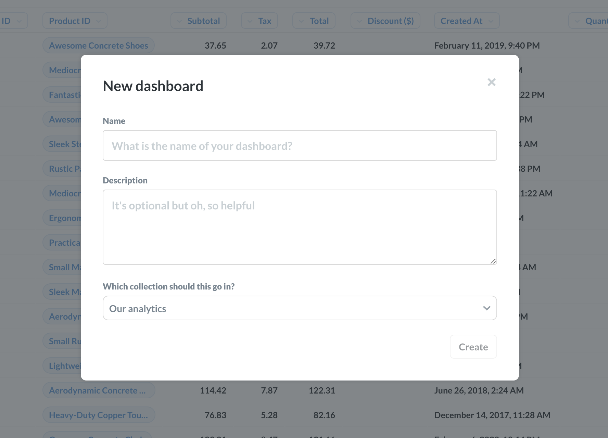
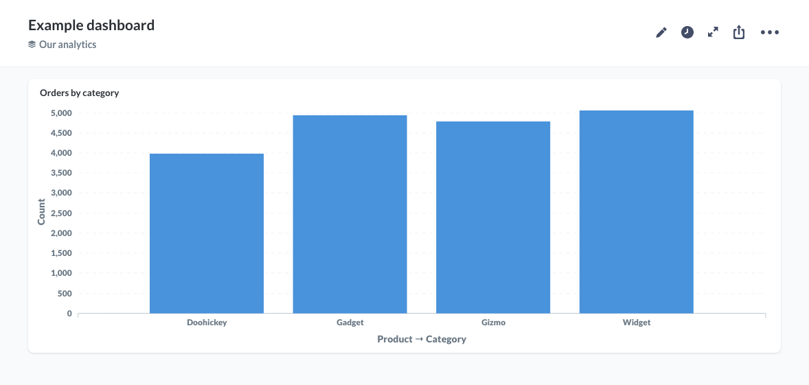
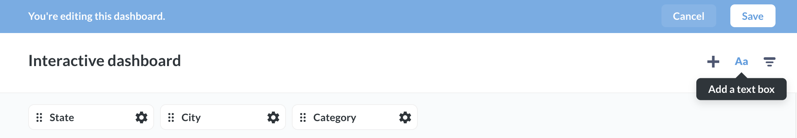
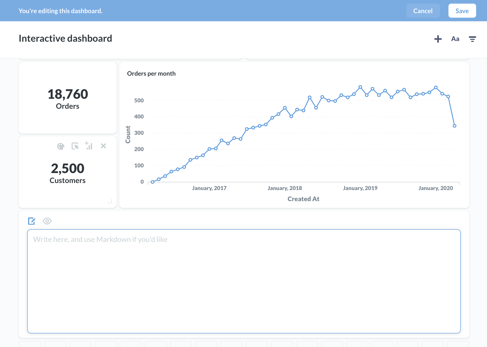
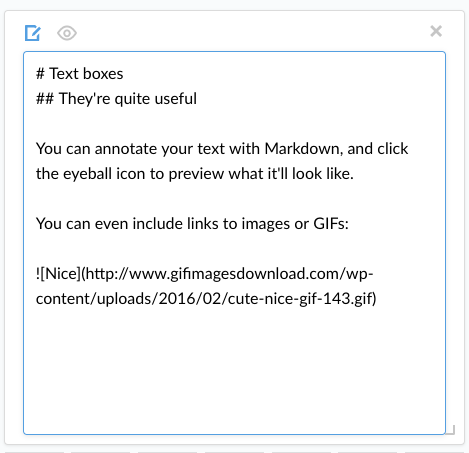
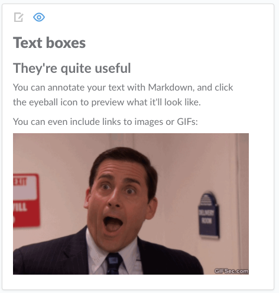
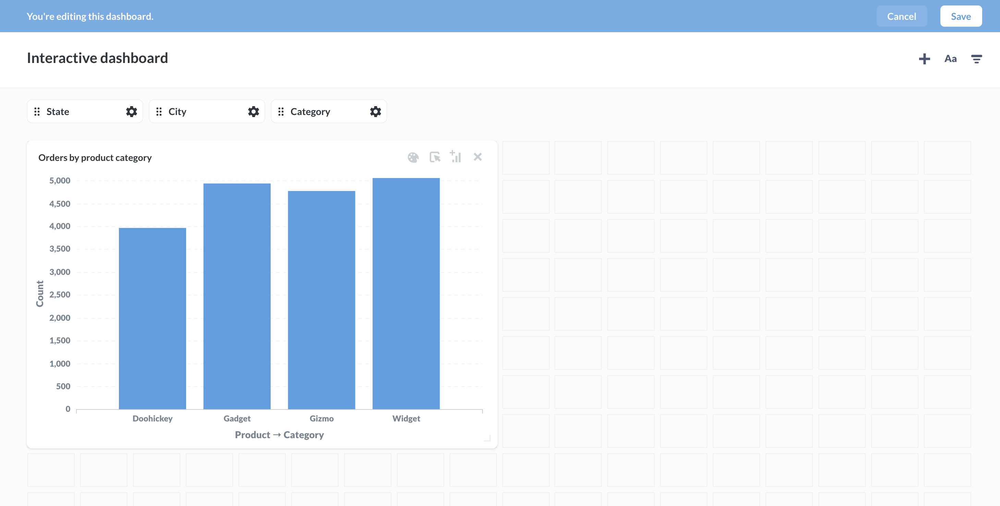
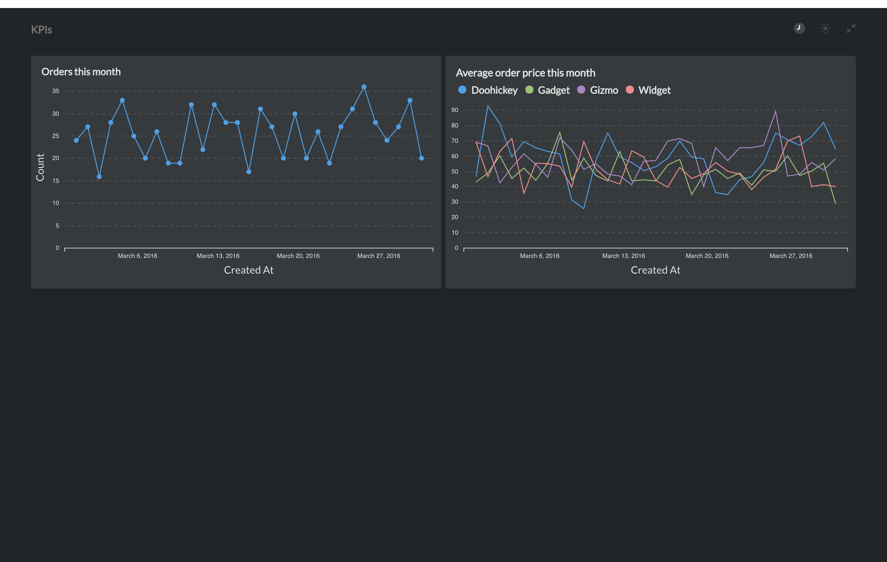
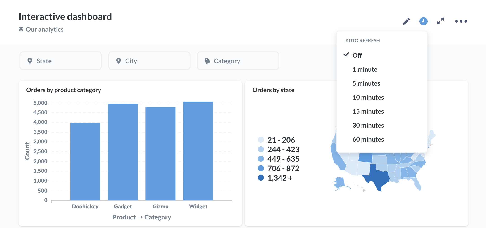
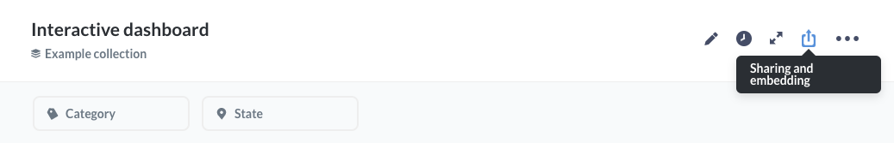

## Dashboards

### What is a dashboard?
A **dashboard** is a collection of saved questions that you want to refer back to and view regularly. It displays groups of questions and their corresponding answers.

Questions on a dashboard are meant to be viewed together, so they’re usually grouped by some kind of theme or topic, like Users, Inventory, or Reservations. A reservations dashboard could show the number of reservations by day of week, time of day, geographical region, and more.

Have a few key performance indicators that you want to be able to easily check? Make a dashboard featuring questions that show your key metrics and share it with your team.

You can make as many dashboards as you want. Go nuts.

### How to create a dashboard
Click the plus (+) icon in the top-right of the screen to open the menu to create a new dashboard. Give your new dashboard a name and a description, choose which collection it should be saved in, then click **Create**, and you’ll be taken to your shiny new dashboard.

### Adding saved questions to a dashboard
You can add a newly saved question to a dashboard directly from the window that pops up after you save the question, or by clicking the Add to Dashboard icon in the top-right of a question page. You can also go to one of your dashboards and click the plus icon in the top right to add any of your saved questions to the dashboard. Dashboards and the questions they contain do not need to be saved in the same collection.

Once you add a question to your dashboard, it’ll look something like this:

### Adding headings or descriptions with text cards
Another neat thing you can do is add text cards to your dashboards so that you can write descriptions, explanations, notes, or even add images. Text cards can also be used to create separations between sections of charts in your dashboards.

To add a new text card, create a new dashboard or edit an existing one and click on the text card button in the top-right:

Your new, empty text card will appear. It has two modes: writing and previewing. Toggle between the modes by clicking the eye or pencil icons in the top-left of the card:

You can use [Markdown](http://commonmark.org/help/) to format the text in your text card, create inline tables or code snippets, or even embed linked images (easy on the GIFs, friends).

Click the eyeball icon to see what your formatted Markdown will look like when you save the card:

### Arranging cards
Each question on a dashboard is in its own card that you can move around or resize as you see fit; just click the edit icon that looks like a pencil in the top-right of the dashboard screen.

Once you're in edit mode you'll see a grid appear. You can move and resize the cards in the dashboard to your liking and they'll snap to the grid.

- To move cards just click and drag.
- To resize a card just click and drag the handle at the bottom right corner of the card.
- To remove a card, click the X icon in the top right corner.

Questions in your dashboard will automatically update their display based on the size you choose to make sure your data looks great at any size.

### Archiving a dashboard
Archiving a dashboard does not archive the individual saved questions on it — it just archives the dashboard. To archive a dashboard while viewing it, click the pencil icon to enter edit mode, then click the Archive button.

You can view all of your archived items by clicking the menu icon in the top-right of any collection page. Archived dashboards in this list can be unarchived by clicking the icon of the box with the upward arrow next to that dashboard.

### Finding dashboards
After a while, your team might have a lot of dashboards. To make it a little easier to find dashboards that your team looks at often, you can pin them to the top of the collection by clicking and dragging them to the top or by opening the `…` menu and selecting the Pin action.

You can also search for any dashboard (or question, collection, or pulse) by its title in the big search box at the top of Metabase.

### Fullscreen dashboards

After you've made your ideal dashboard you may want to put it on a TV or present it in some other visible space to help keep your team up-to-date throughout the day.

To enter fullscreen mode just click the fullscreen icon in the top right of the dashboard.

Once you've entered fullscreen mode you can also switch the dashboard into "Night mode" for higher contrast.

### Auto refresh
If your data is more realtime in nature you can set your dashboard up to auto refresh.

You can set your dashboard to update in 1, 5, 10, 15, 30, and 60 minute intervals depending on how fresh you need the data to be.

Enabling auto refresh will re-run all the queries on the dashboard at the interval you choose, so keep the size of the dashboard and the complexity of the questions in mind when setting up auto refresh.

Combining fullscreen mode and auto refresh is a great way to keep your team in sync with your data throughout the day.

## Sharing dashboards with public links
If your Metabase administrator has enabled [public sharing](../administration-guide/12-public-links.md) on a saved question or dashboard, you can go to that question or dashboard and click on the sharing icon to find its public links. Public links can be viewed by anyone, even if they don't have access to Metabase. You can also use the public embedding code to embed your question or dashboard in a simple web page or blog post.

### Configuring a dashboard through its URL

It is possible to amend URL of the dashboard to automatically enter fullscreen, enable night mode or auto-refresh the dashboard. This allows you to configure the dashboard even when you do not have any input access to the device where the dashboard will be displayed, like scripted screens, for example.

To configure a dashboard using its URL, you can add the following optional keywords: `fullscreen`, `night`, or `refresh`. Here's an example:

`https://metabase.mydomain.com/dash/2#refresh=60&fullscreen&night`

The part that says `refresh=60` sets the dashboard to automatically refresh every 60 seconds, `fullscreen` sets it to fullscreen mode, and `night` sets it to night mode (night mode only works when using fullscreen). Use an `&` in between keywords, and make sure there's a hash `#` after the dashboard's ID number.

## Tips on creating helpful dashboards
To make a really helpful dashboard, you need to first decide what you want the dashboard to tell about your data. What questions will give you insight into what you want to know? It helps to think of a topic or theme for your dashboard — something like “customer satisfaction,” or “second quarter sales goals,” for example.

Once you’ve decided what kinds of questions your dashboard is going to answer, create and save your individual questions from the question builder and save them. Next you can add your saved questions to your dashboard and arrange them in a way that makes it easy to scan and understand.

Some tips:

*  Place the most important saved question cards near the top of the dashboard, and/or make them bigger than the other cards. That will help draw people’s attention to what matters most.
*  If you have more than 10 cards on a dashboard, think about breaking the dashboard into two separate ones. You don't want to overwhelm people with too much information, and each dashboard should revolve around one theme or topic. Remember — you can make as many dashboards as you want, so you don’t have to cram everything into just one.
* Consider [adding filters to your dashboard](08-dashboard-filters.md) to make them more useful and flexible. For example, instead of your dashboard being full of questions that are restricted to a specific time span, you can make more general questions and use dashboard filters to change the time span you're looking at.

---

## Next: Adding dashboard filters
Make your dashboards more flexible and powerful by [adding dashboard filters](08-dashboard-filters.md).
