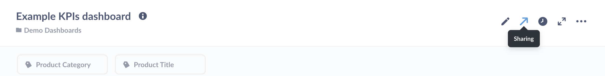

## Dashboards

Quick links:

- [Dashboard filters](08-dashboard-filters.md)
- [Dashboard subscriptions](dashboard-subscriptions.md)
- [Make your dashboards interactive](interactive-dashboards.md)
- [Learn how to build great dashboards](https://www.metabase.com/learn/dashboards/index.html)

### What is a dashboard?

**Dashboards** group questions and present them on a single page. You can think of dashboards as shareable reports that feature a set of related questions.

A dashboard comprises a set of cards arranged on a grid. These cards can be questions - such as tables, charts, or maps - or cards can be text boxes.

You can add filter widgets to dashboards that filter data across multiple questions, and customize what happens when people click on a chart or a table.

You can make as many dashboards as you want. Go nuts.

### How to create a dashboard

In the top right of the screen, click the **+** icon to open the **Create** menu, and select **New Dashboard**. Give your new dashboard a name and a description, choose which [collection](06-sharing-answers.md#collections) the dashboard should go in, then click **Create**, and Metabase will take you to your shiny new dashboard.

If you don't want to build a dashboard from scratch, or want to experiment by making changes to an existing dashboard without affecting the original, you can **duplicate** an existing dashboard. From an existing dashboard, click on the **...** menu in the upper right, and select **Duplicate**.

### Adding saved questions to a dashboard

There are two ways to add questions to a dashboard: from the dashboard, or from the question you want to add.

**From a question**: you can add a newly saved question to a dashboard directly from the window that pops up after you save the question for the first time. You can also add a question to a dashboard by clicking on the **pencil** icon next to the name of the question, and selecting **Add to dashboard**.

**From a dashboard**: Click on the **pencil** icon to **edit the dashboard**. Then click the **+** icon in the top right of the dashboard editing interface (not the **+** in the main navigation bar) to add any of your saved questions to the dashboard, regardless of which collection the questions are in.

Once you add a question to your dashboard, it’ll look something like this:

### Adding headings or descriptions with text cards

Another neat thing you can do is add text cards to your dashboards. Text cards allow you to include descriptions, explanations, notes, or even images and GIFs to your dashboards. You can also use text cards to create separations between sections of charts in your dashboards, or include links to other dashboards, questions, or websites.

To add a new text card, create a new dashboard (or edit an existing one) and click on the text card button, **Aa**, in the top-right:

Your new, empty text card will appear. It has two modes: writing and previewing. Toggle between the modes by clicking the **eye** to preview the card, or the **document with pencil** icon to edit the card.

You can use [Markdown](http://commonmark.org/help/) to format the text in your text card, create inline tables or code snippets, or even embed linked images (easy on the GIFs, friends).

Click the **eye** icon to see what your formatted Markdown will look like when you save the card:

To learn more, see [Fun with Markdown in your dashboards](https://www.metabase.com/blog/markdown-in-dashboards/index.html).

### Arranging cards

Each question on a dashboard is in its own card that you can move around or resize as you see fit. Just click the **pencil** icon in the top right of a dashboard to enter the dashboard's editing interface.

Once you're in edit mode, you'll see a grid appear. You can move and resize the cards in the dashboard to your liking and they'll snap to the grid.

- **To move a card**, just click and drag the card. Other cards will move out of the way.
- **To resize a card**, click the handle at the bottom right corner of the card, and drag to resize. Nearby cards will move away to accommodate the new size.
- **To remove a card**, hover over the card, and click the X icon in the top right corner.

Metabase will automatically update a question's display to make sure your data looks great at any size you choose.

### Changing a question's visualization settings

You can change a question's visualization settings on a dashboard (to add a goal line, for example,) without affecting the original question. Click on the **pencil** icon to enter dashboard edit mode, hover over the question you want to edit, and click on the palette icon to edit the question's visualization's settings.

.

### Finding dashboards

You can search for any dashboard (or question, collection, or pulse) by its title in the big search box at the top of Metabase.

After a while, your team might accumulate a lot of dashboards. To make it easier to find dashboards that your team looks at often, you can pin them to the top of a collection. From the collection screen, click and drag a dashboard to the top, or click on the **...** menu and select **Pin this item**.

### Fullscreen dashboards

After you've made your ideal dashboard, you may want to put the dashboard on a TV to help keep your team up to date throughout the day.

To enter fullscreen mode, click the **fullscreen** icon in the top right of the dashboard (the icon with the arrows pointing in opposite directions).

Once you've entered fullscreen mode, you can also switch the dashboard into "Night mode" for higher contrast.

### Auto refresh

If your data updates frequently, you can set up your dashboard to refresh automatically by clicking on the **clock** icon.

You can set your dashboard to update in 1, 5, 10, 15, 30, and 60 minute intervals, depending on how fresh you need the data to be.

Enabling auto refresh will re-run all the queries on the dashboard at the interval you choose, so keep the size of the dashboard and the complexity of the questions in mind when setting up auto refresh.

Combining fullscreen mode and auto refresh is a great way to keep your team in sync with your data throughout the day.

## Sharing dashboards with public links

If your Metabase administrator has enabled [public sharing](../administration-guide/12-public-links.md) on a saved question or dashboard, you can go to that question or dashboard and click on the **sharing** icon to find its public links.

Public links can be viewed by anyone, even if they don't have access to Metabase. You can also use the public embedding code to embed your question or dashboard in a simple web page or blog post. Check out examples of simple apps with embedded dashboards in our [embedding-reference-apps repository](https://github.com/metabase/embedding-reference-apps). To learn more about [embedding](../administration-guide/13-embedding.md), check out our article on [How to use Metabase to deliver analytics to your customers](https://www.metabase.com/blog/external-facing-analytics/index.html), as well as an article on how to combine branding, Single Sign-On, full app embedding, and data sandboxing to deliver [multi-tenant, self-service analytics](https://www.metabase.com/blog/embedding/index.html).

### Configuring a dashboard through its URL

You can amend the URL of a dashboard to automatically enter fullscreen, enable night mode, or auto-refresh the dashboard. Customizing the dashboard's URL allows you to configure the dashboard - even when you do not have any input access to the device where the dashboard will be displayed, like scripted screens, for example.

To configure a dashboard using its URL, you can add the following optional keywords: `fullscreen`, `night`, or `refresh`. Here's an example:

`https://metabase.mydomain.com/dash/2#refresh=60&fullscreen&night`

The part that says `refresh=60` sets the dashboard to automatically refresh every 60 seconds, `fullscreen` sets it to fullscreen mode, and `night` sets it to night mode (night mode only works when using fullscreen). Use an ampersand, `&`, in between keywords, and make sure there's a hash, `#`, after the dashboard's ID number.

There is one important limitation with the `fullscreen` option: for security reasons, many browsers require user interaction to initiate fullscreen. In those browsers, using the `fullscreen` option will enable the fullscreen UI in Metabase, but it won't expand the browser content to fill the screen. To ensure the dashboard occupies the entire screen, either activate fullscreen by clicking the button in the UI, or use the `fullscreen` URL option and launch the browser in fullscreen or kiosk mode.

### Archiving a dashboard

Archiving a dashboard removes the dashboard from searches and collections. Archiving a dashboard does not archive the individual saved questions on it — it just archives the dashboard.
 
To archive a dashboard, click the **pencil** icon to enter edit mode, then click the **...** menu, and select **Archive**.

To view all archived items, click the **menu** icon in the top-right of any collection page. You can **unarchive** a dashboard by clicking the icon of the box with the upward arrow next to that dashboard.

## Tips on creating helpful dashboards

To make a great dashboard, you first need to decide what you want the dashboard to tell about your data. What questions will give you insight into what you want to know? It helps to think of a topic or theme for your dashboard — something like “customer satisfaction,” or “second quarter sales goals".

Some tips:

- **Emphasize the most important questions**. To draw people’s attention to what matters most, place the most important saved question cards near the top of the dashboard, and/or make them bigger than the other cards, 
- **Keep dashboards focused**. If you have more than 10 cards on a dashboard, think about breaking the dashboard into two separate ones. You don't want to overwhelm people with too much information, and each dashboard should revolve around one theme or topic. Remember — you can make as many dashboards as you want, so you don’t have to cram everything into just one.
- **Add filters to your dashboard**. [Adding filters](08-dashboard-filters.md) to dashboards makes them more useful. For example, instead of your dashboard being full of questions that are restricted to a specific time span, you can make more general questions and use dashboard filters to change the time span you're looking at.
- **Make your dashboards interactive.** [Customize what happens when users click on a chart or table in your dashboard](interactive-dashboards.md).

See [Making dashboards faster](https://www.metabase.com/blog/faster-dashboards/index.html) for tips on improving dashboard performance.

---

## Next: Adding dashboard filters

Make your dashboards more flexible and powerful by [adding dashboard filters](08-dashboard-filters.md).
