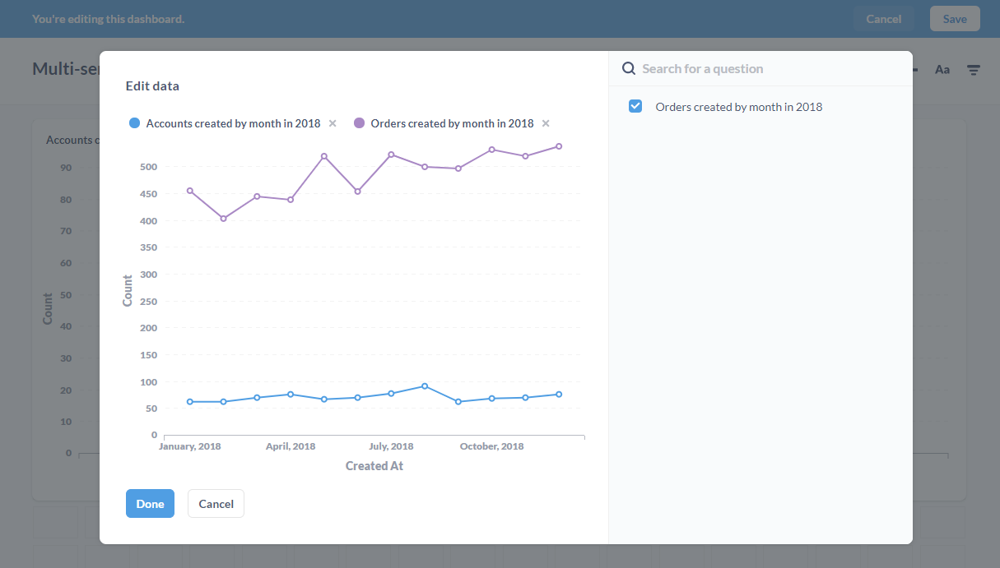
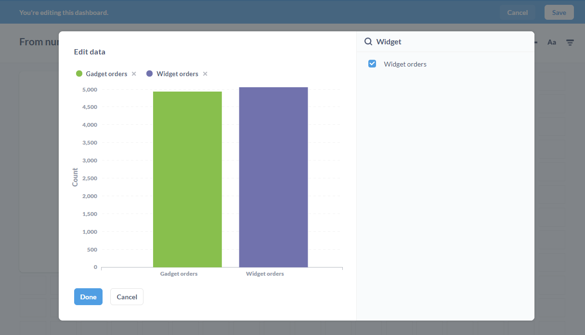

## Charts with multiple series

Data in isolation is rarely all that useful. One of the best ways to add context and clarity when communicating with data is to show data side-by-side with other data. Here are just a few examples of data that is better together than apart.

- Your company’s revenue vs. its costs over time.
- Average order price this month and user signups for that month.
- New users per day vs. returning users per day.
- Orders per day from a few different product lines.

### Displaying data side by side

There are two main ways to visualize data side by side:

1. [**Ask a question that involves multiple dimensions**](#ask-a-question-that-involves-multiple-dimensions) with the Simple or Custom query builders (or in SQL, if you’re fancy). Example: the count of users by region over time.

2. [**Combine two saved questions**](#combining-two-saved-questions) that share a common dimension (like time) on a dashboard. For example, you could look at revenue over time and costs over time together.

### Ask a question that involves multiple dimensions 

If you’re creating a new question, you can view the results as a multi-series visualization by summarizing your data and grouping it into two groups.

As an example, we might want to see which website or service is referring the most people to our website. In the **Sample Dataset** that ships with Metabase, you would group by the `Source` and `Created At` columns of the **People** table.

To create the multi-series chart, select the **People** table, click on the **Summarize** button in the upper right, then add `Source` and `Created At` as groupings (the `count of rows` metric that we want is selected by default). Be sure to click the plus button to the right of your selection, so Metabase knows to add the grouping; otherwise, Metabase will switch to that grouping. [Learn more about asking questions](04-asking-questions.md).

Metabase will automatically display a multi-series line chart visualization of how each referrer has performed for us.

You can also create a multi-series chart by composing a custom question in the notebook editor. All you need to do is summarize your data (e.g., count the rows) and group that data into multiple groups (e.g. `Created At` by month and Product Category).

Note: you won’t be able to add another saved question to multi-series visualizations made in this fashion. Metabase can visualize up to 100 distinct values of a dimension at once, so if you're selecting a field that contains a lot of values, you might need to filter the values.

### Combining two saved questions

If you already have two or more saved questions you’d like to compare, and they share a dimension, they can be combined on any dashboard. Here’s how:

1. Add a question with a dimension like time or category to a dashboard. In practice, these will usually be line charts or bar charts.

2. While in edit mode on the dashboard, hovering over a card will display some editing options in the upper right of the question, including an option to **add a line**, as well as a **gear** icon. Click on the add a line option (the **+** with a line and the word "Add" next to it). 

3. In the Edit Data modal, you’ll see the original question on the left, with a list of compatible questions you can choose from on the right. Search question(s) to add, and check the box next to each question you’d like to see alongside with the original. Metabase will add the question(s) to the same chart.

If necessary, the X and Y axes will automatically update. Metabase will create a legend using the existing card titles to help you understand which question maps to which series on the chart. Repeat this process as many times as you need.

To remove a series, simply uncheck its box.

Once you have your chart looking how you’d like, hit done. Metabase will show your changes on the card in the dashboard. Depending on how dense your data is, at this point you might want to consider enlarging your chart to make sure the data is legible.

> **SQL questions may not work**. Metabase has less information about SQL-based questions, so we cannot guarantee they can be added reliably. You'll see a little warning sign next to SQL questions to indicate this uncertainty, so be aware that adding these kinds of questions may not work.

### Combining Number charts

If you need to compare single numbers to get a sense of how they differ, Metabase can turn multiple number charts into a bar chart. 

As above, while editing a dashboard, hover over a number chart of your choice, and click on the icon with the **+** and bar chart icon to add a saved question. 

Use the search bar to find other saved question(s) that you’d like to see represented on the bar chart, and click the checkbox to add them to your chart. In this case, we added **Widget orders** to compare them to **Gadget orders**.

### Multi-series charts, values, and legibility

When displaying multiple series, it’s important to keep legibility in mind. Combining many series can sometimes decrease the communication value of the data.

Metabase allows you to add values to multi-series charts, but go easy on this feature, especially on charts with lots of data points. Adding values to multiple series, each with many data points, can make charts more difficult to read.

From the **Visualization -> Display** options, you can toggle the option: **Show values on data points**. Metabase will do its best to fit as many values as can fit nicely. You can also force Metabase to (begrudgingly) show values for all data points, by setting the **Values to show** to **All**. 

You can also toggle values for each individual series. If you have three series, for example, you can show values on one, two, or all three series. In the **Display** tab, click on the down arrow to the right of a series to expand its details, and toggle **Show values for this series** to show or hide its values. You can also toggle values for the whole chart, then selectively hide values for individual series until you have your chart looking just right.

Additionally, there is an option to configure the formatting of the values: 

- **Auto**. Metabase selects the appropriate style for you
- **Compact**. Metabase abbreviates values, e.g., 1,000 becomes 1K.
- **Full**. Values are displayed in their natural beauty.

Now go forth and start letting your data get to know each other.

---

## Next: Getting reports with Pulses

Pulses let you send out a group of saved questions on a schedule via email or Slack. [Get started with Pulses](10-pulses.md).
