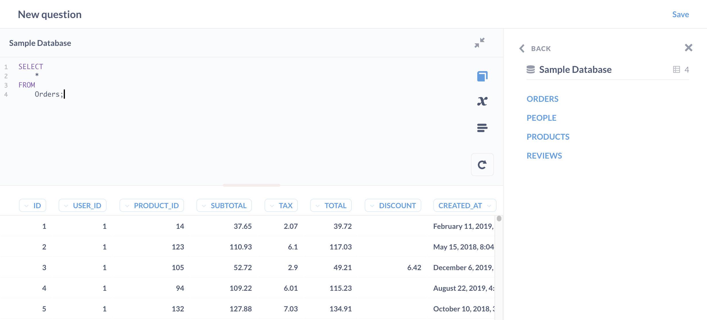
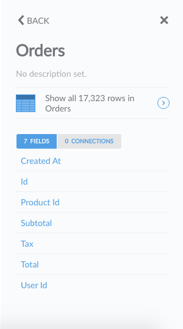
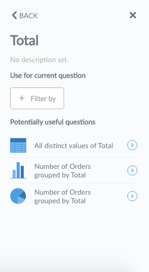

## Data Model Reference
---
Sometimes, as you’re looking at all the various tables and data in your database, you’ll probably have questions about what all the data means. That’s where the *data model reference* comes in handy. You can get to the data model reference from the question builder screen by clicking on the **Book** icon in the top right corner of the screen.

After clicking the icon, the **Data Reference** sidebar will open. It lists all the databases you have access to and the tables inside them.

Click on the table you would like to explore further to see a description of it and a list of all the fields it contains. Each table or field will only contain a description if your admin wrote something there.

If you click on a field you’re interested in, you’ll see a description of the field's contents as well as some suggestions for questions you could view about that field.

In addition to looking at a table's fields, you can also look at its connections if your table includes any. Connections show up here if there’s a field in the table you’re looking at that’s included in another table. Click on **Connections** (located next to **Field** button) to view the connected tables.

---

## Next: powering up your SQL questions with variables
Find out [how to use variables in your native SQL queries](13-sql-parameters.md) to create powerful filter widgets and more.
