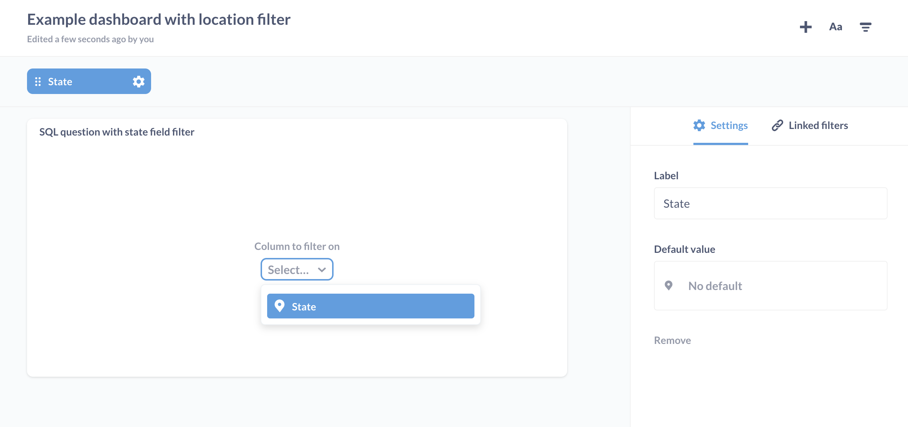

## SQL Parameters
---
Metabase has the flexible ability to allow variables in native (SQL) queries. This lets you dynamically replace values in your queries using filter widgets or through the query's URL.


Options and settings for your variables will appear in the `Variables` side panel of the native query builder once you've defined a variable. So, how do you define a variable?


### Defining Variables
Typing `{{variable_name}}` in your native query creates a variable called `variable_name`. Variables can be given types in the side panel, which changes their behavior. All variable types other than `field filter` will cause a filter widget to be placed on this question corresponding to the chosen variable type. When a value is selected via a filter widget, that value replaces the corresponding variable in the SQL template, wherever it appears. If you have multiple filter widgets, you can click and drag on any of them to move and reorder them.

This example defines a variable called `cat`, allowing you to dynamically change the `WHERE` clause in this query:

```
SELECT count(*)
FROM products
WHERE category = {{cat}}
```

#### The Field Filter variable type
Setting a variable to the `field filter` type allows you to map it to a field in any table in the current database, and lets you display a dropdown filter widget filled with the values of the field you connected it to. Field filter variables also allow you to connect your SQL question to a dashboard filter if you put it in a dashboard.

A field filter variable inserts SQL similar to that generated by the GUI query builder when adding filters on existing columns. This is useful because it lets you do things like insert dynamic date range filters into your native query. When adding a field filter, you should link that variable to a specific column. Field filter variables should be used inside of a `WHERE` clause.

Example:

```
SELECT count(*)
FROM products
WHERE {{created_at}}
```

##### Creating SQL question filters using field filter variables
First, insert a variable tag in your SQL, like `{{my_var}}`. Then, in the side panel, select the `Field Filter` variable type, and choose which field to map your variable to. In order to display a filter widget, you'll have to choose a field whose Type in the Data Model section of the Admin Panel is one of the following:
- Category
- City
- Entity Key
- Entity Name
- Foreign Key
- State
- UNIX Timestamp (Seconds)
- UNIX Timestamp (Milliseconds)
- ZIP or Postal Code

The field can also be a datetime one (which can be left as `No special type` in the Data Model).

You'll then see a dropdown labeled `Widget`, which will let you choose the kind of filter widget you want on your question, which is especially useful for datetime fields (you can select `None` if you don't want a widget at all). **Note:** If you're not seeing the option to display a filter widget, make sure the mapped field is set to one of the above types, and then try manually syncing your database from the Databases section of the Admin Panel to force Metabase to scan and cache the field's values.

Filter widgets **can't** be displayed if the variable is mapped to a field marked as:
- Avatar Image URL
- Description
- Email
- Enum
- Field containing JSON
- Image URL
- Number
- Latitude
- Longitude
- URL

##### Setting a default value
If you input a default value for your field filter, this value will be selected in the filter whenever you come back to this question. If you clear out the filter, though, no value will be passed (i.e., not even the default value). The default value has no effect on the behavior of your SQL question when viewed in a dashboard.

###### Default value in the query
You can also define default value directly in your query, useful for complex default value.

Current date example:
```
SELECT p.*
FROM products p
WHERE p.createdAt = [[ {{dateOfCreation}} #]]CURRENT_DATE()
```

##### Connecting a SQL question to a dashboard filter
In order for a saved SQL question to be usable with a dashboard filter, it must contain at least one field filter. The kind of dashboard filter that can be used with the SQL question depends on the field that you map to the question's field filter(s). For example, if you have a field filter called `{{var}}` and you map it to a State field, you can map a Location dashboard filter to your SQL question. In this example, you'd create a new dashboard or go to an existing one, click the Edit button, and the SQL question that contains your State field filter, add a new dashboard filter or edit an existing Location filter, then click the dropdown on the SQL question card to see the State field filter. [Learn more about dashboard filters here](08-dashboard-filters.md).



### Optional Clauses
To make an optional clause in your native query, type  `[[brackets around a {{variable}}]]`. If `variable` is given a value, then the entire clause is placed into the template. If not, then the entire clause is ignored.

In this example, if no value is given to `cat` from its filter widget or URL, then the query will just select all the rows from the `products` table. But if `cat` does have a value, like `Widget`, then the query will only grab the products with a category type of `Widget`:

```
SELECT count(*)
FROM products
[[WHERE category = {{cat}}]]
```

To use multiple optional clauses you must include at least one regular `WHERE` clause followed by optional clauses, each starting with `AND`.

Example:

```
SELECT count(*)
FROM products
WHERE True
  [[AND id = {{id}}]]
  [[AND category = {{category}}]]
```

---

## Next: automated x-ray explorations
Learn about how to easily and quickly see automatic explorations of your data with Metabase's powerful [x-ray feature](14-x-rays.md).
