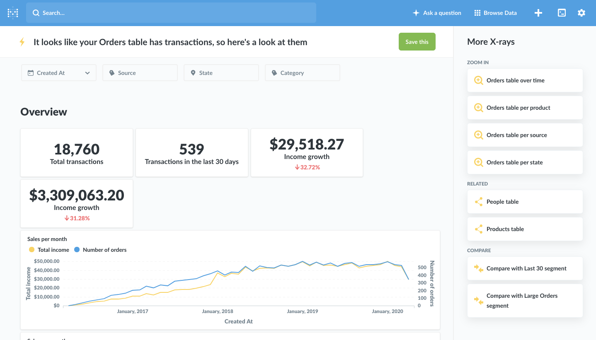

## X-rays

X-rays are a fast and easy way to get automatic insights and explorations of your data.

### Viewing X-rays by clicking on charts or tables

One great way to explore your data in general in Metabase is to click on points of interest in charts or tables, which shows you ways to further explore that point. We've added X-rays to this action menu, so if you for example find a point on your line chart that seems extra interesting, give it a click and X-ray it! We think you'll like what you see.

### Comparisons

To see how the value of a bar, point, or geographic region compares to the rest of the data, click on it to pull up the action menu, then select **Compare to the rest**.

If you're already looking at an X-ray of a table or a segment, Metabase will also give you the option to compare the current table or segment to other segments of the table, if there are any. This is a fast, powerful way to see, for example, how different segments of your users or orders compare to each other.

### Table X-rays

Another great way to get to know your data is by X-raying your tables. From the home page, scroll to the bottom of the screen, click on one of your connected databases, and then click the bolt icon on a table to view an X-ray of it.

## X-rays in the data browser and data reference

You can also view an X-ray by browsing to a table and clicking on the lightning bolt icon. Click on the `Browse Data` button in the top navigation, select a database, and hover over a table to see the icon.

From the Browse Data page, you can also click on `Learn about our data` to view the Data Reference section. From here you can navigate through databases, tables, columns, metrics, or segments, and you can click on the X-ray link in the left sidebar to see an X-ray of the item you're currently viewing.

### Exploring newly added datasets

If you're an administrator, when you first connect a database to Metabase, Metabot will offer to show you some automated explorations of your newly-connected data.

Click on one of these to see an x-ray.

You can see more suggested x-rays over on the right-hand side of the screen. Browsing through x-rays like this is a pretty fun way of getting a quick overview of your data.

### Browsing through suggested X-rays

Depending on the X-ray you're currently viewing, you'll see suggestions that will let you:

- Compare the table or segment you're currently X-raying to another segment.
- "Zoom out" and view an X-ray of the table the current X-ray is based on.
- "Zoom in" to see a more detailed X-ray about a field or dimension of the current X-ray.
- Go to an X-ray of a related item, like a metric based on the current table, or a different table that's related to the current one.

### Saving X-rays

If you come across an X-ray that's particularly interesting, you can save it as a dashboard by clicking the green Save button. Metabase will create a new dashboard and put it and all of its charts in a new collection, and will save this new collection wherever you choose.

### Disabling X-rays

If for some reason X-rays aren't a good fit for your team or your data, administrators can turn them off completely in the general settings area of the Admin Panel.

The X-ray suggestions that appear on the homepage of Metabase will be hidden if you pin any dashboards in the "Our Analytics" collection. You can also manually remove these suggestions for all users by hovering over that section on the homepage and clicking the `X` next to "Try these X-rays based on your data" when logged in as an administrator. This won't disable the X-ray features in the rest of Metabase.

### Need help?

If you still have questions about X-rays or comparisons, you can head over to our [discussion forum](https://discourse.metabase.com/). See you there!

---

## Next: setting up alerts

Learn how to get notified when one of your questions meets or goal or has results with [alerts](15-alerts.md).
